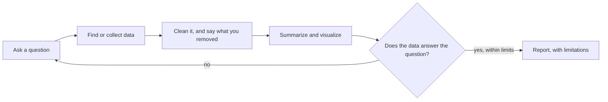
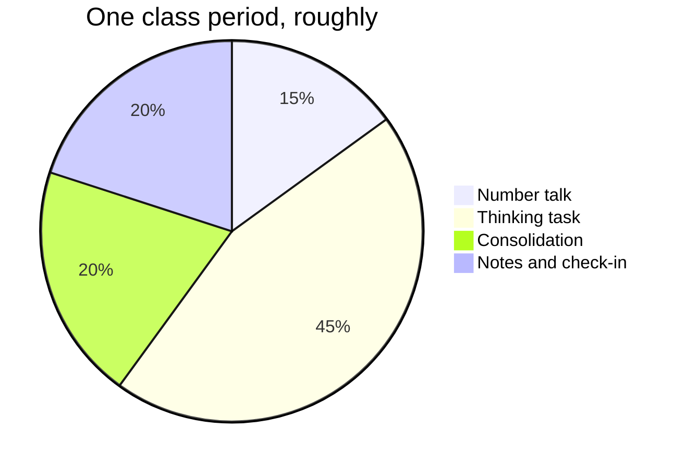
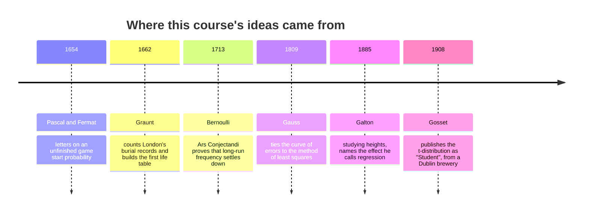

This page exists for two audiences. Students: it shows why the notes
look the way they do. Teachers: it is a working reference for
everything you can put in a page, with the source visible in every
example.

Everything below is written in **Markdown** — plain text with a few
marks of punctuation that mean something. If you can write a text
message, you can write this.

---

## Text that carries meaning

You get **bold**, *italic*, ~~struck through~~, and ==highlighted==
text. Highlighting is the one worth knowing: it draws the eye better
than bold when you want a single ==key term== to stand out in a
paragraph.

**How that was made:**

```markdown
**bold**, *italic*, ~~struck through~~, ==highlighted==
```

Arrows written as `->` become proper arrows: sample -> statistic ->
inference.

Keyboard keys look like keys: press <kbd>⌘</kbd> + <kbd>K</kbd> to
search.

---

## Mathematics, typeset properly

Inline maths sits in a sentence: the chance of drawing an ace is
$\frac{4}{52} = \frac{1}{13}$. Display maths gets its own centred
line — and this course's most quietly powerful definition deserves
one:

$$
P(A \mid B) = \frac{P(A \cap B)}{P(B)}
$$

Fractions, factorials, sums, and Greek letters all come out exactly
as they should:

$$
\binom{n}{r} = \frac{n!}{r!\,(n-r)!}
\qquad
z = \frac{x - \mu}{\sigma}
\qquad
\bar{x} = \frac{1}{n}\sum_{i=1}^{n} x_i
$$

**How that was made:** single dollar signs keep it in the sentence,
double ones give it a line of its own.

```markdown
Inline: $\frac{4}{52} = \frac{1}{13}$

Display:
$$
P(A \mid B) = \frac{P(A \cap B)}{P(B)}
$$
```

No more screenshotting equations out of a document — edit the text
and the mathematics re-typesets itself.

---

## Code — and this course uses it

Unlike most mathematics courses, this one writes a little program on
purpose: a simulation is often the fastest honest answer to a
probability question, and [[Simulating with Python]] is the tutorial.
Code arrives coloured, exact, and with its spacing preserved:

```python
import random

def roll_two_dice():
    return random.randint(1, 6) + random.randint(1, 6)

print(roll_two_dice())
```

**How that was made:** three backticks and the language name, the
code, then three backticks to close it.

---

## Headings, and the table of contents

Every `##` heading on a page becomes a link in **Navigate this page**,
over on the right — built automatically from the headings, so it can
never fall out of step with the page. Deeper headings nest
underneath.

A short page reads better without a contents panel; one frontmatter
line (`enableToc: false`) turns it off. Every class page in
[[All Classes/index|All Classes]] does this — an agenda of six items
does not need navigating.

---

## Callouts

Callouts pull something out of the flow of the page, each kind with
its own colour and icon:

> [!note] Note
> Neutral information worth setting apart.

> [!tip] Tip
> A shortcut, a habit, or something that makes the work easier.

> [!important] Important
> The one thing to take away if you take away nothing else.

> [!warning] Warning
> Where people usually go wrong — reading $P(A \mid B)$ as
> $P(B \mid A)$ lives in boxes like this one, and so does the
> spreadsheet cheerfully averaging a column of missing-value codes.

> [!question] Question
> Something to think about rather than something to know.

> [!abstract] At a glance
> Used at the top of task pages for format and timing.

**How that was made:** a blockquote with the kind named in brackets.

```markdown
> [!warning] Where people usually go wrong
> The text of the callout goes here.
```

### Foldable callouts

Add a `-` to start a callout collapsed. Every practice set in
[[Exercises/index|Exercises]] hides its worked answers this way — try
before you peek, but the peek is always there:

> [!success]- Worked answer
> A committee of 3 from 10 people can be formed in
> $\binom{10}{3} = 120$ ways. If the three roles are chair,
> secretary, and treasurer, order now matters and the count becomes
> $_{10}P_{3} = 720$ — exactly $3!$ times larger, because each
> committee can be assigned its roles in $3! = 6$ ways.

```markdown
> [!success]- Worked answer
> The hidden solution.
```

---

## Diagrams

Diagrams are **written, not drawn** — edited in seconds, never
needing a graphics program.



**How that was made:**

````markdown

````

Proportions draw themselves too:



And history fits on a line:



---

## Tables

**How that was made:** rows of text separated by `|`, with a line of
dashes under the headings. Mathematics works inside cells, which
matters more than it sounds.

| Display | Shows best | Hides |
| --- | --- | --- |
| A histogram | Shape: skew, gaps, clusters, a second peak | Individual people |
| A box plot | Spread and outliers, several groups side by side | Whether the middle is one lump or two |
| A single mean $\bar{x}$ | One number you can carry into an argument | Everything that made the number worth arguing about |
| A scatter plot | Direction, strength, form, and points that do not belong | Which variable, if either, is doing the causing |

---

## Checklists

**How that was made:** a list where each line starts with `- [ ]`, or
`- [x]` for one already done.

- [ ] Source named
- [x] Sample size stated
- [ ] Uncertainty reported, not implied
- [ ] Someone else could check this page

They are clickable in the browser. Nothing is saved — but they are
how [[Writing About Data]] turns from advice into habit.

---

## Links between pages

This is what makes the site more than a pile of documents.

- A plain link: [[Conditional Probability]]
- A link with different words:
  [[The Normal Distribution|the curve that keeps turning up uninvited]]
- A link to a section:
  [[Checking Your Own Work#Estimate first, compare after]]

**How that was made:** double square brackets.

```markdown
[[Conditional Probability]]
[[The Normal Distribution|different words for the link]]
[[Checking Your Own Work#Estimate first, compare after]]
```

### Transclusion — one page inside another

**How that was made:** `![[Page name]]` — a link with an exclamation
mark in front of it. Here is the help-session schedule, embedded live
rather than copied:

![[Help Sessions]]

Change the source page and every page that embeds it updates. This is
how task pages show the curriculum expectations they address, and how
one schedule stays correct everywhere it appears, without anyone
maintaining duplicates.

### Backlinks

Scroll to the bottom of any page and you will find **Backlinks** —
every page that links *to* this one, gathered automatically. Open
[[The Normal Distribution]] and its backlinks list every exploration,
task, and practice set that leans on it. Nobody maintains that list.

---

## Hover previews

Hover over [[Getting Unstuck]] without clicking. The page appears in
a small window. Checking one definition mid-problem does not cost you
your place.

---

## Footnotes

**How that was made:** `[^1]` where the marker goes, and a matching
`[^1]:` line anywhere in the page.

The word "statistics" started life as a branch of government.[^1]

[^1]: It was coined in the eighteenth century, from a root meaning
    *statesman*, for the descriptive facts a state needed about
    itself — populations, harvests, deaths. The mathematics came
    later. "Data" is older and blunter still: Latin for "things
    given", which is a useful reminder that somebody had to give
    them.

---

## Tags

**How that was made:** a `tags` list in the frontmatter at the very
top of the page.

```yaml
---
tags:
  - concepts
  - unit-2
---
```

Every tag becomes a page listing everything filed under it.

---

## What you cannot see

Two things on this page are invisible in the browser:

1. **Comments.** Text wrapped in `%%` double percent marks `%%` never
   reaches the site. Useful for notes to yourself in a page you are
   still writing — tomorrow's hint, next year's fix.
2. **Drafts.** A page with `draft: true` in its frontmatter is
   skipped entirely when the site is built. Write next week's lesson
   today and publish it when you are ready.

%% This sentence is a comment. If you can read it on the website, something is broken. %%

> [!tip] For teachers reading this
> With more than one section, per-section keys like `draftSection1`
> and `draftSection2` let one shared page be published to one class
> and held back from another — useful when your two sections sit a
> few days apart.

---

## The point of all this

None of it is decoration. Each feature removes a reason for a page to
be out of date:

| Feature | The problem it solves |
| --- | --- |
| Typeset maths | Screenshotted equations nobody can edit |
| Transclusion | The same text copied into six places, five stale |
| Backlinks | "Where did we use this again?" |
| Folded answers | Solutions that spoil the attempt |
| Drafts | Next week's lesson in a separate file somewhere |

Write it once, link to it everywhere.
