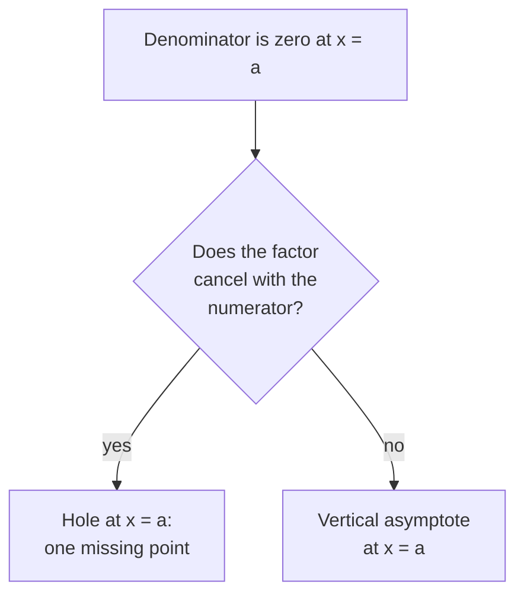

Someone in your group zoomed out on a rational function in
[[Using Desmos|Desmos]] until the curve straightened into what looked
exactly like a line — and asked whether the graph *was* the line now.
It never is, and it never stops approaching. An **asymptote** is not
a wall the graph obeys; it is a summary of behaviour — a line the
function commits to imitating, either near a forbidden input or far
from the origin.

## Where the graph breaks

A vertical asymptote lives where the denominator is zero — usually.
The honest version requires one check first:

$\frac{x^2-1}{x-1}$ simplifies to $x + 1$ everywhere except $x = 1$:
the graph is a line with a single point missing — a **hole** at
$(1, 2)$, not an asymptote. The forbidden input is real either way;
what differs is whether the function explodes there or merely
declines to show up.

## Where the graph settles

End behaviour is a contest between numerator and denominator. When
the bottom's degree is larger, the bottom wins and the graph settles
onto $y = 0$. When the degrees are equal, the graph settles at the
ratio of the leading coefficients — $\frac{2x}{x-3}$ levels off at
$y = 2$. Division tells the same story with more precision: writing
$\frac{x^2+2x-7}{x-2}$ as $x + 4 + \frac{1}{x-2}$ shows a function
that behaves like the line $y = x + 4$ for large $|x|$, because the
leftover fraction fades to nothing.

One caution your intuition will resist: a graph may *cross* its
horizontal asymptote — the asymptote only promises what happens far
away, and makes no claims about the middle. Near a vertical
asymptote, though, the function has no value at all, so there is
nothing to cross.

[[Rational Functions Practice]] asks you to name every asymptote and
hole before sketching — the naming is most of the sketch. Graphs with
mystery asymptotes also make regular appearances in [[Graph Talks]].

%%curriculum-start%%
## Curriculum connection

![[C2.1]]

![[C2.2]]

![[C3.7]]
%%curriculum-end%%
