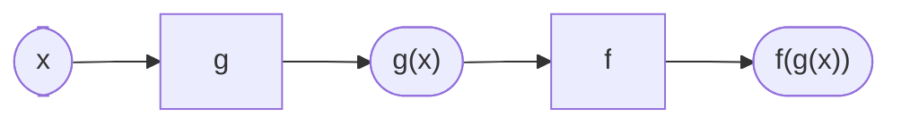

The graph in [[Graph Talks]] was a wave shrinking inside a fading
envelope — and the room's best explanation was that *two* functions
you already knew were in there, multiplied: an exponential holding
the volume, a sinusoid doing the wiggling. Every function in this
course has been a soloist until now. This page is about ensembles.

## Arithmetic with whole functions

Functions add, subtract, multiply, and divide pointwise — at each
$x$, combine the outputs. The combination inherits traits from both
parents, and predicting *which* traits is the interesting part: in
$x^2 + 2^x$, the exponential owns the right end and the parabola owns
the left; in a damped oscillation, the sinusoid supplies the beat and
the decaying exponential supplies the shrinking amplitude. Division
is the spiciest operation — every zero of the denominator is a
potential [[Asymptotes|asymptote]], which is how the rational
functions of Unit 2 were born. Even the symmetry algebra from
[[Even and Odd Functions]] carries through products: odd times odd
is even, a conjecture your group can settle in three lines.

## Composition — machines in a chain

**Composition** feeds one function's output into another's input:

Order matters, and not politely: with $f(x) = x + 1$ and
$g(x) = 2x$, $f(g(x)) = 2x + 1$ but $g(f(x)) = 2x + 2$. The domain
follows the plumbing — $f(g(x))$ is defined only for $x$ where $g$
works *and* where $g$'s output is something $f$ accepts, so
$\sqrt{x - 3}$ lives only on $x \ge 3$. Real models chain constantly:
distance depends on time, cost depends on distance, so cost-of-time
is a composition, $C(d(t))$.

Composition also closes a loop this course opened in Grade 11: a
function and its inverse compose to nothing at all —
$f^{-1}(f(x)) = x$. Each machine run backwards through the other
cancels it, which is precisely the sense in which
[[The Logarithm|the logarithm]] undoes the exponential.

One more honest admission: some equations built from combined
functions, like $\cos x = x$, cannot be solved by any algebra you
will ever own. Graph both sides, corner the intersection, and report
it numerically — that *is* the mathematically mature move, and your
[[The Signature Function|Signature Function]] model will likely need
it. [[Combining Functions Practice]] covers the arithmetic, the
chains, and the domains.

%%curriculum-start%%
## Curriculum connection

![[D2.1]]

![[D2.4]]

![[D2.5]]

![[D2.7]]
%%curriculum-end%%
