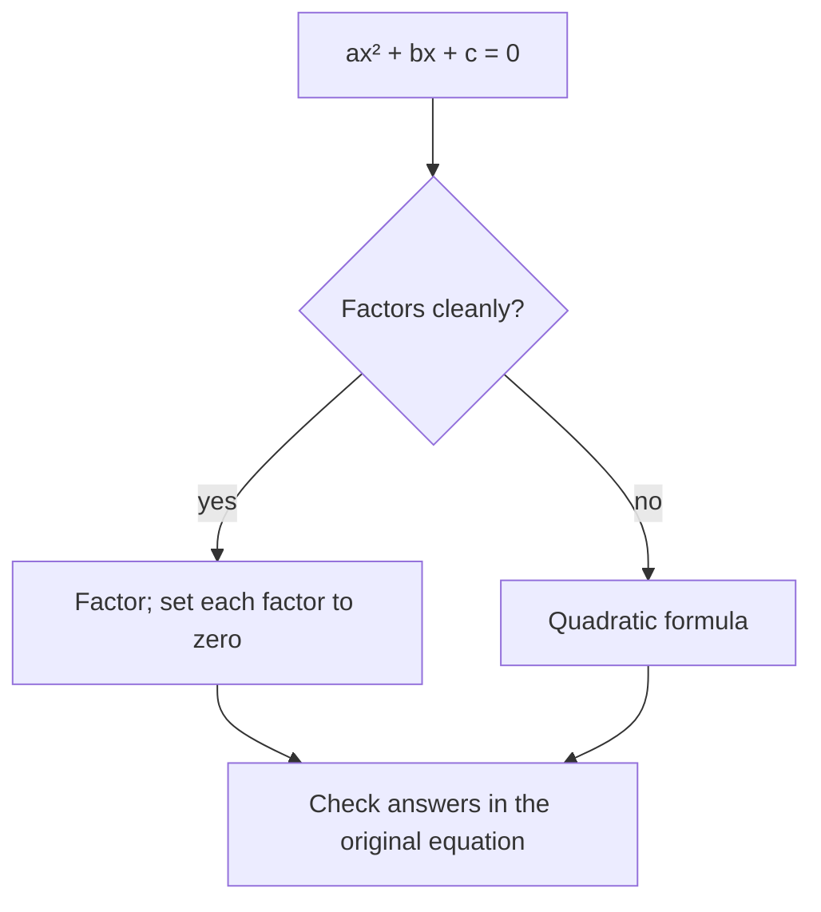

Setting $y = 0$ in a quadratic relation asks a concrete question:
where does the parabola cross the $x$-axis? Those crossing points
are the *zeros*, and solving $ax^2 + bx + c = 0$ is the hunt for
them — when does the ball land, when does the profit run out.

## Route one — factoring

If the quadratic factors, the zeros fall out immediately:

$$
x^2 + x - 6 = 0 \implies (x + 3)(x - 2) = 0
$$

A product is zero only when one of its factors is zero, so $x = -3$
or $x = 2$. This is [[Expanding and Factoring]] cashing in: factored
form $y = a(x - r)(x - s)$ wears its zeros $r$ and $s$ on its sleeve.

## Route two — the formula

Plenty of quadratics refuse to factor nicely. Completing the square
on the general $ax^2 + bx + c = 0$ — a development you followed in
class, not one you must reproduce — yields a formula that works
every single time:

$$
x = \frac{-b \pm \sqrt{b^2 - 4ac}}{2a}
$$

For $x^2 + x - 4 = 0$ it gives $x = \frac{-1 \pm \sqrt{17}}{2}$ —
roughly $1.56$ and $-2.56$, numbers factoring never would have found.

## What the square root already knows

The expression under the root, $b^2 - 4ac$, tells the graphical
story before you finish computing:

- **positive** — two real roots; the parabola crosses the axis twice
- **zero** — one real root; the vertex sits exactly on the axis
- **negative** — no real roots; the parabola never touches the axis

A negative under the root is not a mistake — it is the equation
reporting that the graph floats entirely above or below the axis.
[[Quadratic Formula Practice]] runs both routes side by side, and
[[The Perfect Arc]] is where zeros answer questions about the world.

%%curriculum-start%%
## Curriculum connection

![[A3.4]]

![[A3.7]]

![[A3.8]]
%%curriculum-end%%
