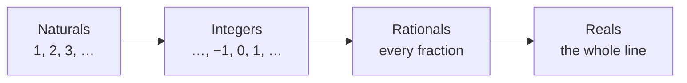

Every number you have ever used lives somewhere in a set of nesting
dolls. Each new set was invented because the previous one could not
answer a question people needed answered — and each one contains all
the sets that came before it.

## The nesting dolls

The **naturals** count things. The **integers** add zero and the
negatives, so that $3 - 5$ finally has an answer. The **rationals**
add every fraction, so that $3 \div 5$ does too. The **reals** fill in
what is left — numbers like $\pi$ and $\sqrt{2}$ that no fraction can
express, however hard it tries. Every natural number is an integer, every
integer is a rational (write $7$ as $\frac{7}{1}$), and every rational
is real. The dolls never argue; the inner ones just fit.

## There is always room for one more

Here is the strangest property of the rationals: between *any* two of
them, no matter how close, there is another. Take $\frac{1}{2}$ and
$\frac{51}{100}$ — their average, $\frac{101}{200}$, sits strictly
between them. And between that pair, another average. Forever. This
property is called **density**, and it means the number line has no
smallest gap: zoom in a millionfold and it looks exactly as crowded as
before. The integers are nothing like this — between $2$ and $3$
there is simply no integer, and never will be.

## A taste of infinity

Counting in [[How Big Is a Million]] showed how vast a *finite* number
can feel. Infinity is a different kind of thing entirely: not a big
number but a statement that the list never ends. Yet infinite
processes can settle. Add half, then a quarter, then an eighth:

$$
\frac{1}{2} + \frac{1}{4} + \frac{1}{8} + \frac{1}{16} + \cdots
$$

Each step closes half the remaining distance to $2$. No step arrives,
but the total creeps as close to $2$ as anyone could demand — and
mathematicians say the sum *has limit* $2$. It is the same idea hiding
in $0.\overline{9} = 1$: not "almost one", but a second name for one.
If that sentence bothers you, wonderful — write the argument with it
in your [[Math Journal]]. That itch is the start of calculus.

%%curriculum-start%%
## Curriculum connection

![[B1.2]]

![[B1.3]]
%%curriculum-end%%
