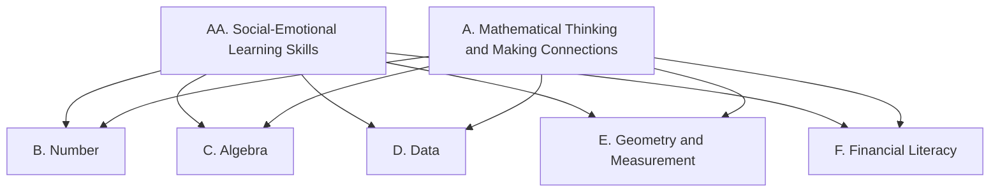

Everything we do in this course points at one or more of these
expectations, from **MTH1W — Mathematics, Grade 9 (de-streamed)**.
Lesson pages link here so you can always see *why* we are doing
something.

> [!info] Where these come from
> The wording below is the Ontario curriculum's own. See
> [[About These Expectations]].

Two strands run through everything: the social-emotional learning
skills (AA) and the mathematical processes and connections (A) are
practised inside every lesson, while strands B through F name the
mathematics itself.

## Overall and specific expectations

### Strand AA. Social-Emotional Learning (SEL) Skills in Mathematics
*Throughout this course, in the context of learning related to the other strands, students will:*

![[AA1. Social-Emotional Learning Skills]]

### Strand A. Mathematical Thinking and Making Connections
*Throughout this course, in connection with the learning in the other strands, students will:*

![[A1. Mathematical Processes]]

![[A2. Making Connections]]

### Strand B. Number
*By the end of this course, students will:*

![[B1. Development of Numbers and Number Sets]]
![[B1.1]]
![[B1.2]]
![[B1.3]]

![[B2. Powers]]
![[B2.1]]
![[B2.2]]

![[B3. Number Sense and Operations]]
![[B3.1]]
![[B3.2]]
![[B3.3]]
![[B3.4]]
![[B3.5]]

### Strand C. Algebra
*By the end of this course, students will:*

![[C1. Algebraic Expressions and Equations]]
![[C1.1]]
![[C1.2]]
![[C1.3]]
![[C1.4]]
![[C1.5]]

![[C2. Coding]]
![[C2.1]]
![[C2.2]]
![[C2.3]]

![[C3. Application of Relations]]
![[C3.1]]
![[C3.2]]
![[C3.3]]

![[C4. Characteristics of Relations]]
![[C4.1]]
![[C4.2]]
![[C4.3]]
![[C4.4]]

### Strand D. Data
*By the end of this course, students will:*

![[D1. Collection, Representation, and Analysis of Data]]
![[D1.1]]
![[D1.2]]
![[D1.3]]

![[D2. Mathematical Modelling]]
![[D2.1]]
![[D2.2]]
![[D2.3]]
![[D2.4]]
![[D2.5]]

### Strand E. Geometry and Measurement
*By the end of this course, students will:*

![[E1. Geometric and Measurement Relationships]]
![[E1.1]]
![[E1.2]]
![[E1.3]]
![[E1.4]]
![[E1.5]]
![[E1.6]]

### Strand F. Financial Literacy
*By the end of this course, students will:*

![[F1. Financial Decisions]]
![[F1.1]]
![[F1.2]]
![[F1.3]]
![[F1.4]]
