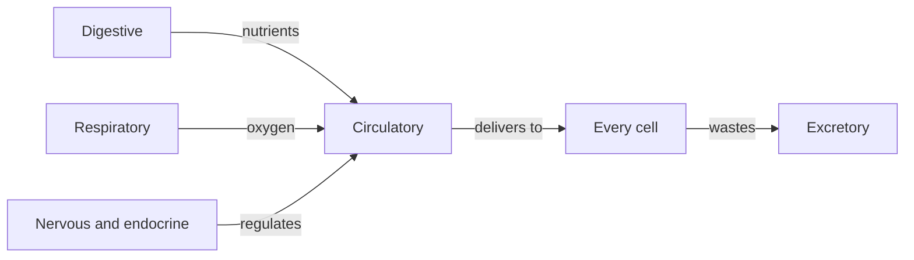

An animal is a set of systems that keep a very particular set of
conditions steady while the outside world does not cooperate.

## The organising idea

Surface area and transport. A single cell can exchange everything it needs
across its membrane. Anything bigger cannot, so multicellular animals
evolve surfaces — villi, alveoli, capillary beds — and a transport system
to connect them.

Nearly every structure in this unit is an answer to "how do you get enough
surface area into a small volume?"

## Levels of organisation

Cells → tissues → organs → systems → organism. Each level does something
the level below cannot, and the interactions between systems are where
this unit's exam questions live.

%%curriculum-start%%
## Curriculum connection

![[E3.1]]

![[E2.1]]
%%curriculum-end%%
