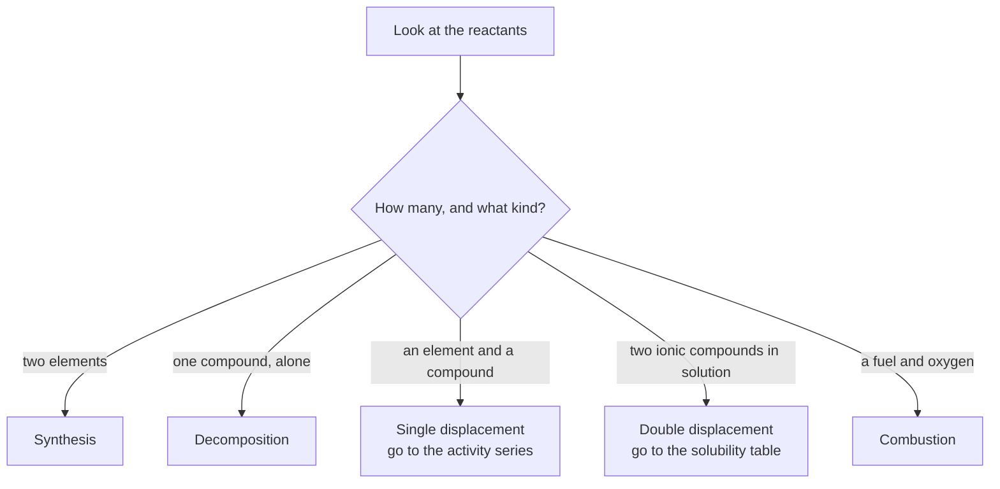

Sorting reactions you have already watched, as you did in
[[Sorting Five Reactions]], is history. Prediction is the harder and more
interesting direction: here are the reactants, nobody has run this, say
what comes out — and then check.

That is the actual work of a chemist, and the reason
[[Types of Chemical Reactions]] was worth learning. The classification is
not a filing system. It is a set of instructions for what to do next.

## Identify the type first

Every prediction starts by asking what shape the reactants are in.

Notice that two of the five branches send you to a **reference table**.
That is not a weakness in the method — it is the method. Nobody predicts
a single displacement from first principles; you look up which element
is more reactive, because somebody measured it.

## Synthesis and decomposition

**Synthesis** joins things. A metal and a non-metal make an ionic
compound, and the charges tell you the formula — that part is just
[[Naming and Formulas]] run forwards. Two non-metals make a molecular
compound, and here the ratio is genuinely not predictable from
first principles, which is why sulfur and oxygen can give you either
$\text{SO}_2$ or $\text{SO}_3$ depending on conditions.

The synthesis reactions worth memorising are the **oxides with water**,
because they explain something you can taste and measure:

$$\text{CaO(s)} + \text{H}_2\text{O(l)} \rightarrow \text{Ca(OH)}_2\text{(aq)}$$

$$\text{CO}_2\text{(g)} + \text{H}_2\text{O(l)} \rightarrow \text{H}_2\text{CO}_3\text{(aq)}$$

A **metal** oxide plus water gives a hydroxide — a base. A **non-metal**
oxide plus water gives an acid. That single pair of rules is most of
[[Acids and Bases]], and it is what you were testing in
[[Oxides and Neutralisation]].

**Decomposition** is synthesis backwards and usually needs energy put in
— heat, electricity, or light. Four patterns cover nearly everything you
will be asked:

- A binary compound splits into its elements:
  $2\text{H}_2\text{O(l)} \rightarrow 2\text{H}_2\text{(g)} + \text{O}_2\text{(g)}$
- A metal carbonate gives the metal oxide and carbon dioxide:
  $\text{CaCO}_3\text{(s)} \rightarrow \text{CaO(s)} + \text{CO}_2\text{(g)}$
- A metal hydroxide gives the metal oxide and water:
  $\text{Ca(OH)}_2\text{(s)} \rightarrow \text{CaO(s)} + \text{H}_2\text{O(g)}$
- A hydrate gives the anhydrous compound and water, which is the
  reaction you will exploit in [[Molar Mass and Composition]].

The carbonate one is the reaction that turns limestone into the lime
used in cement, and it is a large fraction of the carbon dioxide the
construction industry releases — the gas comes out of the rock itself,
not only out of the fuel used to heat it. That is worth raising in
[[Chemistry at Industrial Scale]].

## Single displacement needs the activity series

An element goes in, a different element comes out. Whether it happens at
all depends on which of the two holds its electrons more loosely, and
that ordering is the **activity series** you built by experiment in
[[Building the Activity Series]].

The rule: **a more reactive element displaces a less reactive one from
its compound. A less reactive element does nothing at all.**

$$\text{Mg(s)} + 2\text{HCl(aq)} \rightarrow \text{MgCl}_2\text{(aq)} + \text{H}_2\text{(g)}$$

Magnesium sits above hydrogen, so it pushes hydrogen out of the acid and
the tube fizzes. Copper sits below hydrogen, so copper in hydrochloric
acid gives you copper sitting in hydrochloric acid. Not a slow reaction
— no reaction.

Halogens have their own series, in plain periodic-table order:
fluorine, chlorine, bromine, iodine, most reactive first. A halogen
displaces any halide below it:

$$\text{Cl}_2\text{(aq)} + 2\text{NaBr(aq)} \rightarrow 2\text{NaCl(aq)} + \text{Br}_2\text{(aq)}$$

and bromine in sodium chloride solution does nothing. Both series are
laid out in [[The Activity Series]].

## Double displacement needs the solubility table

Two ionic compounds in solution swap partners. But swapping is not by
itself a reaction: the ions were already dissolved and separate, and
after the swap they can be dissolved and separate again. **Nothing has
happened unless something leaves the solution.**

There are exactly three ways for something to leave.

**A precipitate forms.** Check both possible products against
[[Solubility Rules]]. If either one is insoluble, it falls out as a solid
and the reaction goes.

$$\text{AgNO}_3\text{(aq)} + \text{NaCl(aq)} \rightarrow \text{AgCl(s)} + \text{NaNO}_3\text{(aq)}$$

**A gas escapes.** A carbonate with an acid is the usual case. The
carbonic acid you would predict is unstable and decomposes as fast as it
forms, which is why the products look like three things instead of two.

$$\text{Na}_2\text{CO}_3\text{(aq)} + 2\text{HCl(aq)} \rightarrow 2\text{NaCl(aq)} + \text{H}_2\text{O(l)} + \text{CO}_2\text{(g)}$$

**Water forms.** This is neutralisation, and the water molecule locks up
an $\text{H}^+$ and an $\text{OH}^-$ where neither can act as an ion any
longer.

$$\text{HCl(aq)} + \text{NaOH(aq)} \rightarrow \text{NaCl(aq)} + \text{H}_2\text{O(l)}$$

Naming which of the three is happening is the difference between
explaining a reaction and labelling it. The full machinery for writing
what actually changed is in
[[Precipitation and Net Ionic Equations]].

## When the prediction fails

Mix sodium chloride solution with potassium nitrate solution. Swap the
partners: potassium chloride and sodium nitrate. Look both up — both
soluble. No precipitate, no gas, no water. The correct answer is **no
reaction**, written out as those two words, and it is a genuine
prediction rather than an admission of defeat.

Now the more interesting failure: you predicted a reaction and the tube
sat there. Three things that could mean, in the order worth checking:

- **The prediction was right and the observation is limited.**
  "Insoluble" means low solubility, not zero. If both solutions were
  dilute, there may not be enough product to see. A faint cloudiness is
  a positive result.
- **The rule was applied to the wrong case.** Reversed the activity
  series, or read the solubility table's exceptions column too quickly.
  Most failed predictions are this.
- **The rule is incomplete.** Rate is not part of any of this.
  Aluminium sits well above hydrogen in the activity series and looks
  unreactive in air, because it carries a tough oxide layer that has to
  be got through first. The prediction says what *can* happen, not how
  fast, and not what is in the way.

> [!failure] A wrong prediction is data
> The instinct to quietly change your prediction after seeing the result
> is strong and worth resisting. A prediction that failed tells you
> something about your model that a prediction that succeeded never
> could — and in a lab report, "I predicted a precipitate, none formed,
> and here is what I now think was wrong" earns more than a page of
> confirmed guesses. That is the argument in
> [[What Counts as Evidence]], and it is the standard
> [[The Reaction Prediction]] is marked against.

Practise the whole cycle in [[Reaction Types Practice]]. Then
[[Combustion]] takes one of the five types and asks what happens when it
runs short of oxygen.

%%curriculum-start%%
## Curriculum connection

![[C2.4]]

![[C2.5]]

![[C2.6]]
%%curriculum-end%%
