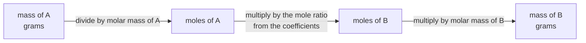

You balanced equations in [[Types of Chemical Reactions]] and treated the
coefficients as a bookkeeping device — whatever numbers make the atoms
come out even. Then [[The Mole]] gave those numbers a second job. This
page is what happens when you take that second job seriously, and it is
the reason the whole unit exists.

The question stoichiometry answers is the one every chemist actually
asks: *I have this much of that. How much of the other thing will I
get?*

## The coefficients are a ratio of particles, and therefore of moles

Look at

$$2\text{H}_2\text{(g)} + \text{O}_2\text{(g)} \rightarrow 2\text{H}_2\text{O(l)}$$

That equation says two hydrogen molecules react with one oxygen
molecule. It does **not** say two grams of hydrogen react with one gram
of oxygen, and if you use it that way every answer after it is wrong.

Here is the step that makes it usable. If two *molecules* of hydrogen
react with one molecule of oxygen, then two million react with one
million, and two moles react with one mole — the ratio survives being
scaled by any number, including $6.022 \times 10^{23}$. So the
coefficients are a **mole ratio**, and moles are something you can reach
from a balance reading.

The mass ratio, for comparison, is 4.03 g of hydrogen to 32.00 g of
oxygen. There is no way to see 2 : 1 in those numbers. That is why the
conversion to moles is not an extra step you could skip if you were
clever — it is the only place where the equation's information can get
into your calculation.

## One road, and it is always the same road

Every stoichiometry problem is this journey, or part of it.

Three steps, always in that order. The middle one is the only step that
uses the chemistry; the two on the outside are arithmetic with the
periodic table. Later pages hang extra approaches onto the two ends —
$n = cV$ for a solution in [[Concentration]], molar volume for a gas in
[[The Gas Laws]] — but the road through the middle never changes.

Two things follow that are worth saying plainly:

- **The equation must be balanced before you start.** An unbalanced
  equation has no mole ratio to give you. This is not a tidiness rule.
- **You never convert mass directly to mass.** If you find yourself
  multiplying a mass by a coefficient, stop — that is the single most
  common error in this unit, and it produces answers that look
  reasonable.

## Worked: how much carbon dioxide from 10.0 g of propane

Propane burns completely as

$$\text{C}_3\text{H}_8\text{(g)} + 5\text{O}_2\text{(g)} \rightarrow 3\text{CO}_2\text{(g)} + 4\text{H}_2\text{O(g)}$$

The molar mass of propane is $3(12.01) + 8(1.01) = 44.11$ g/mol, and of
carbon dioxide $12.01 + 2(16.00) = 44.01$ g/mol.

$$\begin{aligned} n(\text{C}_3\text{H}_8) &= \frac{10.0 \text{ g}}{44.11 \text{ g/mol}} = 0.2267 \text{ mol} \\ n(\text{CO}_2) &= 0.2267 \text{ mol} \times \frac{3 \text{ mol CO}_2}{1 \text{ mol C}_3\text{H}_8} = 0.6801 \text{ mol} \\ m(\text{CO}_2) &= 0.6801 \text{ mol} \times 44.01 \text{ g/mol} = 29.9 \text{ g} \end{aligned}$$

Ten grams of fuel, thirty grams of carbon dioxide. The extra mass is the
oxygen from the air, which is exactly what the equation said would
happen — five molecules of it per molecule of propane. Notice also that
the answer carries **three** significant figures because 10.0 g did; the
intermediate values were kept to four and rounded only at the end, which
is the habit set out in [[Significant Figures and Units]].

This number is the honest version of a claim people make loosely. A
barbecue cylinder does not "release its weight" in carbon dioxide. It
releases roughly three times its weight, and you can prove it with a
periodic table.

## What goes wrong, in order of frequency

- **The equation was not balanced.** Every subsequent step is then
  arithmetic on a false premise. Balance first, count the atoms, and
  only then start converting.
- **The ratio was used upside down.** Write it as a fraction with units
  in it — $\frac{3 \text{ mol CO}_2}{1 \text{ mol C}_3\text{H}_8}$ — and
  the wrong way up becomes visible immediately, because the units will
  not cancel.
- **A mass was treated as a mole count.** Especially when the numbers
  are convenient. 44.11 g of propane is one mole; 44 g of anything else
  is not.
- **Rounding partway through.** Rounding at each step and then again at
  the end can move the final digit. Carry one or two extra digits
  through and round once.
- **The answer has no units.** A number without units is not an answer
  to a chemistry question, and "29.9" could be grams, moles, or
  molecules.

Practise the road in both directions in [[Stoichiometry Practice]].

So far every problem has quietly assumed you have as much of the other
reactant as you need. Real reactions rarely oblige, and what happens
when one reactant runs out first is
[[Limiting Reagent and Yield]] — which is also where the number you
calculated meets the number you actually recovered.

%%curriculum-start%%
## Curriculum connection

![[D3.4]]

![[D2.5]]
%%curriculum-end%%
