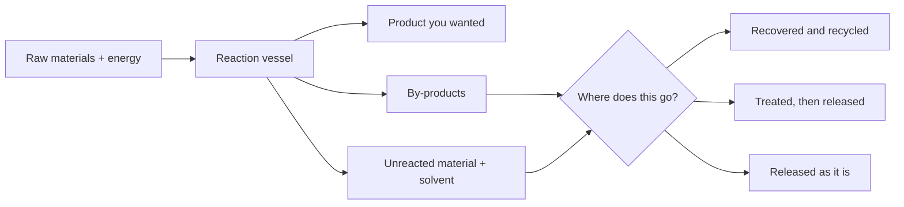

Every reaction you have run this unit was done in a test tube, with a
spatula tip of solid and a few millilitres of dilute solution, and the
waste went into a labelled beaker. Somewhere in Canada the same
chemistry is running continuously, in tonnes, beside a town.

This discussion is about what changes between those two sentences.

## The question

An industrial process brings a real benefit and a real cost, and the two
rarely land on the same people. What would make a process acceptable to
the community that hosts it — and who gets to decide that it is?

## Scale is not a bigger beaker

A reaction that is well behaved at the bench can be a completely
different engineering problem at scale, and the reasons are chemistry
rather than logistics.

- **Heat has nowhere to go.** A test tube is mostly surface; a reactor
  is mostly interior. A reaction that warms your hand through the glass
  will cook itself in a vessel, so industrial exothermic processes are
  built around removing heat as fast as they make it.
- **Rate becomes an economic quantity.** At the bench you wait. At scale
  the waiting is the cost, which is why so much industrial chemistry is
  really catalysis — finding a way to get the same products faster and
  cooler.
- **Every by-product becomes a stream.** In a test tube the side
  reaction is a faint smell. In a plant it is a pipe going somewhere,
  and somebody has to decide where.
- **Purity of feedstock stops being free.** Your reagents came clean in
  a bottle. Industrial inputs come out of the ground, and whatever came
  with them is now in the process.

The diagram is the whole discussion. Nothing in it is optional — the
arrows exist whether or not anyone plans them — and the argument is
about which of the three bottom boxes each stream ends up in.

## The arithmetic that makes scale different

Suppose a process converts 99% of its input into the intended product
and 1% into something else. At the bench that 1% is undetectable.

Run the same process on ten thousand tonnes of input and the 1% is one
hundred tonnes of a substance nobody designed, nobody wanted, and
somebody must now store, treat, sell, or release. A rounding error at
one scale is a waste-management problem at another, and no chemistry
changed — only the multiplier.

That is also why the two numbers used to judge an industrial reaction
answer different questions:

| Measure | The question it answers |
| --- | --- |
| Percentage yield | How much of the product I could have made did I get? |
| Atom economy | Of all the mass I put in, how much ended up in the product I wanted? |

A reaction can have a superb yield and a terrible atom economy — every
gram of input reacted exactly as intended, and most of that mass left as
something else. You will meet the first of those properly in
[[Limiting Reagent and Yield]]; the second is what an industrial chemist
is usually being paid to improve.

## What the chemistry actually does about it

Chemistry does not only create these problems. A good deal of it exists
to solve them, and every solution has a bill attached.

| The problem | The chemical fix | The cost of the fix |
| --- | --- | --- |
| Sulfur dioxide in flue gas from combustion and smelting | Scrub it with a base — lime or limestone — turning an acidic oxide into a solid salt | Consumes limestone and produces a solid product that must be used or landfilled |
| Carbon monoxide and unburned fuel from engines | A catalytic converter oxidises them to $\ce{CO2}$ and water and reduces nitrogen oxides toward $\ce{N2}$ | Depends on scarce platinum-group metals, which must themselves be mined |
| Acidic drainage from mine workings | Neutralise with lime | Ongoing forever, long after the mine closes |
| Unsafe drinking water | Coagulation and disinfection | Disinfection can form by-products that then have to be managed |
| Not enough nitrogen for crops | Synthesise ammonia from atmospheric $\ce{N2}$ | Very energy-intensive, and nitrogen that runs off does its own damage |

Notice what the right-hand column is not. It is not an argument that the
fixes are pointless — scrubbing genuinely removed a great deal of acidic
gas from the air over eastern North America, and ammonia synthesis
genuinely feeds a large fraction of the world. It is an argument that
every fix is a trade, and pretending otherwise is how you lose an
argument to somebody who has read the details.

The neutralisation in the first row is exactly the chemistry you did in
[[Oxides and Neutralisation]], run at a scale where it is measured in
truckloads.

## What to bring

- [ ] One process, named, that runs somewhere in Canada — pulp and
      paper, mining or smelting, chemical manufacture, fertiliser, fuel
      processing
- [ ] The main reaction, written as a balanced equation if you can find
      it
- [ ] What it produces that people want
- [ ] What it produces that nobody wants, and where that goes
- [ ] One change that would reduce the second without eliminating the
      first
- [ ] Who would pay for that change

> [!question]- The complication I will raise if nobody else does
> Both easy positions are available and both are lazy. "Industry is
> poisoning us" ignores that almost everything in this room — the
> glassware, the reagents, the building, the medication in somebody's
> bag — came out of an industrial process, and that the alternative to a
> regulated plant is usually an unregulated one somewhere else.
> "Regulation kills jobs" ignores that the community carrying the
> exposure is generally not the community collecting the profit, and
> that the costs of cleanup arrive decades after the revenue has gone.
> Take a position that survives both of those objections, or say plainly
> which one you are prepared to accept and why.

## Ground rules

- Attack arguments, never people.
- No invented numbers. If you cannot say where a figure came from, say
  "I could not find a figure" — that is a legitimate contribution.
- Steelman the other side, including the people who work there.

Afterwards, log it in your [[Chemistry Journal]]: the process, the
trade-off you found hardest to resolve, and whether your position
changed. This feeds directly into [[The Reaction Prediction]]. Related:
[[Types of Chemical Reactions]] and [[Combustion]].

%%curriculum-start%%
## Curriculum connection

![[C1.1]]

![[C1.2]]
%%curriculum-end%%
