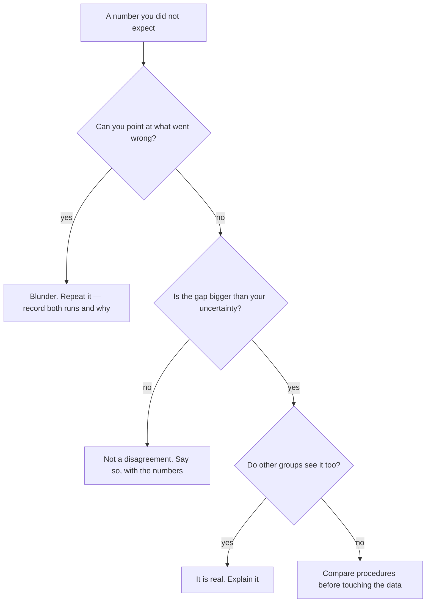

A result you did not expect is information. It is only a failure if you
throw it away without finding out which kind of unexpected it was.

Chemistry makes this sharper than last year did, because the surprises
now arrive as numbers. "It went a bit differently" is a feeling. "The
third trial came out 8% low and the other four agreed to within 1%" is a
lead worth following.

## The question we are arguing about

When is it honest to leave a data point out of your analysis, and when
is leaving it out the same thing as making the data up?

## Three different things people call a mistake

| Kind | Example | What you do about it |
| --- | --- | --- |
| A blunder | Read the wrong scale; used the wrong reagent; wrote 2.53 when the balance said 2.35 | Repeat the trial, and record that you did |
| A limitation of the method | A balance that resolves 0.01 g; solid left on the filter paper; a thermometer read through a fogged beaker | Report it, estimate its size, and say **which direction** it pushed the result |
| A genuine anomaly | Everything was done correctly and the number still disagrees | Investigate it — this is the interesting case |

The distinction matters because the three belong in different parts of a
report. Blunders belong in your notes. Limitations belong in the
conclusion of [[Writing a Lab Report]], where they earn marks. Anomalies
belong in the discussion, where they earn respect.

The middle row is the one that changes this year. Naming a limitation is
no longer enough; you have to say how big it is and which way it pushed
you. "Some product was lost on the filter paper" is a sentence anyone
can write. "Product lost on the filter paper can only reduce the mass we
recovered, so our figure is a lower bound on the true yield" is an
argument, and it is the version that gets marked.

## Deciding, in the moment

Two things the diagram never offers: a branch where you quietly delete
the point, and a branch where you decide a difference is real without
first comparing it against how well you can measure. That second check
is new this year and it is the one people skip — see
[[Significant Figures in Practice]] for how to make it.

## The rule about outliers

You may exclude a measurement **only** for a reason independent of the
fact that you disliked the answer — the sample was contaminated, the
crucible cracked, the balance had not settled, the burette was refilled
mid-titration. Write the reason down at the time.

"It did not fit the trend" is not a reason. It is the result you were
trying to test.

> [!important] The Grade 11 case you will meet in Unit 3
> When you calculate a percentage yield, sooner or later somebody in the
> room will get a figure **above 100%**. The instinct is to hide it,
> because a yield over 100% looks impossible and therefore looks like
> incompetence.
>
> It is neither. It is evidence, and it is quite specific evidence: your
> product weighed more than the reaction could possibly have made, so
> something else is on the balance with it. Water that was not dried
> off. Unreacted starting material. Filter paper fibres. Each of those
> is testable — dry it again and reweigh, and if the mass falls you have
> your answer. A yield of 104% honestly reported and chased down is
> worth far more here than a yield of 91% that was quietly nudged.

## Two results that were nearly binned

Lord Rayleigh measured the density of nitrogen twice: once on nitrogen
separated from air, once on nitrogen produced from a chemical compound.
The two disagreed slightly — a discrepancy that only showed up in the
third significant figure, small enough that almost anyone would have
called it experimental error and moved on. He did not. He and William
Ramsay went after the difference, and what was hiding inside
"atmospheric nitrogen" was argon: an entire family of elements that the
periodic table of the day had no column for.

William Perkin, at eighteen, was trying to synthesise a medicine and got
a dark sludge instead. Rather than washing it out, he noticed that it
dyed silk a brilliant purple, and the synthetic dye industry started in
his washing-up.

Neither went looking for what they found. Both simply refused to discard
something they could not explain — and in Rayleigh's case, the entire
discovery lived in a decimal place that a less careful worker would
never have measured, let alone trusted.

> [!note] What I actually want from you
> Not perfect data. I want to be able to reconstruct, from your record,
> exactly what happened — including the run that went badly and what you
> did next. A careful investigation that names its problems is worth
> more here than a tidy one that hides them, and [[How Marks Work]] says
> so in the categories.

Bring one thing that did not go as expected this unit, with the numbers.
We will sort the room's examples into the three kinds above and argue
about the borderline cases, which is where all the interesting ones
live. Related: [[What Counts as Evidence]] and [[Showing Growth]].
