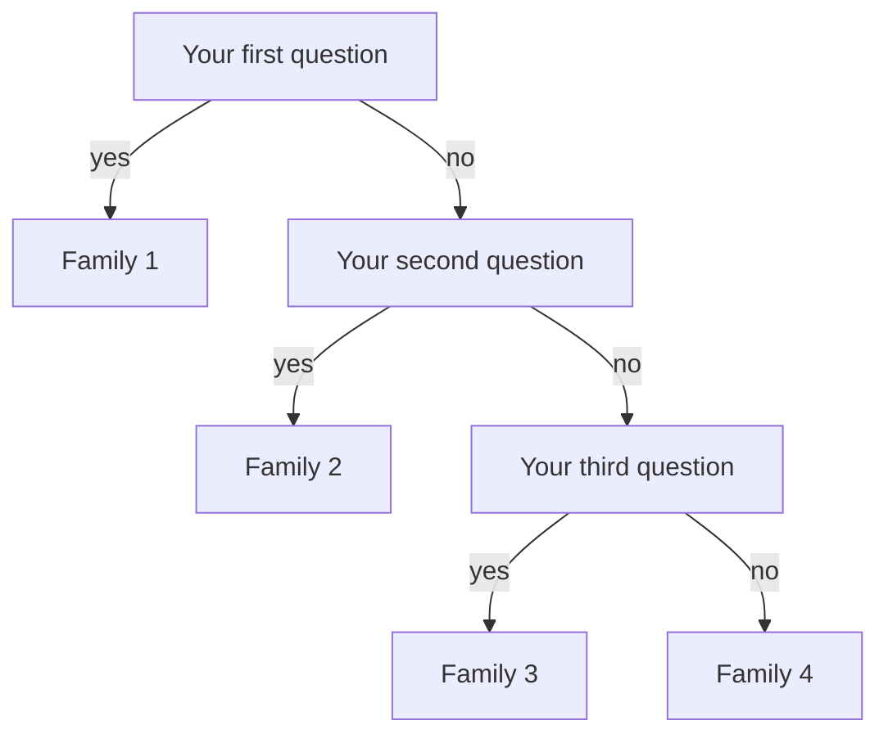

Five stations around the room. At each one, something happens. Nobody is
going to tell you what the five happenings have in common or how they
differ, because working that out is the whole job.

By the end of the period your group produces one thing: a **sorting
rule** that puts each of the five into a family, stated clearly enough
that another group could apply it to a sixth reaction they have never
seen.

## What you are trying to find out

There are a great many chemical reactions and only one of you. If every
reaction had to be learned individually the subject would be
unlearnable, so chemists sort. The question is whether the sorting is
**forced by what reactions do**, or whether it is a filing convenience
that could just as well have been done another way.

The way to find out is to sort them yourself, before you are handed
anybody's categories, and then see how close your families come to the
ones the subject settled on.

## What you have to work with

Five stations, each with a card giving the substances present. What the
products are is not on the card — that is what your tests are for.

| Station | What you are given |
| --- | --- |
| **A** | A strip of copper foil, tongs, a burner |
| **B** | Dilute hydrogen peroxide and a spatula tip of manganese(IV) oxide |
| **C** | Zinc granules and dilute hydrochloric acid, 1.0 mol/L |
| **D** | Calcium chloride solution and sodium carbonate solution, both 0.5 mol/L |
| **E** | A tealight candle, a cold dry beaker, and limewater |

And four diagnostic tests, which you must decide when to use:

- **Glowing splint.** Relights in the gas — the gas supports burning.
- **Burning splint at the mouth of the tube.** A squeaky pop — the gas
  burns.
- **Limewater.** Turns milky — carbon dioxide.
- **Universal indicator or litmus.** Tells you whether a solution has
  become acidic or basic.

Your design decisions, written down before you start:

- **Which test to run at which station, and in what order.** A test used
  at the wrong moment consumes the gas you needed. You get one clean
  attempt at some of these.
- **What evidence would convince you that a new substance was made**, as
  opposed to something merely dissolving, melting, or moving.
- **Which two stations you expect to end up in the same family**, and on
  what grounds.
- **How you will record a negative test.** "Splint did not relight" is a
  result and belongs in the table. A blank cell is not a result.

> [!danger] Flames and hydrogen in the same room — read this properly
> Stations A and E use an open flame. Station C makes a gas that burns.
> These stations are **physically separated** and the reason is not
> decorative.
>
> - **Collect only a small test tube of gas at station C**, and carry out
>   the burning splint test **at station C's own tray**, with the tube
>   pointed away from you and away from everybody else. Never bring a
>   flame to the reaction vessel, and never test a large volume.
> - **No burner is lit at station C at any time**, and no zinc-and-acid
>   tube travels to station A or E.
> - **Manganese(IV) oxide is a fine powder that is harmful if inhaled.**
>   Take a spatula tip, keep the lid on the jar, and do not tip, blow, or
>   dust it. Wash your hands afterwards.
> - **The peroxide reaction is fast and it warms up.** Use a large test
>   tube or a small beaker, never a stoppered one, and never anything
>   sealed. Dilute hydrogen peroxide stings in an eye and bleaches
>   clothing, and neither of those repairs itself.
> - **Hot copper foil looks exactly like cold copper foil.** It is
>   handled with tongs only and set down on the heat mat, never on the
>   bench top, and never picked up to check.
> - **Hair tied back and sleeves secured before any burner is lit.**
>   Candles included — a tealight is a small flame at exactly hair
>   height when you lean over to look at it.
> - Waft to smell, never inhale over a container. Nothing is tasted.
> - Acid, peroxide, and the calcium carbonate mixture go to the labelled
>   waste containers. **Nothing returns to a stock bottle.**
> - Tell me at once if anything catches, spills, splashes, or surprises
>   you.

## The prediction you write first

Before you visit a single station, in your journal:

1. **How many families you expect the five to fall into.** Commit to a
   number.
2. For each station, **what you expect the products to be** — as far as
   you can say — and which test you expect to confirm it.
3. **Which station will be hardest to classify**, and why.

Then, and this is the part worth doing properly: **write down the
sorting rule you expect to end up with.** One sentence per family.
Because you will change it, and the record of the change is the most
interesting thing you will produce today.

## What to collect

| Station | Substances before | Observations, with times where relevant | Tests run and results | Products you infer | Family you assign |
| --- | --- | --- | --- | --- | --- |
| A | | | | | |
| B | | | | | |
| C | | | | | |
| D | | | | | |
| E | | | | | |

Then turn your rule into a **key** — a sequence of yes/no questions that
lands each reaction in exactly one family. The shape looks like this,
and the wording of every box is yours:

A good key asks about the **number and kind of substances going in and
coming out**, not about what the reaction looked like. "Did it fizz" is
an observation; "did one substance become two" is a question with a
family behind it.

## What to bring to the consolidation discussion

- Your completed table, including every negative test.
- Your key, drawn out, with the questions in the order you actually
  apply them.
- **The rule you started with and the rule you finished with**, and the
  station that forced the change.
- **A sixth reaction test.** I will give each group a reaction it has
  not seen. Run your key on it and report where it lands, or report
  honestly that your key cannot decide.
- Your best guess at what the products were at each station, with the
  evidence attached to each guess.

## What you should not claim

- **A pop, a relit splint, and milky limewater identify three gases and
  nothing else.** They say nothing about the other product at that
  station. At station C you have evidence for hydrogen and no evidence
  at all about what is left in the tube.
- **Station A did not "turn the copper black".** Something new is on the
  surface. You have not established what, and "black coating" is what
  your data supports. Naming it would be borrowing a conclusion you have
  not earned.
- **Two reactions in the same family are not the same reaction.** Your
  families group by *pattern*, and a pattern is a claim about the shape
  of the equation, not about the substances, the rate, or the energy.
- **A key that sorts five reactions has been tested on five reactions.**
  That is a small number. The sixth reaction is the real test and it is
  perfectly respectable for your key to fail it.
- **Timing at station C is not a rate measurement, and it is biased
  low.** Zinc granules vary in surface area and the acid warms as it
  reacts, so a second trial in the same tube starts faster than the
  first. If you timed both, your second number is smaller for a reason
  that has nothing to do with chemistry you are studying today.

%%curriculum-start%%
## Curriculum connection

![[C2.3]]

![[C3.1]]

![[A1.6]]
%%curriculum-end%%
