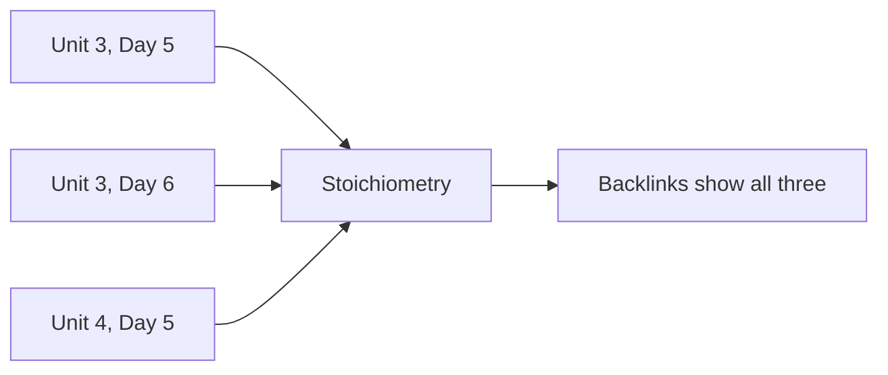

There are two kinds of page here, and knowing which is which makes the
whole site easier to use.

## Class pages

Under **All Classes**, one page per class, in order. Each carries:

- an **Agenda** — what we did, with links to everything we used
- **Things to do before our next class** — the homework, as a checklist

Class pages are the *narrative*: what happened, and when. They hold no
explanations at all, which is deliberate.

## Reference pages

Everything else — Concepts, Investigations, Exercises, Reference, Tasks,
Tutorials, Discussions, Setup — is *reference*. Each is written once and
linked from however many class pages need it.

Nobody builds that backlinks list. It is assembled from the links
themselves every time the site is rebuilt, which is why linking
generously costs nothing now and pays off later.

## Why not simply put the explanation on the class page?

Because then the mole would be explained in five places, and correcting
an error would mean correcting it five times. In practice it would be
corrected once and left wrong four times, and the four stale copies
would be indistinguishable from the good one.

So: **each idea lives in exactly one page, and everything else links to
it.** If you ever find the same explanation written out twice on this
site, that is a bug, and I would like to know.

## The Reference folder does a different job from Concepts

These two get confused, and the difference is worth stating.

| Folder | What is in it | You open it |
| --- | --- | --- |
| **Concepts** | Explanations — why something is true, and where it stops being true | When you are trying to understand |
| **Reference** | Tables and rules — the polyatomic ions, the solubility rules, the activity series | When you are trying to *do* something and need a value |

[[The Mole]] explains why a counting unit was needed and how the number
was chosen. [[Significant Figures and Units]] tells you the rules in the
shortest form that is still correct. You want the first one on a Tuesday
and the second one in the middle of a calculation, and putting them on
the same page would make both worse.

This course leans on its Reference pages much more heavily than Grade 10
did, because chemistry runs on lookup tables in a way that a survey
science course does not.

## Where your own work fits

The Portfolios folder is the one part of this structure that is yours
rather than mine. It follows the same rule: one entry per piece of
thinking, written close to the work, linked from wherever it is
relevant. See [[Chemistry Journal]].

> [!tip] Which page do I actually want?
> "What did we do on Tuesday?" → a class page.
> "How does that work again?" → a Concepts page.
> "What is the formula for sulfate?" → a Reference page.
> "How do I *do* it?" → a Tutorials page.
> "When did we cover this?" → open the concept page and read its
> backlinks.

Next: [[What This Site Can Do]], or [[Using This Site]] if you want the
short version.
