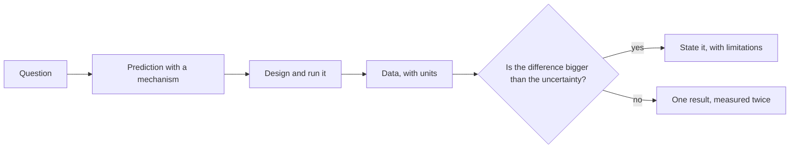
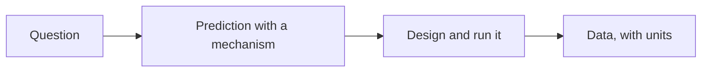
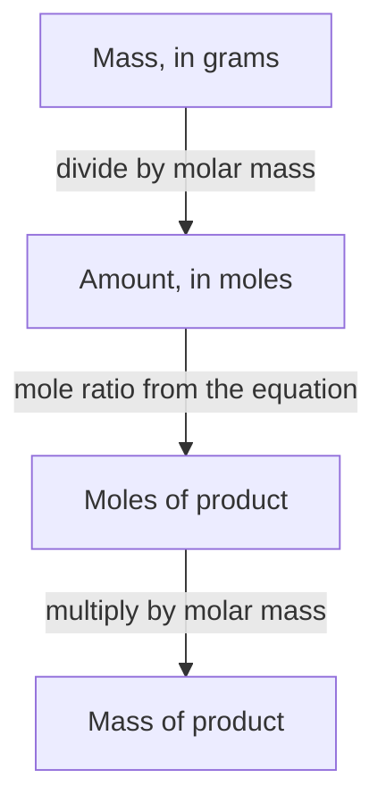
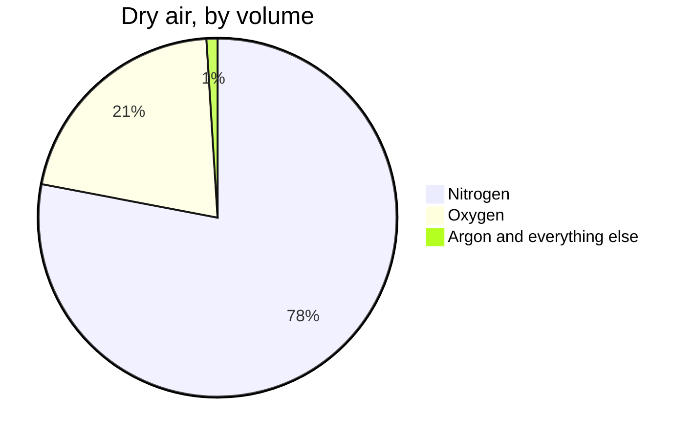

This page has two audiences. Students: it explains why the notes look
the way they do. Teachers: it is a working reference for everything you
can put in a page, with the source shown beside every example.

Everything below is written in **Markdown** — plain text with a few
marks of punctuation that mean something. If you can write a text
message, you can write this.

---

## Text that carries meaning

You get **bold**, *italic*, ~~struck through~~, and ==highlighted==
text. Highlighting is the one worth knowing: it catches the eye better
than bold when a single ==limiting reagent== has to stand out inside a
paragraph.

**How that was made:**

```markdown
**bold**, *italic*, ~~struck through~~, ==highlighted==
```

Arrows written as `->` become proper arrows: reactants -> products ->
evidence.

Keyboard keys look like keys: press <kbd>⌘</kbd> + <kbd>K</kbd> to
search.

---

## Headings, and the table of contents

Every `##` heading becomes a link in **Navigate this page**, over on the
right. Nothing builds that list by hand — it is assembled from the
headings as the page is built, so it can never fall out of step with the
page it describes.

Deeper headings nest underneath: a `###` sits inside the `##` above it.

**How that was made:** `##` at the start of a line, and `###` for a
sub-heading.

```markdown
## Callouts

### Foldable callouts
```

> [!tip] Write headings for the person skimming
> The table of contents is the first thing many students read.
> "Subtraction is where precision goes to die" tells them what is there;
> "More on this" does not.

### Turning it off

A short page, or one that is mostly a list, reads better without a
contents panel. One line in the frontmatter:

```yaml
---
enableToc: false
---
```

Every class page in [[All Classes/index|All Classes]] uses this. Open
[[Unit 1, Day 1]] and there is no "Navigate this page" panel, even
though the page has headings that would otherwise appear there — an
agenda of six items does not need navigating.

---

## Callouts

Callouts lift something out of the flow of the page. There are a dozen
kinds, each with its own colour and icon, so students learn to recognise
them at a glance.

> [!note] Note
> Neutral information worth setting apart.

> [!tip] Tip
> A shortcut, a habit, or something that makes the work easier.

> [!important] Important
> The one thing to take away if you take away nothing else.

> [!warning] Warning
> Where people usually go wrong.

> [!danger] Safety
> Used in this course only for physical safety in the lab.

> [!question] Question
> Something to think about rather than something to know.

> [!example] Example
> A worked case.

> [!abstract] At a glance
> Used at the top of task pages for the format and what is due.

**How that was made:** a blockquote with the kind named in brackets.

```markdown
> [!warning] Where people usually go wrong
> The text of the callout goes here.
```

### Foldable callouts

Add a `-` after the kind and the callout starts collapsed. Clicking the
title opens it. This is how answers, hints, and worked solutions stay on
the page without giving themselves away.

> [!success]- Answer: how many moles in 4.6 g of sodium chloride?
> The molar mass is 58.44 g/mol, so
> $n = 4.6 \div 58.44 = 0.079 \text{ mol}$ — two significant figures,
> because the mass had two.

**How that was made:** the `-` after the kind is the whole difference.

```markdown
> [!success]- Answer: how many moles in 4.6 g?
> The hidden content.
```

---

## Mathematics and chemistry

Inline maths sits inside a sentence: a solution of concentration
$c = 0.100\ \text{mol/L}$ in a volume $V = 0.250\ \text{L}$ contains
$n = 0.0250\ \text{mol}$.

Display maths gets a line of its own, centred:

$$n = \frac{m}{M} \qquad c = \frac{n}{V} \qquad PV = nRT$$

Chemistry is written inside `\ce{...}`. Everything in there is read as
chemistry, so subscripts sit low, charges sit high, states sit in
brackets, and reaction arrows are arrows rather than a hyphen and a
greater-than sign:

$$\ce{CH4(g) + 2O2(g) -> CO2(g) + 2H2O(g)}$$

$$\ce{HCl(aq) + NaOH(aq) -> NaCl(aq) + H2O(l)}$$

Ions carry their charge properly — sulfate is $\ce{SO4^2-}$ and
ammonium is $\ce{NH4+}$ — which matters, because
$\ce{SO4^2-}$ and $\ce{SO3^2-}$ are different substances and
the difference is one character.

Multi-step working goes on a single line, aligned on the equals signs:

$$\begin{aligned} n &= \frac{2.46\ \text{g}}{58.44\ \text{g/mol}} \\ &= 0.0421\ \text{mol} \end{aligned}$$

**How that was made:** single dollar signs keep it in the sentence,
double ones give it a line of its own.

```markdown
Inline: $c = 0.100\ \text{mol/L}$

Display: $$\ce{CH4 + 2O2 -> CO2 + 2H2O}$$
```

### Writing chemistry with `\ce{}`

Everything chemical on this site is typed inside `\ce{}`, and it is worth
ten minutes once. You type roughly what you would say aloud; it works out
which digits are subscripts, which are coefficients, and where the
spacing goes.

| What you type | What appears | What it means |
| --- | --- | --- |
| `$\ce{H2O}$` | $\ce{H2O}$ | Digits drop to subscripts |
| `$\ce{2H2O}$` | $\ce{2H2O}$ | A digit in front is a coefficient |
| `$\ce{SO4^2-}$` | $\ce{SO4^2-}$ | A charge, number before sign |
| `$\ce{Ca(OH)2}$` | $\ce{Ca(OH)2}$ | Brackets as you write them |
| `$\ce{CaCO3(s)}$` | $\ce{CaCO3(s)}$ | A state, typed literally |
| `$\ce{2H2 + O2 -> 2H2O}$` | $\ce{2H2 + O2 -> 2H2O}$ | The reaction arrow |
| `$\ce{CaCO3(s) <=> CaO(s) + CO2(g)}$` | $\ce{CaCO3(s) <=> CaO(s) + CO2(g)}$ | The equilibrium arrow |
| `$\ce{CuSO4 * 5H2O}$` | $\ce{CuSO4 * 5H2O}$ | The dot in a hydrate |
| `$\ce{AgCl v}$` | $\ce{AgCl v}$ | Precipitate down, gas up |
| `$\ce{Zn^2+ + 2e- -> Zn}$` | $\ce{Zn^2+ + 2e- -> Zn}$ | Electrons behave like ions |
| `$\ce{->[heat]}$` | $\ce{->[heat]}$ | A condition above the arrow |

Two habits worth keeping:

- **Anything chemical goes inside `\ce{}`**, including a formula in the
  middle of a sentence, like $\ce{NaHCO3}$. Outside it, `H_2O` comes out
  in maths italic — the convention for *variables*, which reads wrongly
  for an element.
- **A display equation stays on one physical line.** A `$$` span broken
  across lines, indented four spaces, or spread down a callout hits a
  markdown seam and shatters.

---

## Diagrams

Diagrams are **written, not drawn** — which means they can be edited in
seconds, they never need a graphics program, and a change to one shows
up in a diff.

### Flowchart



**How that was made:** not a picture — these lines of text, between two
fence lines that say `mermaid`.

````markdown

````

`-->` draws an arrow, `["…"]` makes a box, `{"…"}` makes a decision
diamond, and `-->|yes|` labels the arrow. Change a word and the diagram
redraws.

### Processes



That diagram is the whole of [[Stoichiometry]] in four boxes, which is
roughly the point of drawing it.

### Proportions



Carbon dioxide is inside that last sliver.[^1]

---

## Tables

**How that was made:** rows of text separated by `|`, with a line of
dashes under the headings.

| Quantity | Symbol | Unit | Where it turns up |
| --- | --- | --- | --- |
| Amount of substance | $n$ | mole (mol) | [[The Mole\|the counting unit]] |
| Molar mass | $M$ | grams per mole (g/mol) | [[Molar Mass and Composition]] |
| Concentration | $c$ | moles per litre (mol/L) | [[Concentration]] |

Maths works inside table cells, and so do links — which matters more
than it sounds, because it means a summary table can be a navigation aid
rather than a dead end.

> [!note] For teachers: escape the pipe inside a table cell
> A wikilink with different display words uses a pipe, and so does the
> table. Inside a table cell, write `[[The Mole\|the counting unit]]`
> with a backslash, or the row splits into an extra column.

---

## Checklists

**How that was made:** a list where each line starts with `- [ ]`, or
`- [x]` for one already done.

- [ ] Eye protection on
- [ ] Procedure checked by the teacher
- [x] Prediction written down before measuring
- [ ] Waste route confirmed
- [ ] Station cleaned

On the site they are read-only — the boxes show what the page says, and
clicking one does nothing. Copied into a notebook, they are useful for
keeping your place during a lab.

---

## Code

**How that was made:** three backticks and the name of a language, the
code, then three backticks to close it.

````markdown
```python
def moles(mass_in_grams, molar_mass):
    return mass_in_grams / molar_mass
```
````

```python
def moles(mass_in_grams, molar_mass):
    return mass_in_grams / molar_mass

print(round(moles(2.46, 58.44), 4), "mol")
```

Syntax colouring follows the language you name after the opening fence
and adapts to light or dark mode. **This course does not ask you to
write any code** — it is here because the site supports it, and a
teacher adapting these pages for a computer science course will want to
know.

---

## Links between pages

This is what makes the site more than a pile of documents.

- A plain link: [[The Mole]]
- A link with different words:
  [[The Mole|why chemists needed a counting unit at all]]
- A link to a section:
  [[The Mole#Why this is the hinge of the course]]

**How that was made:** double square brackets.

```markdown
[[The Mole]]
[[The Mole|different words for the link]]
[[The Mole#Why this is the hinge of the course]]
```

### Transclusion — one page inside another

**How that was made:** `![[Page name]]` — a link with an exclamation
mark in front of it. Below, the help-session times are pulled in live
rather than copied:

![[Help Sessions]]

Change the source page and every page that embeds it updates. That is
how a section landing page always shows the current class agenda without
anybody maintaining a second copy of it. It is also how the curriculum
expectations appear at the foot of a concept page — the wording lives in
one file and is quoted everywhere it applies.

### Backlinks

Scroll to the bottom of any page and you will find **Backlinks** — every
page that links *to* this one, gathered automatically. Nobody maintains
that list, which is why linking generously costs nothing and pays off
later.

---

## Hover previews

Hover over [[Polyatomic Ions]] without clicking. The page appears in a
small window. A student checking one formula mid-calculation does not
lose their place — which, in a course with this much looking-up in it,
is the feature they will use most.

---

## Footnotes

**How that was made:** `[^1]` where the marker goes, and a matching
`[^1]:` line anywhere in the page.

[^1]: Carbon dioxide makes up well under a tenth of one percent of dry
    air by volume, which is why it does not get its own slice above. Its
    effect on the planet's energy balance is out of all proportion to
    that share — the reason being part of what
    [[Gases and the Atmosphere]] is for.

---

## Tags

**How that was made:** a `tags` list in the frontmatter at the very top
of the page.

```yaml
---
tags:
  - quantities
  - safety
---
```

Every tag becomes a page listing everything filed under it.

---

## What you cannot see

Two things on this page are invisible in the browser:

1. **Comments.** Text wrapped in `%%` double percent marks `%%` never
   reaches the site. Useful for notes to yourself in a page you are
   still writing.
2. **Holding a page back.** A page with `publish: false` in its
   frontmatter is skipped entirely when the site is built. Write next
   week's lesson today and publish it when you are ready.

%% This sentence is a comment. If you can read it on the
website, something is broken. %%

> [!tip] For teachers reading this
> A shared page can also be published to one section and held back from
> another: look at the top of this page's source and you will find a
> `createdSection1` / `publishForSection1` pair for each of your
> sections. Set one section's key to `false` and the page waits for
> that class — useful when your two classes have drifted a few days
> apart and one of them has not done the titration yet.

---

## The point of all this

None of it is decoration. Each feature removes a reason for a page to go
out of date:

| Feature | The problem it solves |
| --- | --- |
| Transclusion | The same text copied into six places, five of them stale |
| Backlinks | "Where did we use this again?" |
| Diagrams as text | Rebuilding a whole diagram to change one arrow |
| Holding a page back | Keeping unpublished work in some other file somewhere |
| Typeset chemistry | Screenshotting equations out of a document |
| Hover previews | Losing your place to check one polyatomic ion |

Write it once, link to it everywhere.
