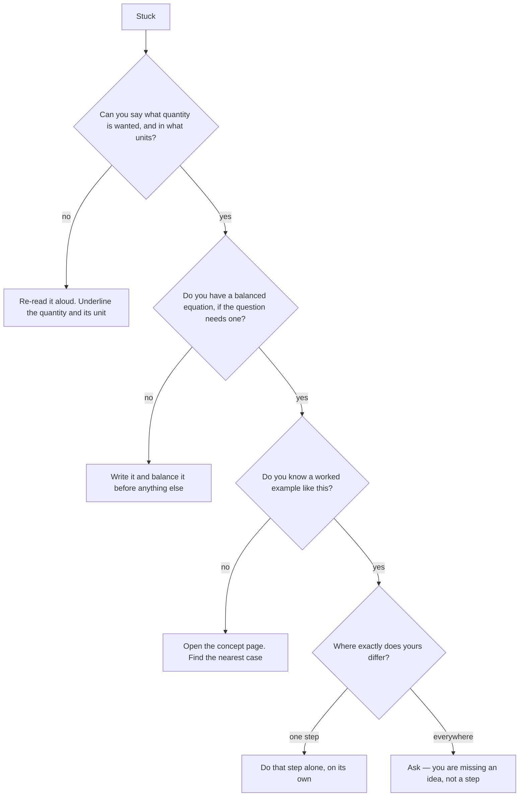

Being stuck is normal and is not a sign of anything. Being stuck for
forty minutes without changing what you are doing is the part worth
fixing.

## First, work out which kind of stuck you are

The bottom-right branch matters most. If your problem differs from the
worked example *everywhere*, no amount of staring will close the gap,
because what you are missing is a concept rather than a step. That is
the moment to ask, not an hour later.

## Units are a debugging tool, not decoration

This is the single most useful habit in the course and almost nobody
arrives with it.

Write every quantity with its unit, then write the unit you are trying
to end up with. Now check whether the operation you are about to perform
produces that unit.

- Grams divided by grams per mole gives moles. Correct.
- Grams multiplied by grams per mole gives grams squared per mole, which
  is not a thing. You divided when you should have multiplied, or the
  other way round, and the units caught it before the arithmetic did.
- Moles per litre times litres gives moles. Correct.
- Moles per litre divided by litres gives moles per litre squared,
  which is your signal to stop.

Most "I don't know which formula to use" is really "I have not written
the units down". If you carry them through every line, a substantial
fraction of wrong answers refuse to be written.

## Then ask: is this number a plausible size?

The second habit. Before you accept an answer, ask whether it could be
true.

- A few grams of anything is a small fraction of a mole, not four
  hundred moles.
- A percentage yield of 3% or of 900% is telling you something went
  wrong in the arithmetic, unless you can say exactly why.
- A concentration of 40 mol/L is denser than most things dissolve.
- A gas volume of 0.002 L from a spatula of solid is too small; a
  volume of 2000 L is too large for a bench.

You do not need to know the right answer to know that an answer is
absurd, and noticing takes five seconds. This is also, quietly, how
professionals catch their own mistakes.

## Things to try before asking, in order of how often they work

1. **Say the question out loud.** A surprising share of stuck is
   misreading, and your ear catches what your eye skipped.
2. **Write down what you know, with units**, and what you want, with
   its unit.
3. **Write the balanced equation** and mark on it which quantity you
   were given and which you want. Half of the stoichiometry problems in
   this course solve themselves at that point, because the route becomes
   visible.
4. **Do the simpler version.** One mole instead of 0.0374. A 1:1 ratio
   instead of 2:3. Then look at what the awkward version changed.
5. **Find the sentence where your understanding stops.** Not the page —
   the sentence. That sentence is your question.

## Then ask well

"I don't get it" gets you a re-explanation of something you may already
understand. Any of these gets you a real answer in one exchange:

| Instead of | Say |
| --- | --- |
| "I don't get the mole" | "I can get from grams to moles, but I don't know why the ratio from the equation goes in there" |
| "The lab didn't work" | "We calculated 1.42 g of precipitate and recovered 1.31 g, and I can't tell if that gap is losses or an error" |
| "I'm lost on titrations" | "I follow it up to the endpoint, then I lose which concentration I'm solving for" |
| "My answer's wrong" | "I get 0.0421 and the back of the page says 0.0842, which is exactly double" |

Each of those tells me where to start. The first column tells me
nothing, so my first three questions have to be diagnostic — and that is
three minutes you did not need to spend. The last row is the best kind
of question, because "exactly double" is a clue that points at one
specific thing.

> [!note] Twenty minutes, then ask
> That is the rule I would like you to use on homework. Twenty minutes
> of genuine attempts, **with the attempts written down**, and then stop
> and bring them to me. The written attempts are not evidence against
> you; they are the most useful thing you can hand me, because a wrong
> attempt shows exactly which idea is bent.

Where to ask: [[Getting Help]] has the routes and [[Help Sessions]] has
the times. If the problem is that your result disagrees with everyone
else's, that is a different and more interesting situation — see
[[Mistakes Are Data]].
