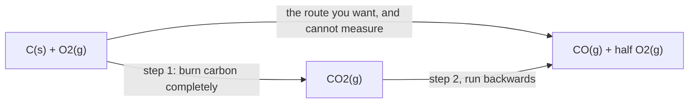

In [[Testing Hess's Law]] you measured the enthalpy change of two
reactions and then measured a third that was, on paper, the sum of them.
The third answer came out close to the sum of the first two — not
exactly, because of the heat losses [[Calorimetry]] warned you about,
but close enough that the pattern was not an accident.

You had just tested a law, in the proper sense: a prediction that could
have failed and did not.

## Enthalpy is a state function

Here is the reason, and it is one sentence:

> The enthalpy of a system depends only on **what state the system is
> in** — which substances, in which physical states, at what
> temperature and pressure — and not at all on how it got there.

A quantity like that is called a **state function**. Altitude is the
everyday example. Two hikers reach the same summit from the same
trailhead by completely different trails; one walks eight kilometres and
the other twenty. Their *distances walked* differ enormously. Their
*changes in altitude* are identical, because altitude is a property of
where you are standing, not of how you arrived.

Enthalpy behaves the same way. Start with the same reactants and finish
with the same products, and $\Delta H$ is the same whatever route the
chemistry took — one step or six, fast or slow, catalysed or not.

**Hess's law** is the immediate consequence:

$$\Delta H_\text{overall} = \Delta H_1 + \Delta H_2 + \Delta H_3 + \cdots$$

The enthalpy change of a reaction equals the sum of the enthalpy changes
of any set of steps that add up to it. And that turns out to be enormously
useful, because plenty of reactions cannot be measured directly. Some
are too slow. Some are too violent. Some refuse to produce only the
product you asked for.

Burning carbon in a limited supply of oxygen gives a mixture of carbon
monoxide and carbon dioxide, in proportions you cannot control. So the
enthalpy change for making carbon monoxide alone has never been measured
in a calorimeter by anybody. It is known precisely all the same.

## Three moves, and nothing else

To make a set of given equations add up to your target, you are allowed
to do three things.

| Move | Effect on the equation | Effect on $\Delta H$ |
| --- | --- | --- |
| Reverse it | reactants and products swap | change the sign |
| Multiply by a factor | every coefficient scales | multiply $\Delta H$ by the same factor |
| Add two equations | species combine on each side | add the two $\Delta H$ values |

Then cancel anything appearing on both sides — and cancel it **only if
it is identical, state symbol included.** Water as a liquid does not
cancel water as a vapour. They are different states of the system, so
they have different enthalpies, and treating them as the same species is
the most expensive error available in this topic.

A working order that avoids most trouble:

1. Write the **target** equation and leave space above it.
2. Find the given equation containing the first reactant of the target.
   Arrange it — reverse or multiply — so that species is on the correct
   side with the correct coefficient.
3. Repeat for the next species, and the next.
4. Add everything up and check that the intermediates cancel completely.
   If something is left over that should not be there, one of your
   arrangements is wrong; go back rather than fudging.

> [!example]- The carbon monoxide problem, worked symbolically
> **Target:** $\text{C(s)} + \tfrac{1}{2}\text{O}_2\text{(g)} \rightarrow \text{CO(g)}$
>
> **Given (1):** $\text{C(s)} + \text{O}_2\text{(g)} \rightarrow \text{CO}_2\text{(g)}$, with $\Delta H_1$
>
> **Given (2):** $\text{CO(g)} + \tfrac{1}{2}\text{O}_2\text{(g)} \rightarrow \text{CO}_2\text{(g)}$, with $\Delta H_2$
>
> Equation (1) already has carbon on the left, where the target needs
> it, so leave it alone. Equation (2) has carbon monoxide on the left
> and the target needs it on the right, so **reverse** it — and change
> the sign:
>
> $$\text{CO}_2\text{(g)} \rightarrow \text{CO(g)} + \tfrac{1}{2}\text{O}_2\text{(g)} \qquad -\Delta H_2$$
>
> Add that to equation (1). Carbon dioxide appears on both sides and
> cancels completely. Of the oxygen, one mole is used on the left and
> half a mole is produced on the right, leaving half a mole on the left:
>
> $$\text{C(s)} + \tfrac{1}{2}\text{O}_2\text{(g)} \rightarrow \text{CO(g)} \qquad \Delta H = \Delta H_1 - \Delta H_2$$
>
> The target, exactly. Substitute the two combustion enthalpies from
> your data booklet and the number falls out — and it is a number for a
> reaction that has never been run cleanly enough to measure.

## The shortcut: enthalpies of formation

Doing that by hand every time would be tedious, so chemistry agreed on a
common reference point.

A **standard enthalpy of formation** is the enthalpy change when exactly
**one mole** of a substance is formed from its **elements in their
standard states**. Two consequences follow at once.

First, the enthalpy of formation of an element in its standard state is
**zero**, by definition. Forming oxygen gas from oxygen gas is not a
change. The zero is a choice of origin, like sea level for altitude, not
a claim that elements contain no energy.

Second, once every substance has a formation value measured against that
common origin, any reaction can be assembled from them:

$$\Delta H_\text{rxn} = \sum n\,\Delta H_f(\text{products}) - \sum n\,\Delta H_f(\text{reactants})$$

That formula is **not a new law**. It is Hess's law with the route
chosen for you: take the reactants apart into their elements, then build
the products from those elements. Products minus reactants, each
multiplied by its coefficient from the balanced equation.

> [!warning] An enthalpy of reaction is not an enthalpy of formation
> Every formation enthalpy is a reaction enthalpy. Almost no reaction
> enthalpy is a formation enthalpy.
>
> To qualify, a reaction must produce exactly **one mole** of exactly
> **one product**, from **elements** only, each in its standard state.
> The combustion of methane produces two products from a compound and an
> element, so its $\Delta H$ is a combustion enthalpy and belongs in a
> different column of the booklet. Reaching for the wrong column gives
> an answer that is wrong by a large margin and looks perfectly
> reasonable.

Practise both routes — assembling equations by hand, and running the
formation formula — in [[Hess's Law Practice]]. Then the unit changes
question completely: [[Rates of Reaction]] asks not how far the energy
went, but how long it took, and the answer to one says nothing about the
answer to the other.

%%curriculum-start%%
## Curriculum connection

![[D3.4]]

![[D2.5]]

![[D2.7]]
%%curriculum-end%%
