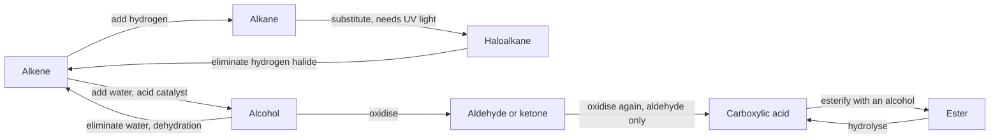

In [[Identifying an Unknown Organic Compound]] you used reactions as
**tests** — decolourise this, warm with that, see whether anything
happens. This page turns them around. The same reactions, read forwards
instead of backwards, are how one class of compound is turned into
another on purpose.

That is most of what industrial organic chemistry is: not making
molecules out of nothing, but converting a molecule you have into the
molecule you want, one functional group at a time.

## The map

Almost everything in this unit is one of six moves, and they connect the
classes from [[Functional Groups]] into a single network.

Notice how many arrows come in pairs pointing opposite ways. Addition
and elimination are one reaction run in two directions; esterification
and hydrolysis likewise. Which way it goes is a matter of conditions,
and by Unit 4 you will have the language for that — see
[[Dynamic Equilibrium]].

## Adding, substituting, eliminating

**Addition** happens at a multiple bond. The second bond of the pair
opens, and something attaches to each of the two carbons. **No atoms are
lost.**

$$\ce{CH2=CH2 + Br2 -> CH2BrCH2Br}$$

That specific reaction is the bromine water test. Orange-brown bromine
water added to an alkene loses its colour immediately, because the
bromine is consumed. Added to an alkane in the dark, nothing happens.
The alkene is **unsaturated** — it has room to take more atoms on — and
the alkane is **saturated** and does not.

Addition also covers hydrogenation (adding $\ce{H2}$ over a metal
catalyst, which is how liquid oils are hardened into solid fats),
adding a hydrogen halide, and adding water across a double bond with an
acid catalyst to make an alcohol.

**Substitution** replaces one atom or group with another. Alkanes are
unreactive, and it takes ultraviolet light to start one:

$$\ce{CH4 + Cl2 -> CH3Cl + HCl}$$

The contrast with addition is the thing to hold on to. In an addition,
the product contains everything that went in. In a substitution,
something leaves — here, as $\ce{HCl}$.

**Elimination** is addition reversed: a small molecule is pulled out and
a multiple bond forms in the gap. Heating an alcohol with concentrated
sulfuric acid removes water and leaves an alkene. That reaction needs a
concentrated acid and heat, which is a combination handled by your
teacher, not at your bench.

## The oxidation ladder

In organic chemistry, **oxidation** usually means gaining oxygen or
losing hydrogen, and **reduction** means the reverse. That is a working
definition rather than the real one; the rigorous version, in terms of
electrons and oxidation numbers, arrives in [[Redox Bookkeeping]] and
gives the same answers.

Alcohols climb a ladder, and where a given alcohol stops depends on its
structure:

| Alcohol | Oxidises to | Then to | Why it stops where it does |
| --- | --- | --- | --- |
| Primary | aldehyde | carboxylic acid | two hydrogens on that carbon, so two rungs available |
| Secondary | ketone | — | only one hydrogen there; the ketone has none left |
| Tertiary | no reaction | — | no hydrogen on the carbon bearing the $-\ce{OH}$ at all |

That table is not three separate facts. It is one fact — *oxidation
removes a hydrogen from the carbon carrying the $-\ce{OH}$* — applied
to three structures. Count the hydrogens on that carbon and the table
writes itself.

**Combustion** is the far end of the same ladder: complete oxidation to
carbon dioxide and water, releasing a lot of energy, which is why
[[Enthalpy]] opens next unit with a combustion example. Incomplete
combustion, with too little oxygen, gives carbon monoxide and soot
instead — the same fuel, a different product, and one of them is
lethal in an unventilated room.

> [!warning] Two different meanings of the word "saturated"
> A **saturated hydrocarbon** has no multiple bonds. A **saturated
> solution** has as much solute dissolved as it can hold. They share a
> word and share nothing else, and both appear in this course within a
> few weeks of each other. Read the noun before you read the adjective.

## Esterification and hydrolysis

Warm a carboxylic acid with an alcohol and a trace of acid catalyst, and
you get an ester and water:

$$\ce{CH3COOH + C2H5OH <=> CH3COOC2H5 + H2O}$$

This is a **condensation** reaction: two molecules join and a small
molecule — here water — is expelled from the join. That mechanism is
worth naming carefully now, because [[Polymers]] is about doing it
thousands of times in a row.

The double arrow is not decoration. Esterification does not go to
completion; it settles part-way, with all four substances present. Run
it in the other direction by adding water instead of removing it and you
have **hydrolysis** — the ester is split back into its acid and its
alcohol. Do the hydrolysis with sodium hydroxide instead and it goes to
completion, because the acid is converted to its salt and taken out of
the reaction as it forms. That version is centuries old and is how soap
is made.

Esters are the reason so much of this unit smells pleasant. Short esters
carry the odour of fruit, and the same compounds are used as flavourings
and in perfume — which is a good place to start
[[Chemistry We Live With]], and a reminder that the molecule does not
care whether it came out of an orange or a flask.

Analyse the reactions themselves, with real reagents and real
observations, in [[Identifying an Unknown Organic Compound]].

%%curriculum-start%%
## Curriculum connection

![[B3.3]]

![[B2.4]]
%%curriculum-end%%
