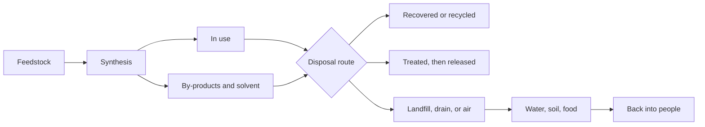

You have spent a unit learning that a molecule's behaviour is written
into its structure — which groups it carries, how polar it is, what it
can hydrogen bond to. This discussion takes that idea out of the
stockroom and asks what happens when one of those molecules turns up in
a bottle, on a field, inside a package, or inside a person.

Last year the same argument was about substances in general. This year
it is about **organic** compounds specifically, and structure is the
whole of the argument rather than the background to it.

## The question

Pick an organic compound people actually use. Is it worth using — and if
it is not, what would you replace it with, and how do you know the
replacement is better?

That last clause is the hard half, and it is where most of the period
will go.

## Structure decides what the molecule does to you

Three properties settle most of the argument, and you can predict all
three from a structural formula before you look anything up.

**Where it goes in a body.** A molecule that is mostly hydrocarbon has
little to hydrogen bond with, so water does a poor job of dissolving it
and fat does a good one. Substances like that are not excreted quickly;
they partition into fatty tissue and stay, and the dose that matters
becomes the accumulated dose rather than the daily one. Add a polar
group — a hydroxyl, a carboxyl — and the same skeleton behaves
completely differently. This is [[Polarity]] and
[[Intermolecular Forces]] doing pharmacology.

**How long it lasts in the environment.** Persistence is not a mysterious
property of "chemicals". It is a statement about which bonds something
can be broken at. Esters and amides can be hydrolysed, so nature has a
route in. A polymer chain of nothing but carbon–carbon and carbon–hydrogen
bonds offers no such site, which is why some plastics fragment
mechanically into smaller and smaller pieces without actually breaking
down chemically. Carbon–fluorine bonds are among the strongest single
bonds carbon forms, and compounds built around them are correspondingly
hard for anything to take apart.

**What it does when it gets there.** The functional group is the
reactive part — see [[Functional Groups]] — so it is the group, not the
carbon count, that predicts whether a molecule will react with a
protein, an enzyme site, or your skin.

> [!important] Persistence and toxicity are separate axes
> A compound can be harmless and immortal, or nasty and gone by
> Thursday, and the two need different responses. Something acutely
> toxic that degrades in days is a handling problem: control the
> exposure and the problem ends. Something barely toxic at all that
> never degrades is an accumulation problem, and there is no version of
> "be careful" that solves it, because the decision was made the day it
> was manufactured. Arguments in this room collapse constantly because
> one person is talking about one axis and one about the other.

## Where the molecule goes after you are finished with it

Every compound has a life beyond the moment of use, and the arrows below
exist whether or not anybody planned them.

The argument is about which of the three boxes on the right each stream
lands in — and about the fact that the bottom path exists at all. A
compound that is stable enough to be useful is often stable enough to
complete that loop.

## Hazard, risk, and the substitution trap

**Hazard** is what a compound can do; it is a property of the molecule.
**Risk** is hazard combined with exposure — how much, by what route, how
often, to whom. A concentrated organic solvent sealed in a cupboard is
enormously hazardous and carries almost no risk. The same solvent in an
open beaker beside a hot plate is the same hazard and a very different
risk, which is exactly why [[Lab Safety and WHMIS]] talks about vapour
rather than about liquid.

> [!warning] Two words that end arguments badly
> **"Chemical-free"** describes nothing. Every molecule in this room and
> in you is a chemical. **"Natural"** is not a safety axis either: some
> of the most toxic compounds known are made by living things, and some
> of the gentlest are made in a reactor. Ask what the structure predicts,
> not where the molecule came from — that is the entire point of the
> unit you have just finished.

Then the trap that catches serious proposals rather than lazy ones.
Substituting a well-studied compound for a newer one usually reduces the
**information** about the risk rather than the risk itself. Fifty years
of data makes a compound look worse than a replacement nobody has
studied, and that appearance is an artefact of the studying. Before you
propose a substitution, say what you would need to know about the
replacement in order to be confident, and whether anyone has looked.

## What to bring

Choose one organic compound. A polymer, a food additive, a
pharmaceutical, a pesticide or herbicide, a solvent, a surfactant, a
fuel additive, a cosmetic ingredient.

- [ ] Its name — systematic where you can manage it, per
      [[Naming Organic Compounds]] — and a structural formula
- [ ] Its functional groups, and one property you can predict from them
      before reading any source
- [ ] What it is used for, and what people used before it existed
- [ ] Its hazards, from a **safety data sheet**, with the section number
      you took each one from
- [ ] What happens to it after use, as far as you can find out
- [ ] One personal course of action you would actually take, stated
      concretely enough that somebody could tell whether you did it
- [ ] The strongest objection to your own proposal

The sixth item is a curriculum expectation and it is also the item most
likely to be written insincerely. "Use less plastic" is not an action.
"Stop buying the version of this product that is packaged in a laminated
pouch, because a laminate of two polymers cannot be separated for
recycling and the single-polymer bottle can" is an action, and you can
be held to it.

## Where to look, and where not to

The kind of source matters more than the specific page. Solid ground:
the **safety data sheet** from the supplier, written for people who
handle the substance; the product label; **Health Canada**, the federal
department responsible for consumer chemical products, cosmetics, drugs,
and pesticides; and **Environment and Climate Change Canada** for what
happens to a compound once it is released.

Do not bring a number you cannot trace to a measurement, and judge every
source against the five tests in [[What Counts as Evidence]] before you
lean on it.

> [!question]- The complication I will raise if nobody else does
> Almost every proposal in this room will assume that the person
> deciding is the person exposed. Usually they are not. The highest
> exposures to an industrial organic compound belong to the people who
> synthesise, apply, or dispose of it, and they did not choose it —
> somebody further up made a purchasing decision and the exposure landed
> downstream. Does a compound count as low-risk when the risk is real
> but concentrated on people who are not in this conversation? And if
> you say no, what do you propose instead, given that "stop making it"
> usually moves the exposure rather than deleting it?

## Ground rules

- Attack arguments, never people.
- Finish the sentence: "I disagree because…"
- Steelman. Argue against the best version of the other case.
- No number without a source, and no source without a reason to trust
  it.

Afterwards, write the paragraph you actually believe in your
[[Chemistry Journal]]. It is direct groundwork for
[[The Molecule Dossier]]. Background: [[Organic Reactions]] and
[[Polymers]].

%%curriculum-start%%
## Curriculum connection

![[B1.1]]

![[B1.2]]
%%curriculum-end%%
