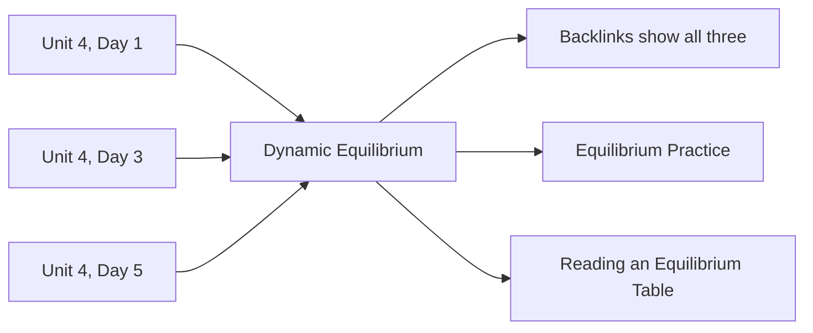

There are two kinds of page here, and knowing which is which makes the
whole site easier to use.

## Class pages

Under **All Classes**, one page per class, in order. Each carries:

- an **Agenda** — what we did, with links to everything we used
- **Things to do before our next class** — the homework, as a checklist

Class pages are the *narrative*: what happened, and when. They hold no
explanations at all, which is deliberate.

## Reference pages

Everything else — Concepts, Investigations, Exercises, Reference, Tasks,
Tutorials, Discussions, Setup — is *reference*. Each is written once and
linked from however many class pages need it.

Nobody builds that backlinks list. It is assembled from the links
themselves every time the site is rebuilt, which is why linking
generously costs nothing now and pays off later. The two arrows on the
right are the other half of the pattern: an idea, the practice that
makes it automatic, and the table you need in order to use it, each in
its own page and each reachable from the others.

## Why not simply put the explanation on the class page?

Because then equilibrium would be explained in six places, and
correcting an error would mean correcting it six times. In practice it
would be corrected once and left wrong five times, and the five stale
copies would be indistinguishable from the good one.

So: **each idea lives in exactly one page, and everything else links to
it.** If you ever find the same explanation written out twice on this
site, that is a bug, and I would like to know.

## The Reference folder does a different job from Concepts

These two get confused, and the difference is worth stating — more so
this year than last, because the Reference pages have changed character.

| Folder | What is in it | You open it |
| --- | --- | --- |
| **Concepts** | Explanations — why something is true, and where it stops being true | When you are trying to understand |
| **Reference** | How to *read* the tables this course runs on | When you are in the middle of a calculation and the booklet is open |

[[Dynamic Equilibrium]] explains why a reaction stops before it
finishes and what the constant is a statement about.
[[Reading an Equilibrium Table]] tells you what the number in the
booklet assumes and what it is silent on. You want the first one on a
Tuesday evening and the second one at a bench with a calculator, and
putting them on the same page would make both worse.

Notice what the Reference pages here are **not**: they are not copies of
the data booklet. Reproducing tables of constants on a website is a way
of generating a second, slightly wrong set of numbers, and every value
you are assessed on will come from the booklet in your hand. So the
pages teach the reading rather than the values —
[[Reading a Reduction Potential Table]] is a page about sign
conventions, not a list of potentials.

## Where your own work fits

The Portfolios folder is the one part of this structure that is yours
rather than mine. It follows the same rule: one entry per piece of
thinking, written close to the work, linked from wherever it is
relevant. See [[Chemistry Journal]].

> [!tip] Which page do I actually want?
> "What did we do on Tuesday?" → a class page.
> "How does that work again?" → a Concepts page.
> "What does the sign in this table mean?" → a Reference page.
> "How do I *do* it?" → a Tutorials page.
> "When did we cover this?" → open the concept page and read its
> backlinks.

Next: [[What This Site Can Do]], or [[Using This Site]] if you want the
short version.
