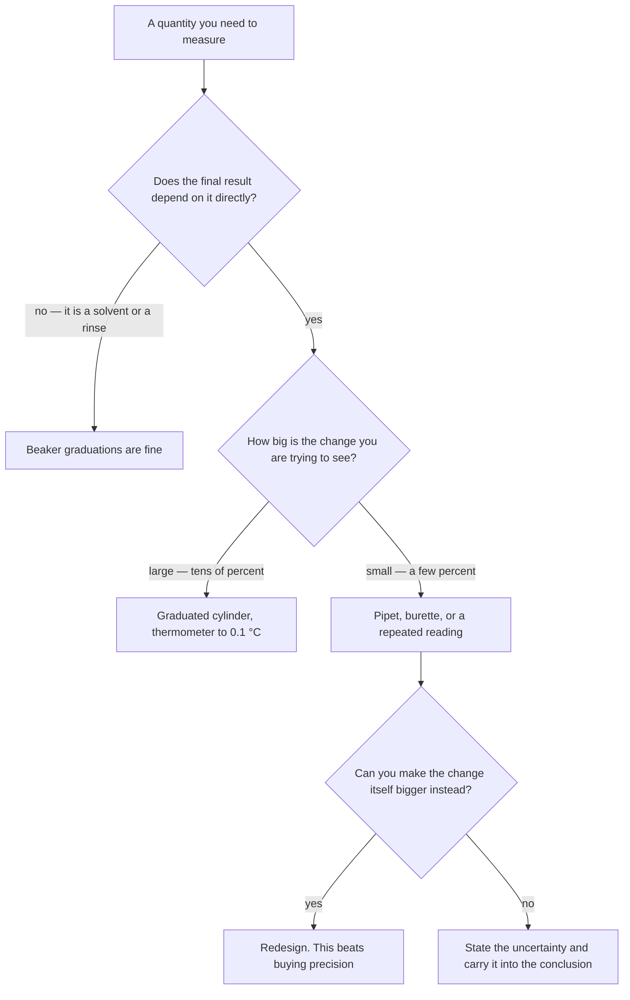

Every number you will defend this semester came out of an instrument.
How well you know that number is decided before you write anything down
— by which instrument you reached for and how you read it.

You know the glassware already. This page assumes the meniscus, the
balance, and the volumetric flask, and spends its time on the four
instruments this course adds: the calorimeter that loses heat while you
watch, the thermometer measuring a change barely larger than itself, the
burette in a titration, and the voltmeter across a cell.

## The instrument decides the answer, not the calculation

A calculation cannot improve a measurement. If you delivered your acid
with a beaker, no amount of careful arithmetic afterwards makes the
result better than the beaker was, and quoting the answer to four
figures does not hide that — it advertises it.

So the first question in designing any procedure is not "what do I do?"
It is **how well do I need to know this quantity, and what gives me
that?** Sometimes the answer is a beaker, and reaching for a volumetric
pipet would waste everyone's afternoon. Knowing which situation you are
in is the skill being assessed.

The box on the bottom right is the one Grade 11 did not ask of you.
Where the measurement cannot be improved, the answer is not to pretend —
it is to say what the number is worth and let the conclusion inherit
that. Where it *can* be improved, the cheapest improvement is almost
always to the experiment rather than to the equipment.

## The burette, read properly

Titration is where most of this course's precision lives, and a burette
rewards care more than any other piece of glassware in the room.

- **Read the bottom of the meniscus, at eye level, to two decimal
  places.** Hold a white card with a thick black band behind the tube,
  the top of the band just under the meniscus, and the curve turns from
  a faint grey line into an obvious dark crescent. It is what people who
  titrate for a living do.
- **Expel the air bubble in the tip** before the initial reading. If it
  comes out during the titration, the level falls without anything
  reaching the flask, and the delivered volume is recorded too large —
  a mistake that looks exactly like a real result.
- **The scale runs downward**, zero at the top, and there is no
  requirement to start at 0.00. You take an initial and a final reading
  and the delivered volume is the difference.
- **Half-drops near the endpoint**, and wash the flask walls down with
  distilled water. That water changes the volume in the flask and not
  the amount of substance in it, so it cannot change the titre.

Each burette reading is good to roughly ±0.02 mL, and the delivered
volume is a difference of two readings, so it is good to roughly ±0.03
mL. Now do the division, because it decides how you design the
titration:

| Titre | Uncertainty of ±0.03 mL is | So |
| --- | --- | --- |
| 25.00 mL | about 0.1% | Excellent — this is the target |
| 10.00 mL | about 0.3% | Acceptable |
| 4.00 mL | about 0.8% | Change the concentrations and run it again |

A tiny titre is not a fast titration. It is a bad one, and the fix is to
choose concentrations that put the endpoint somewhere in the twenties.

### Rinsing, which decides the whole result

| Glassware | Rinse with | Because |
| --- | --- | --- |
| Burette | The solution it will hold | Water left inside dilutes it, and its true concentration is no longer the one on the label |
| Pipet | The solution it will hold | Same reason, and you cannot see the film that is doing it |
| Conical flask | Distilled water only | The amount of substance delivered into it is fixed; extra water changes the volume but not the moles |
| Volumetric flask | Distilled water only | It is going to be filled to the mark anyway |

If you can explain the third row to somebody else, you understand
concentration better than the rule does. And, as ever: **never pipette
by mouth**, with anything, including water.

## The calorimeter, and the heat you did not measure

A polystyrene cup is a beautiful teaching instrument and a mediocre
calorimeter, and being clear about the difference is most of what
[[Calorimetry]] is trying to teach you.

Every calorimetry calculation in this course starts from

$$Q = mc\Delta T$$

and that equation, applied to a cup of solution, quietly assumes four
things:

1. **No heat leaves the system.** It does — through the walls, out of
   the open top, and up the thermometer.
2. **The calorimeter itself absorbs nothing.** It does. The cup, the
   lid, and the thermometer all warm up, and that energy came from your
   reaction.
3. **The solution's mass is its volume times 1.00 g/mL.** Close for a
   dilute aqueous solution and not exact.
4. **The solution's specific heat capacity is water's,
   4.18 J/(g·°C).** Also close, also not exact.

Every one of those pushes the same way for an exothermic reaction: the
measured temperature rise comes out **too small**, so the magnitude of
your calculated $\Delta H$ comes out too small, and your reaction looks
less exothermic than it is. That is a systematic error with a known
direction, which means it belongs in your conclusion as a statement, not
as an apology. See [[Writing a Lab Report]].

What actually reduces it:

- **Lid on**, always, with the thermometer through it rather than beside
  it.
- **Nested cups**, if the procedure provides them.
- **Mix quickly and stir gently.** Stirring vigorously with a
  thermometer both adds energy and breaks thermometers.
- **Take readings on a schedule**, not just before and after — every 30
  seconds for a couple of minutes before mixing and for several minutes
  afterwards. Then plot them, extend the post-mixing cooling line
  backwards to the instant of mixing, and read the temperature change
  off the extrapolation. That correction recovers much of the heat that
  had already escaped by the time the reading peaked, and it is the
  single most effective thing you can do with equipment you already
  have.

> [!warning] Combustion calorimetry is not a student activity here
> Burning a measured sample to heat a known mass of water is the classic
> demonstration and it stays a demonstration, run by me. Everything
> about it — an open flame, a flammable sample, a hot metal vessel — is
> a hazard that gets worse with more hands. You will get the data and
> you will do the analysis. See [[Lab Safety and WHMIS]].

## The thermometer, against the change you are measuring

An instrument's resolution only means something next to the size of the
thing you are measuring, and calorimetry is where that becomes painfully
obvious.

Suppose your thermometer reads to 0.1 °C. You take an initial reading
and a final one, so the **difference** carries the uncertainty of both —
call it about ±0.2 °C in the worst case. Now:

| Temperature change | ±0.2 °C is | Your $\Delta H$ is known to |
| --- | --- | --- |
| 24.0 °C | under 1% | Better than everything else in the experiment |
| 8.0 °C | about 2.5% | Comfortably good enough |
| 2.3 °C | about 9% | The limiting factor in the whole result |

The lesson is not "get a better thermometer". It is **make $\Delta T$
bigger** — more concentrated solutions, or a smaller volume of them, so
the same energy raises the temperature further. That is a design
decision, made before the lab, and it is exactly the kind of judgement
this course marks.

Two smaller points that cost people marks every year:

- **Digits on a display are not accuracy.** A probe reading 21.437 °C is
  not accurate to a thousandth of a degree; it is displaying more
  figures than it can support. Find out the instrument's stated
  resolution and record to that.
- **Let the thermometer equilibrate.** A thermometer that has just gone
  in is measuring itself as much as the solution. Watch until the
  reading stops drifting, then record.

## The voltmeter across a cell

Unit 5 measures a potential rather than a volume, and the rules are
different enough to be worth stating.

- **Use a digital voltmeter**, which draws almost no current. That
  matters chemically: if appreciable current flows, the cell is
  discharging while you measure it, concentrations are changing under
  your reading, and the value you see is lower than the cell's actual
  potential.
- **Read quickly and write it down.** The reading drifts, and the drift
  is not noise — it is the cell doing its reaction.
- **Red lead to the cathode, black to the anode.** A **negative reading
  is not an error**: it means the leads are the other way round, which
  tells you which half-cell is really the anode. Record the magnitude
  and the sign you got, and say which electrode each lead was on.
- **Clean the electrodes.** A zinc strip with an oxidised surface is not
  the metal named in the table, and the reading will sit low.
- **A fresh salt bridge, properly in contact with both solutions.** A
  drying bridge raises the internal resistance and pulls the reading
  down.

> [!important] Your reading will be below the tabulated value, and that is not a failure
> $E^\circ_{\text{cell}} = E^\circ_{\text{cathode}} - E^\circ_{\text{anode}}$
> uses standard reduction potentials, and the word standard is doing
> enormous work: 1 mol/L solutions, 25 °C, 100 kPa, clean electrodes,
> no current drawn. Your bench meets none of those exactly.
>
> So the interesting question is never "why is my value wrong". It is
> **which of those conditions did my cell break, and does that account
> for the size and the direction of the difference?** An answer that
> names two of them and estimates their effect is worth more than a
> reading that happened to land on the tabulated number. See
> [[Reading a Reduction Potential Table]].

## The balance, briefly

You know this. Three reminders that still catch people:

- **Check it reads zero** before you start, and use the same balance for
  every mass in one experiment — a balance that is consistently 0.01 g
  out gives a wrong mass and a *right difference*.
- **Nothing goes directly on the pan**, and hot things are allowed to
  cool first: a warm object sets up rising air currents and reads light.
- **Weigh by difference when you are transferring.** Two readings, so
  the uncertainties combine, but it measures what actually left the
  container rather than what you intended to leave it. You accept a
  larger uncertainty to remove a systematic error, which is the same
  bargain [[What Counts as Evidence]] keeps making.

## Before you leave the bench

- [ ] Burette drained and rinsed, left with the tap open
- [ ] Pipets rinsed and returned to the rack, tips up
- [ ] Calorimeter cups emptied to the correct waste container
- [ ] Electrodes rinsed and dried; metal ion solutions **not** down the
      drain
- [ ] Balance area brushed clean and the pan wiped
- [ ] Every reading in your notebook in ink, in the order you took it,
      with the instrument's resolution written once at the top

Related: [[Significant Figures and Units]] for what to do with the
digits you have just collected, [[Writing a Lab Report]] for where they
go, and [[Lab Safety and WHMIS]] for handling what is in the glassware.

%%curriculum-start%%
## Curriculum connection

![[A1.2]]

![[A1.6]]
%%curriculum-end%%
