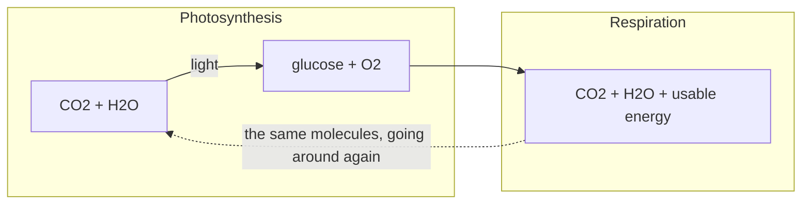

## The idea

Respiration is photosynthesis run backwards. Cells take the sugar and the oxygen
and release the stored energy in a form the cell can spend.

$$
\mathrm{C_6H_{12}O_6} + 6\,\mathrm{O_2} \longrightarrow 6\,\mathrm{CO_2} + 6\,\mathrm{H_2O} + \text{energy}
$$

## Compare the two

| | Photosynthesis | Cellular respiration |
| --- | --- | --- |
| Who does it | Producers | **Every** living thing, producers included |
| Energy | Stored | Released |
| Takes in | $\mathrm{CO_2}$, $\mathrm{H_2O}$ | $\mathrm{C_6H_{12}O_6}$, $\mathrm{O_2}$ |
| Gives off | $\mathrm{C_6H_{12}O_6}$, $\mathrm{O_2}$ | $\mathrm{CO_2}$, $\mathrm{H_2O}$ |
| When | Only in light | All the time |

> [!important] The pairing is the point
> The outputs of one are the inputs of the other. That is what keeps the
> composition of the atmosphere roughly steady — and it is the clearest example
> of ==dynamic equilibrium== you will meet all year.

%%curriculum-start%%
## Curriculum

- [[B2.3]] — ![[B2.3#^text]]
- [[B2.2]] — ![[B2.2#^text]]
%%curriculum-end%%
