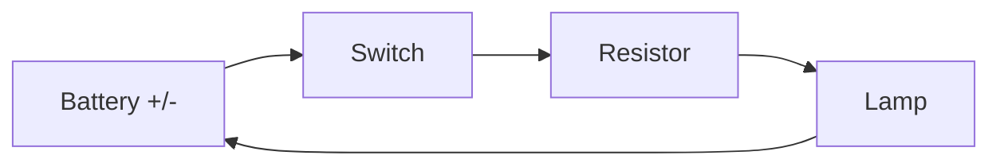

## The idea

Circuit diagrams are a shared language. Draw the symbol, not a picture of the
battery.

| Component | Job |
| --- | --- |
| Cell / battery | Supplies potential difference |
| Switch | Opens or closes the path |
| Resistor | Limits current |
| Lamp | Converts electrical energy to light and heat |
| Ammeter | Measures current — wired **in series** |
| Voltmeter | Measures potential difference — wired **in parallel** |

> [!important] Meters go in different places, and it matters
> An **ammeter** must be in the path so all the current passes through it.
> A **voltmeter** goes across a component to compare two points.
>
> Put an ammeter across a battery and you have created a short circuit with a
> very expensive fuse in it. Ask me how the department knows.

## Drawing conventions

- Straight lines, right angles, no diagonal spaghetti.
- Components spaced evenly along the sides of a rectangle.
- Label every component with its value: $9\ \mathrm{V}$, $220\ \Omega$.

Practise at [[Circuit Diagram Practice]].

%%curriculum-start%%
## Curriculum connection

![[D2.3]]
%%curriculum-end%%
