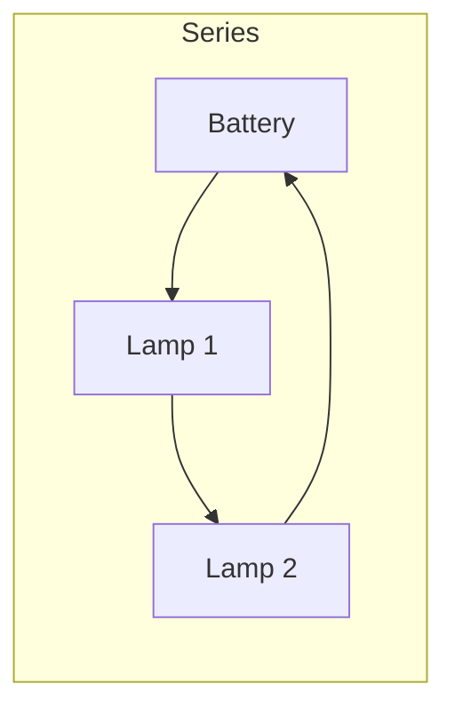
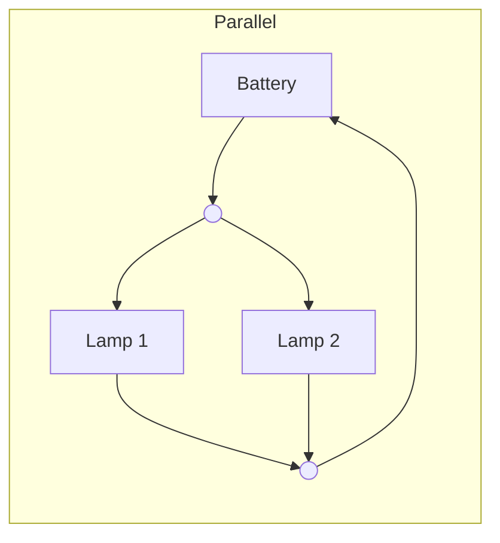

## The idea

Components can be wired in a single loop (**series**) or on separate branches
(**parallel**), and the two behave completely differently.

| | Series | Parallel |
| --- | --- | --- |
| Current | Same everywhere | Splits between branches |
| Potential difference | Divides among components | Same across each branch |
| Total resistance | $R_T = R_1 + R_2$ | $\frac{1}{R_T} = \frac{1}{R_1} + \frac{1}{R_2}$ |
| One component fails | Everything stops | The others keep going |

## Why your house is wired in parallel

Every outlet gets the full $120\ \mathrm{V}$, and unplugging a lamp does not
switch off the fridge. Old Christmas lights were series — one dead bulb, and the
whole string went dark.

> [!question] Predict before you build
> Two identical lamps in series, then the same two in parallel, on the same
> battery. Which arrangement is brighter, and why? Commit to an answer, then
> test it in [[Building Series and Parallel Circuits]].

%%curriculum-start%%
## Curriculum connection

![[D2.6]]

![[D2.4]]
%%curriculum-end%%
