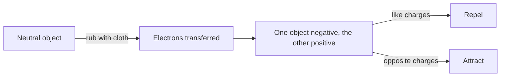

## The idea

Electrons can be moved from one object to another. An object with extra
electrons is negatively charged; one short of electrons is positively charged.

**Protons never move.** Only electrons do. Say "this object lost electrons"
rather than "it gained protons" — the second is wrong.

## Three ways to charge something

| Method | What happens | Contact? |
| --- | --- | --- |
| Friction | Rubbing transfers electrons between materials | Yes |
| Conduction | Charge flows between touching conductors | Yes |
| Induction | A nearby charge pushes electrons within an object | **No** |

## The law of electric charges

- Like charges **repel**
- Opposite charges **attract**
- A charged object attracts a **neutral** one

> [!question] The third one is the interesting one
> Why does a charged balloon stick to a neutral wall? The balloon's charge
> pushes the wall's electrons slightly away, leaving the near surface slightly
> opposite in charge. Attraction to the closer side beats repulsion from the
> farther side. This is **induced charge separation**.

> [!tip] Why winter is sparky
> Charge leaks away through moisture in the air. Cold air holds little water
> vapour, so charge accumulates instead of draining — which is why doorknobs
> start biting in January and not in September.

%%curriculum-start%%
## Curriculum

- [[D2.1]] — ![[D2.1#^text]]
- [[D2.2]] — ![[D2.2#^text]]
%%curriculum-end%%
