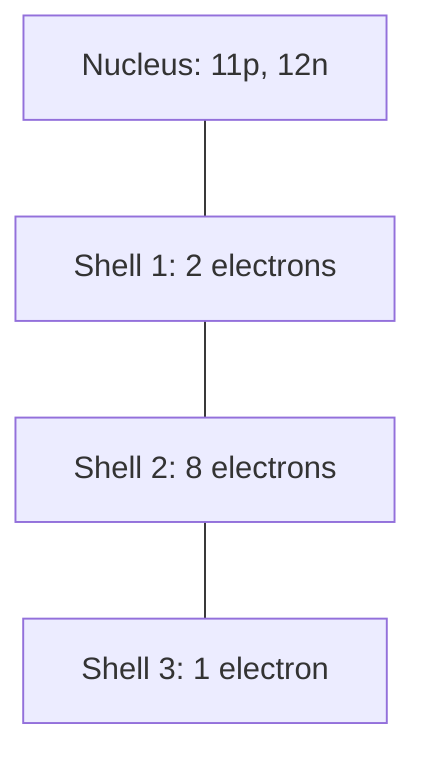

## The idea

Protons and neutrons sit in a tiny central **nucleus**. Electrons occupy
**shells** around it, and each shell holds only so many.

| Particle | Charge | Relative mass | Where |
| --- | --- | --- | --- |
| Proton | $+1$ | 1 | Nucleus |
| Neutron | $0$ | 1 | Nucleus |
| Electron | $-1$ | $\approx \frac{1}{1836}$ | Shells around the nucleus |

## Shell capacity

$$
\text{shell } 1 = 2, \quad \text{shell } 2 = 8, \quad \text{shell } 3 = 8
$$

## Drawing one, step by step

Take sodium: atomic number 11, mass number 23.

1. **Protons** = atomic number = 11
2. **Electrons** = 11 for a neutral atom
3. **Neutrons** = mass number − atomic number = $23 - 11 = 12$
4. Fill shells outward: 2, then 8, leaving **1** in the third shell

> [!tip] The outermost shell is the whole story
> That single lonely electron is why sodium is violently reactive: losing one
> electron leaves a full shell behind. Chemistry is mostly the behaviour of
> **valence electrons**.

Practise at [[Bohr-Rutherford Diagrams]].

%%curriculum-start%%
## Curriculum

- [[C2.3]] — ![[C2.3#^text]]
- [[C2.4]] — ![[C2.4#^text]]
%%curriculum-end%%
