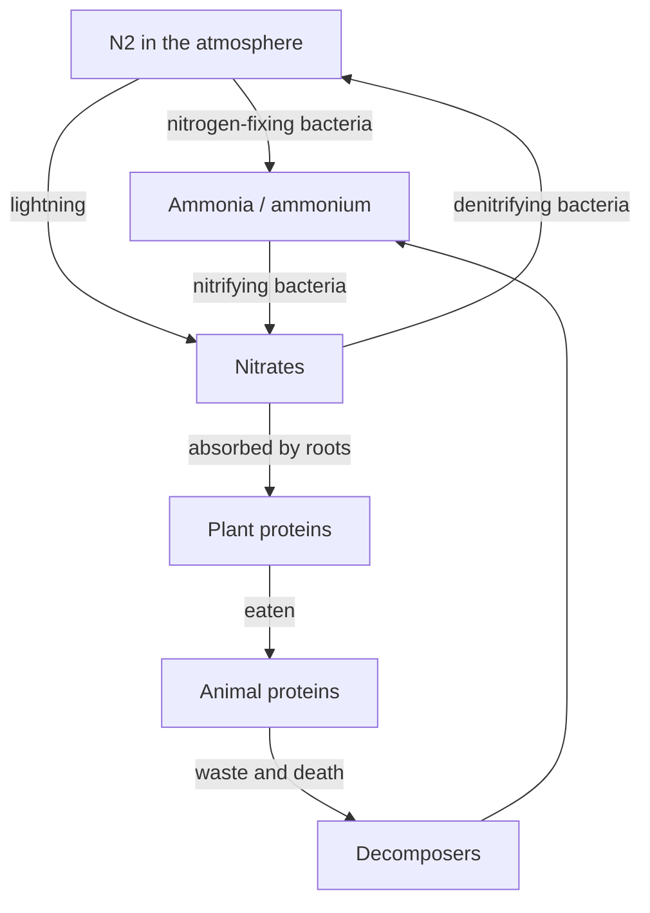

## The idea

The air is **78% nitrogen**, and almost nothing can use it. $\ce{N2}$ is
held together by a triple bond that most living things cannot break.

## Why farmers care

Nitrogen is usually the **limiting nutrient**: the one that runs out first and
caps how much can grow. Three ways to add it:

1. Plant legumes — clover, beans, alfalfa — which host nitrogen-fixing bacteria.
2. Spread manure or compost, returning nitrogen the decomposers released.
3. Apply synthetic fertiliser, made by forcing $\ce{N2}$ and hydrogen
   together at high temperature and pressure.

> [!warning] Too much of a good thing
> Fertiliser that washes into a lake feeds algae instead of crops. The algae
> bloom, die, and decompose — and decomposition consumes the dissolved oxygen
> that fish need. This is **eutrophication**, and it is why buffer strips beside
> waterways are worth the lost field space.

%%curriculum-start%%
## Curriculum connection

![[B2.2]]

![[B2.7]]
%%curriculum-end%%
