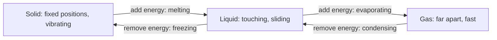

## The idea

Everything is made of particles too small to see, and their behaviour explains
what we *can* see.

The theory has five claims:

1. All matter is made of tiny particles.
2. Every pure substance has its own kind of particle, different from others.
3. The particles are always moving; warmer means faster.
4. There is space between particles.
5. Particles attract one another.

## What it explains

| Observation | Explanation |
| --- | --- |
| A balloon shrinks outdoors in winter | Particles slow down, strike the walls less often and less hard |
| You smell cookies from another room | Particles spread out through the air |
| 50 mL water + 50 mL ethanol < 100 mL | Small particles settle into the spaces between larger ones |
| Solids hold their shape | Attraction wins over motion; particles vibrate in place |

> [!tip] Temperature *is* motion
> "Hot" is not a substance that flows into things. Temperature is a measure of
> the average kinetic energy of the particles. Heating something means making
> its particles move faster — nothing more mysterious than that.

%%curriculum-start%%
## Curriculum connection

![[C2.1]]
%%curriculum-end%%
