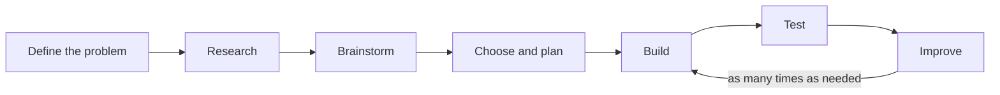

> [!abstract] At a glance
> **Format:** built prototype + design log · **Curriculum:** [[A1.3]], [[A2.1]], [[D2.3]], [[D2.8]]

## The task

Design, build, and test a working device that solves a real problem using an
electric circuit. Constraints: battery power only, under $\$15$ in materials,
must fit in a shoebox.

## The engineering design process

The loop is not decoration. I expect **at least two** trips around it, and your
log must show what failed the first time.

## Past examples that worked well

- A moisture sensor that lights up when a plant needs water
- A door alarm using a reed switch
- A hand-crank generator charging a capacitor
- A continuity tester for finding breaks in cables

## Your design log

Keep it as you go, not afterwards. It carries most of the marks.

| Section | What goes in it |
| --- | --- |
| Problem | Who has it, and how you know |
| Research | What exists already; what you borrowed |
| Design | Circuit diagram with component values |
| Build | What actually happened, including mistakes |
| Test | Data, not impressions |
| Improve | What you changed and what it did |

> [!warning] A working device with no log scores lower than a failed device with a good one
> The curriculum expectation is about the **process**. A prototype that failed
> for reasons you understood and documented demonstrates more than one that
> worked by luck.

## Hand in

- [ ] The device
- [ ] Design log
- [ ] Circuit diagram drawn to convention — see [[Circuit Diagram Practice]]
- [ ] Two minutes demonstrating it to the class
