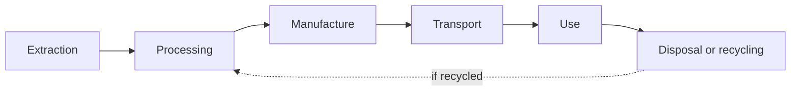

> [!abstract] At a glance
> **Due:** end of the chemistry unit · **Curriculum:** [[C1.1]], [[C1.2]], [[A2.3]]

## The task

Pick one everyday product and follow it from the ground to the landfill.

Good choices: a smartphone, a pair of running shoes, an aluminium can, a lithium
battery, a cotton t-shirt.

## The stages

For each stage, answer:

- Which **elements and compounds** are involved? Name them properly.
- What energy is used, and where does it come from?
- What waste is produced?
- Who bears the cost — and are they the same people who get the benefit?

## Required depth

At least **two** specific elements traced from source to disposal. For a phone,
lithium and cobalt are the obvious pair, and their stories are not the same.

> [!question] The question that makes this task worth doing
> Recycling is presented as the answer. For your product, find out what
> percentage is actually recycled in practice — not what *could* be. Then
> explain the gap.

## Hand in

- [ ] Life cycle diagram, your own, with your product's real stages
- [ ] Analysis of each stage
- [ ] Two elements traced end to end
- [ ] Three concrete recommendations, each naming who would have to act
