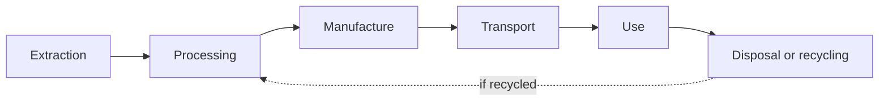

> [!abstract] At a glance
> Individual · **three class periods** of work time — Unit 3, Days 12, 13
> and 14 — then handed in on Day 15 · **Format:** written analysis with
> sources

## The task

Pick one everyday product and follow it from the ground to the landfill.

Good choices: a smartphone, a pair of running shoes, an aluminium can, a lithium
battery, a cotton t-shirt.

## The stages

For each stage, answer:

- Which **elements and compounds** are involved? Name them properly.
- What energy is used, and where does it come from?
- What waste is produced?
- Who bears the cost — and are they the same people who get the benefit?

## Required depth

At least **two** specific elements traced from source to disposal. For a phone,
lithium and cobalt are the obvious pair, and their stories are not the same.

> [!question] The question that makes this task worth doing
> Recycling is presented as the answer. For your product, find out what
> percentage is actually recycled in practice — not what *could* be. Then
> explain the gap.

## Success criteria

| Quality | What it looks like in your analysis |
| --- | --- |
| The whole life cycle, not the visible part | Every stage has something specific in it, including the ones you never see — and a stage you could not find out about says so, rather than being filled with a guess |
| Chemistry named properly | Elements and compounds named and written correctly, with the ones that matter distinguished from the ones that are along for the ride. Never "chemicals" |
| Energy and waste accounted for | Each stage says what energy went in and what came out that nobody wanted |
| Costs and benefits placed with people | Who gains and who pays, named — and where those are not the same people, said plainly |
| Recommendations somebody could act on | Three, each naming the person or body who would have to act and what it would cost them |

Run those five rows over your own draft at the start of the last working
period — [[Judging Your Own Work]] is the routine — and spend the rest of
that period on the row you called weakest.

## Hand in

- [ ] Life cycle diagram, your own, with your product's real stages
- [ ] Analysis of each stage
- [ ] Two elements traced end to end
- [ ] Three concrete recommendations, each naming who would have to act
- [ ] Source list, saying which stage each source informed

%%curriculum-start%%
## Curriculum connection

![[C1.1]]

![[C1.2]]

![[A2.3]]

![[C2.1]]
%%curriculum-end%%

%%
Triangulation — the evidence you will not have unless you go and get it.

Research tasks are the worst offenders for product-only evidence, because a
smooth paragraph and a well-founded one are the same number of words. The two
prompts below both sit on periods the arc already has.

OBSERVE — Unit 3, Day 13, the working period on the stages
  Watch for: what happens at the stage where the information simply is not
  findable. Nobody publishes what a shoe factory does with its offcuts, and
  the student meets that wall around the twenty-minute mark. The criteria
  table on this page asks them to say so, which means the analysis will tell
  you who declared a gap — this period tells you who met one. Those are not
  the same set: an invented paragraph and a found one are the same number of
  words, and a source list will happily show a source for whatever page the
  words came off.
  Going well: the search visibly failing, and the stage left thin on purpose
  with a line about what was looked for. Worth saying out loud when you see
  it, because most of them do not yet believe a gap is allowed to be an
  answer.
  Stuck: the wall met, and a confident paragraph appearing thirty seconds
  later in a voice that is not theirs.
  Record: three columns on your day plan — reported the gap, filled the gap,
  has not reached it yet. The middle column is who to sit beside on Day 14.

TALK — Unit 3, Day 12, the conference already on that agenda
  The agenda's own question — can you actually find out what it is made of —
  is spent by the time you sit down. Two minutes, once the two elements are
  chosen.
  Ask: "Of your two elements, which one would be hardest to replace? What
  would the product be like without it?"
  Then: "If this product were built to last twice as long, which stage's
  impact would shrink the most — and which one would not shrink at all?"
  A strong answer to the first names a property that makes the element hard to
  substitute — how much energy a lithium cell holds for its mass, what cobalt
  does to a cathode — rather than saying it is rare. A strong answer to the
  second gets that extraction and manufacture shrink per year of use, and that
  disposal is postponed rather than reduced. Both are C1.1 heard: the impacts
  of the life cycle assessed, with the elements and compounds actually in
  view, and ways to minimise the negative ones suggested from the chemistry
  rather than from a slogan.
  Record: one line per student in the margin. Note which of the two questions
  they could not start — the first one is chemistry, the second is systems
  thinking, and they fail for different reasons.

The product evidence is the analysis, handed in on Unit 3, Day 15.
%%
