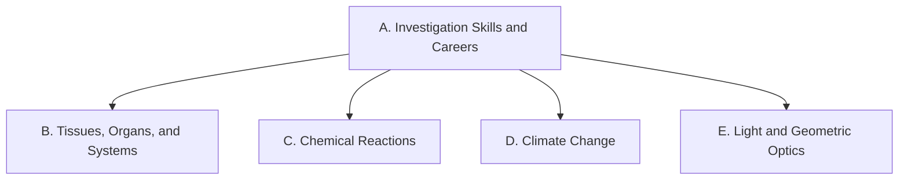

Everything we do in this course points at one or more of these
expectations, from **SNC2D — Science, Grade 10, Academic**.
Lesson pages link here so you can always see *why* we are doing
something.

> [!info] Where these come from
> The wording below is the Ontario curriculum's own. See
> [[About These Expectations]] — including a note about the codes.

## Overall and specific expectations

### Strand A. Scientific Investigation Skills and Career Exploration
*Throughout this course, students will:*

![[A1. Scientific Investigation Skills]]
![[A1.1]]
![[A1.2]]
![[A1.3]]
![[A1.4]]
![[A1.5]]
![[A1.6]]
![[A1.7]]
![[A1.8]]
![[A1.9]]
![[A1.10]]
![[A1.11]]
![[A1.12]]
![[A1.13]]
![[A2. Career Exploration]]
![[A2.1]]
![[A2.2]]

### Strand B. Biology: Tissues, Organs, and Systems of Living Things
*By the end of this course, students will:*

![[B1. Relating Science to Technology, Society, and the Environment]]
![[B1.1]]
![[B1.2]]
![[B1.3]]
![[B2. Developing Skills of Investigation and Communication]]
![[B2.1]]
![[B2.2]]
![[B2.3]]
![[B2.4]]
![[B2.5]]
![[B2.6]]
![[B2.7]]
![[B3. Understanding Basic Concepts]]
![[B3.1]]
![[B3.2]]
![[B3.3]]
![[B3.4]]
![[B3.5]]

### Strand C. Chemistry: Chemical Reactions
*By the end of this course, students will:*

![[C1. Relating Science to Technology, Society, and the Environment]]
![[C1.1]]
![[C1.2]]
![[C2. Developing Skills of Investigation and Communication]]
![[C2.1]]
![[C2.2]]
![[C2.3]]
![[C2.4]]
![[C2.5]]
![[C2.6]]
![[C3. Understanding Basic Concepts]]
![[C3.1]]
![[C3.2]]
![[C3.3]]
![[C3.4]]
![[C3.5]]
![[C3.6]]
![[C3.7]]
![[C3.8]]

### Strand D. Earth and Space Science: Climate Change
*By the end of this course, students will:*

![[D1. Relating Science to Technology, Society, and the Environment]]
![[D1.1]]
![[D1.2]]
![[D2. Developing Skills of Investigation and Communication]]
![[D2.1]]
![[D2.2]]
![[D2.3]]
![[D2.4]]
![[D2.5]]
![[D2.6]]
![[D2.7]]
![[D2.8]]
![[D2.9]]
![[D3. Understanding Basic Concepts]]
![[D3.1]]
![[D3.2]]
![[D3.3]]
![[D3.4]]
![[D3.5]]
![[D3.6]]
![[D3.7]]
![[D3.8]]

### Strand E. Physics: Light and Geometric Optics
*By the end of this course, students will:*

![[E1. Relating Science to Technology, Society, and the Environment]]
![[E1.1]]
![[E1.2]]
![[E2. Developing Skills of Investigation and Communication]]
![[E2.1]]
![[E2.2]]
![[E2.3]]
![[E2.4]]
![[E2.5]]
![[E2.6]]
![[E3. Understanding Basic Concepts]]
![[E3.1]]
![[E3.2]]
![[E3.3]]
![[E3.4]]
![[E3.5]]
![[E3.6]]
![[E3.7]]
![[E3.8]]
