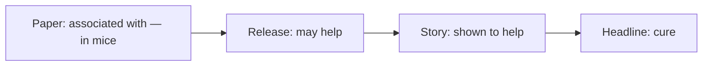

Every few classes, two people bring a science story that ran in the
past week and we take it apart together. Not to sneer at it — most
science reporting is done carefully under real deadline pressure — but
because reading a claim properly is a skill, and the only way to get it
is repetition.

## What to bring

A story about new scientific work: a finding, a technology, a health
claim, a climate result. Anything where somebody is telling you
something is now known that was not known before.

## Work through this before you present

- [ ] The claim, in one sentence, in your own words
- [ ] Where the claim comes from — a published study, a press release,
      a conference talk, one expert's opinion, or nothing named at all
- [ ] What was actually measured: the quantity, on how many, for how
      long, compared with what
- [ ] Whether the study design can support the verb in the headline
      ("linked to" and "causes" are not the same study)
- [ ] What the article does not say that you would need to know
- [ ] Who paid for the work, if the article or the study says
- [ ] One question you would put to the researcher

## The gap that produces most bad headlines

The researcher writes a cautious paper. The institution writes a press
release that firms it up. A newsroom writes a story from the press
release. Somebody who never read any of it writes the headline. Each
step is reasonable and the total drift is enormous.

So: find the study. Most articles name the researchers and the journal
somewhere near the bottom. Even the abstract will usually tell you the
sample and the design in two sentences.

> [!warning] Correlation is the one that will catch you
> "People who do X have less of Y" is compatible with X preventing Y,
> with Y preventing X, and with something else causing both. An
> observational study cannot separate those three on its own, no matter
> how large it is. See [[Reading a Graph Honestly]] for what this looks
> like on a set of axes.

## How the discussion runs

You present for two minutes. The room then tries to find the weakest
joint in the chain — and you defend it if you think it holds. Being
unable to answer a question is a normal outcome, and "I could not find
out" is a legitimate answer, provided you say where you looked.

Afterwards, log it in your [[Science Journal]]: the claim, the weakest
link, and whether you would repeat it to someone. Related:
[[What Counts as Evidence]].
