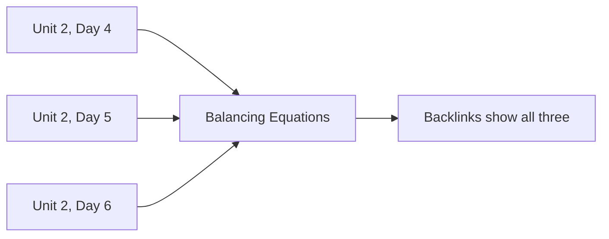

There are two kinds of page here, and knowing which is which makes the
whole site easier to use.

## Class pages

Under **All Classes**, one page per class, in order. Each carries:

- an **Agenda** — what we did, with links to everything we used
- **Things to do before our next class** — the homework, as a checklist

Class pages are the *narrative*: what happened, and when.

## Reference pages

Everything else — Concepts, Investigations, Exercises, Tasks,
Tutorials, Discussions, Setup — is *reference*. Each is written once and
linked from however many class pages need it.

Nobody builds that backlinks list. It is assembled from the links
themselves every time the site is rebuilt, which is why linking
generously costs nothing now and pays off later.

## Why not simply put the explanation on the class page?

Because then how to balance an equation would exist in three places,
and correcting an error would mean correcting it three times. In
practice it would be corrected once and left wrong twice, and the two
stale copies would be indistinguishable from the good one.

So: **each idea lives in exactly one page, and everything else links to
it.** If you ever find the same explanation written out twice on this
site, that is a bug, and I would like to know.

> [!tip] Which page do I actually want?
> "What did we do on Tuesday?" → a class page.
> "How does that work again?" → a concept page.
> "How do I *do* it?" → a tutorial.
> "When did we cover this?" → open the concept page and read its
> backlinks.

## Where your own work fits

The Portfolios folder is the one part of this structure that is yours
rather than mine. It follows the same rule: one entry per piece of
thinking, written close to the work, linked from wherever it is
relevant. See [[Science Journal]].

Next: [[What This Site Can Do]], or [[Using This Site]] if you want the
short version.
