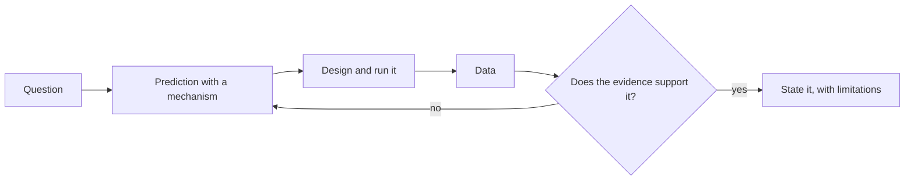
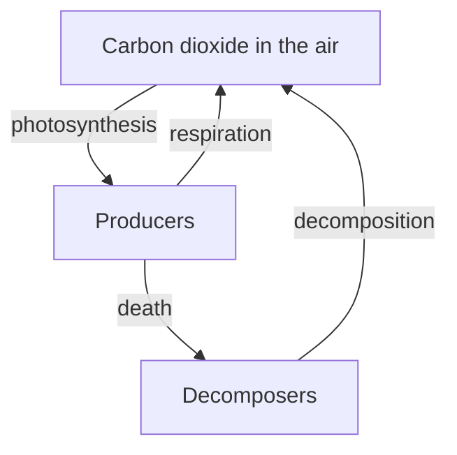
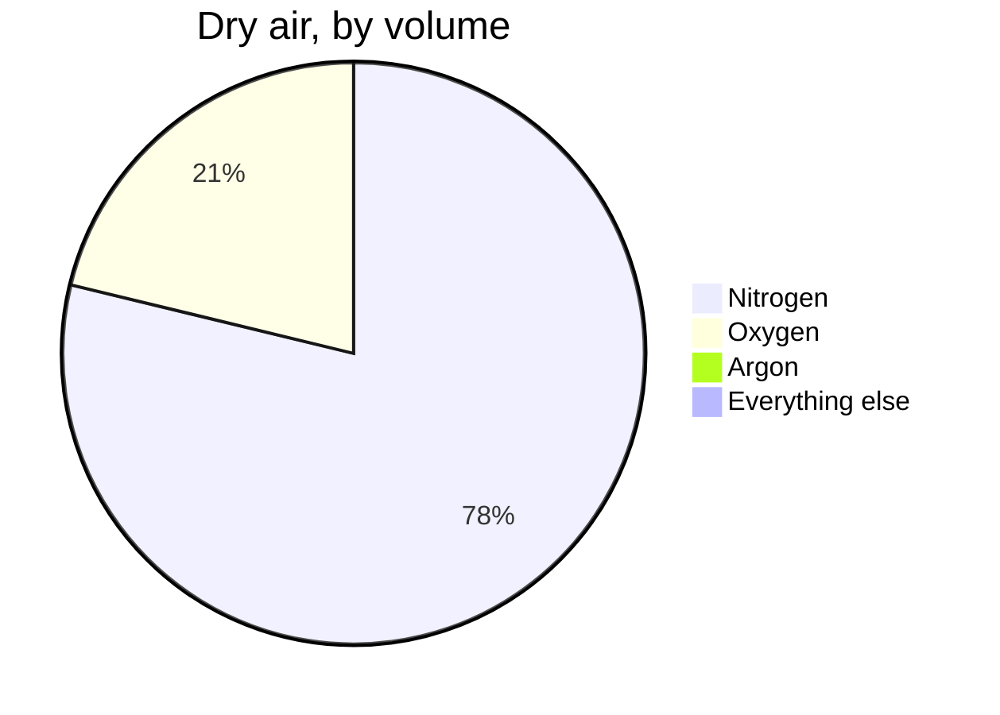
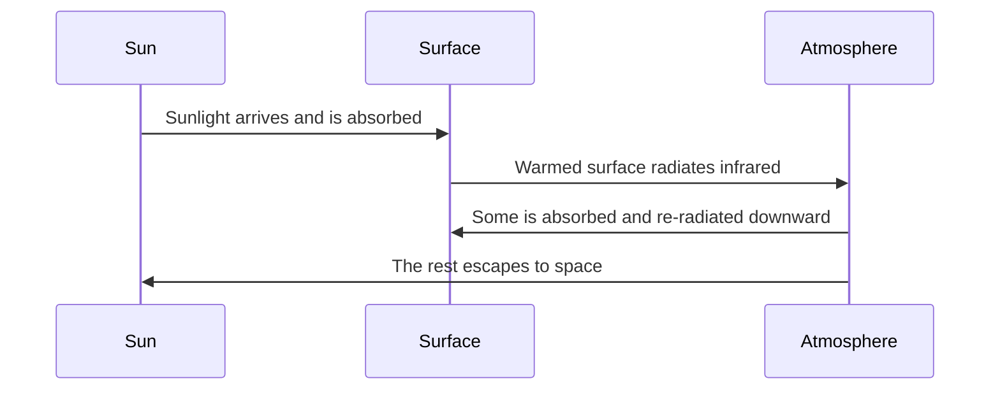

This page has two audiences. Students: it explains why the notes look
the way they do. Teachers: it is a working reference for everything you
can put in a page, with the source shown beside every example.

Everything below is written in **Markdown** — plain text with a few
marks of punctuation that mean something. If you can write a text
message, you can write this.

---

## Text that carries meaning

You get **bold**, *italic*, ~~struck through~~, and ==highlighted==
text. Highlighting is the one worth knowing: it catches the eye better
than bold when a single ==key term== has to stand out inside a
paragraph.

**How that was made:**

```markdown
**bold**, *italic*, ~~struck through~~, ==highlighted==
```

Arrows written as `->` become proper arrows: reactants -> products ->
evidence.

Keyboard keys look like keys: press <kbd>⌘</kbd> + <kbd>K</kbd> to
search.

---

## Headings, and the table of contents

Every `##` heading becomes a link in **Navigate this page**, over on the
right. Nothing builds that list by hand — it is assembled from the
headings as the page is built, so it can never fall out of step with the
page it describes.

Deeper headings nest underneath: a `###` sits inside the `##` above it,
which is why "Foldable callouts" appears indented under "Callouts".

**How that was made:** `##` at the start of a line, and `###` for a
sub-heading.

```markdown
## Callouts

### Foldable callouts
```

> [!tip] Write headings for the person skimming
> The table of contents is the first thing many students read. "Worked
> example" tells them what is there; "More on this" does not.

### Turning it off

A short page, or one that is mostly a list, reads better without a
contents panel. One line in the frontmatter:

```yaml
---
enableToc: false
---
```

Every class page in [[All Classes/index|All Classes]] uses this. Open
[[Unit 1, Day 1]] and there is no "Navigate this page" panel, even
though the page has headings that would otherwise appear there — an
agenda of six items does not need navigating.

---

## Callouts

Callouts lift something out of the flow of the page. There are a dozen
kinds, each with its own colour and icon, so students learn to
recognise them at a glance.

> [!note] Note
> Neutral information worth setting apart.

> [!tip] Tip
> A shortcut, a habit, or something that makes the work easier.

> [!important] Important
> The one thing to take away if you take away nothing else.

> [!warning] Warning
> Where people usually go wrong.

> [!danger] Safety
> Used in this course only for physical safety in the lab.

> [!question] Question
> Something to think about rather than something to know.

> [!example] Example
> A worked case.

> [!abstract] At a glance
> Used at the top of task pages for the format and what is due.

**How that was made:** a blockquote with the kind named in brackets.

```markdown
> [!warning] Where people usually go wrong
> The text of the callout goes here.
```

### Foldable callouts

Add a `-` after the kind and the callout starts collapsed. Clicking the
title opens it. This is how answers, hints, and worked solutions stay on
the page without giving themselves away.

> [!success]- Answer: how many oxygen atoms on each side?
> Four. Two in the carbon dioxide and one in each of the two water
> molecules, matched by the two oxygen molecules on the left.

**How that was made:** the `-` after the kind is the whole difference.

```markdown
> [!success]- Answer: how many oxygen atoms on each side?
> The hidden content.
```

---

## Mathematics and chemistry

Inline maths sits inside a sentence: a lens of focal length
$f = 15\ \text{cm}$ with the object at $d_o = 45\ \text{cm}$ gives
$d_i = 22.5\ \text{cm}$.

Display maths gets a line of its own, centred:

$$\frac{1}{f} = \frac{1}{d_o} + \frac{1}{d_i}$$

$$M = \frac{h_i}{h_o} = -\frac{d_i}{d_o}$$

Chemistry is typeset the same way, so subscripts sit low, charges sit
high, and reaction arrows are arrows rather than a hyphen and a
greater-than sign:

$$\text{CH}_4 + 2\text{O}_2 \rightarrow \text{CO}_2 + 2\text{H}_2\text{O}$$

$$\text{HCl(aq)} + \text{NaOH(aq)} \rightarrow \text{NaCl(aq)} + \text{H}_2\text{O(l)}$$

Ions carry their charge properly — sulfate is $\text{SO}_4^{2-}$ and
ammonium is $\text{NH}_4^{+}$ — which matters, because
$\text{SO}_4^{2-}$ and $\text{SO}_3^{2-}$ are different substances.

**How that was made:** single dollar signs keep it in the sentence,
double ones give it a line of its own.

```markdown
Inline: $f = 15\ \text{cm}$

Display: $$\text{CH}_4 + 2\text{O}_2 \rightarrow \text{CO}_2 + 2\text{H}_2\text{O}$$
```

> [!warning] For teachers: element symbols need `\text{}`
> Write `\text{H}_2\text{O}`, not `H_2O` — without it the symbols come
> out in maths italic, which is the convention for *variables* and looks
> wrong for elements. This build does not include the `mhchem`
> extension, so the chemistry shorthand you may have seen in other
> KaTeX setups is unavailable here — and it fails quietly, producing
> garbled text rather than an error you would notice. The plain
> commands above render correctly and are worth the extra characters.

---

## Diagrams

Diagrams are **written, not drawn** — which means they can be edited in
seconds, they never need a graphics program, and a change to one shows
up in a diff.

### Flowchart



**How that was made:** not a picture — these lines of text, between two
fence lines that say `mermaid`.

````markdown

````

`-->` draws an arrow, `["…"]` makes a box, `{"…"}` makes a decision
diamond, and `-->|yes|` labels the arrow. Change a word and the diagram
redraws.

### Cycles



### Proportions



Carbon dioxide is inside that last sliver.[^1]

### Sequence



---

## Tables

**How that was made:** rows of text separated by `|`, with a line of
dashes under the headings.

| Quantity | Symbol | Unit | Where it turns up |
| --- | --- | --- | --- |
| Focal length | $f$ | centimetre (cm) | [[Finding the Focal Length]] |
| Angle of incidence | $\theta_i$ | degree (°) | [[The Law of Reflection]] |
| Mass | $m$ | gram (g) | [[Balancing by Counting]] |

Maths works inside table cells, and so do links — which matters more
than it sounds, because it means a summary table can be a navigation
aid rather than a dead end.

---

## Checklists

**How that was made:** a list where each line starts with `- [ ]`, or
`- [x]` for one already done.

- [ ] Eye protection on
- [ ] Procedure checked by the teacher
- [x] Prediction written down before measuring
- [ ] Station cleaned

They are clickable in the browser. Nothing is saved — but students find
them useful for keeping their place during a lab.

---

## Code

**How that was made:** three backticks and the name of a language, the
code, then three backticks to close it.

````markdown
```python
def total_magnification(eyepiece, objective):
    return eyepiece * objective
```
````

```python
def total_magnification(eyepiece, objective):
    return eyepiece * objective

print(total_magnification(10, 40), "times")
```

Syntax colouring follows the language you name after the opening fence
and adapts to light or dark mode. **This course does not ask you to
write any code** — it is here because the site supports it and a
teacher adapting these pages for a computer science course will want to
know.

---

## Links between pages

This is what makes the site more than a pile of documents.

- A plain link: [[Balancing Equations]]
- A link with different words:
  [[Balancing Equations|why coefficients are the only thing you may change]]
- A link to a section:
  [[Balancing Equations#The one rule people break]]

**How that was made:** double square brackets.

```markdown
[[Balancing Equations]]
[[Balancing Equations|different words for the link]]
[[Balancing Equations#The one rule people break]]
```

### Transclusion — one page inside another

**How that was made:** `![[Page name]]` — a link with an exclamation
mark in front of it. Below, the help-session times are pulled in live
rather than copied:

![[Help Sessions]]

Change the source page and every page that embeds it updates. That is
how the section landing page always shows the current class agenda
without anybody maintaining a second copy of it.

### Backlinks

Scroll to the bottom of any page and you will find **Backlinks** —
every page that links *to* this one, gathered automatically. Nobody
maintains that list, which is why linking generously costs nothing and
pays off later.

---

## Hover previews

Hover over [[Refraction]] without clicking. The page appears in a small
window. A student checking one definition mid-paragraph does not lose
their place.

---

## Footnotes

**How that was made:** `[^1]` where the marker goes, and a matching
`[^1]:` line anywhere in the page.

[^1]: Carbon dioxide makes up well under a tenth of one percent of dry
    air by volume, which is why it does not get its own slice above.
    Its effect on the planet's energy balance is out of all proportion
    to that share — the reason being the subject of
    [[The Greenhouse Effect]].

---

## Tags

**How that was made:** a `tags` list in the frontmatter at the very top
of the page.

```yaml
---
tags:
  - chemistry
  - safety
---
```

Every tag becomes a page listing everything filed under it.

---

## What you cannot see

Two things on this page are invisible in the browser:

1. **Comments.** Text wrapped in `%%` double percent marks `%%` never
   reaches the site. Useful for notes to yourself in a page you are
   still writing.
2. **Drafts.** A page with `draft: true` in its frontmatter is skipped
   entirely when the site is built. Write next week's lesson today and
   publish it when you are ready.

%% This sentence is a comment. If you can read it on the
website, something is broken. %%

> [!tip] For teachers reading this
> A shared page can also be published to one section and held back from
> another, using per-section `draft` and `created` keys in the
> frontmatter — useful when your two classes have drifted a few days
> apart and one of them has not done the lab yet.

---

## The point of all this

None of it is decoration. Each feature removes a reason for a page to go
out of date:

| Feature | The problem it solves |
| --- | --- |
| Transclusion | The same text copied into six places, five of them stale |
| Backlinks | "Where did we use this again?" |
| Diagrams as text | Rebuilding a whole diagram to change one arrow |
| Drafts | Keeping unpublished work in some other file somewhere |
| Typeset chemistry | Screenshotting equations out of a document |

Write it once, link to it everywhere.
