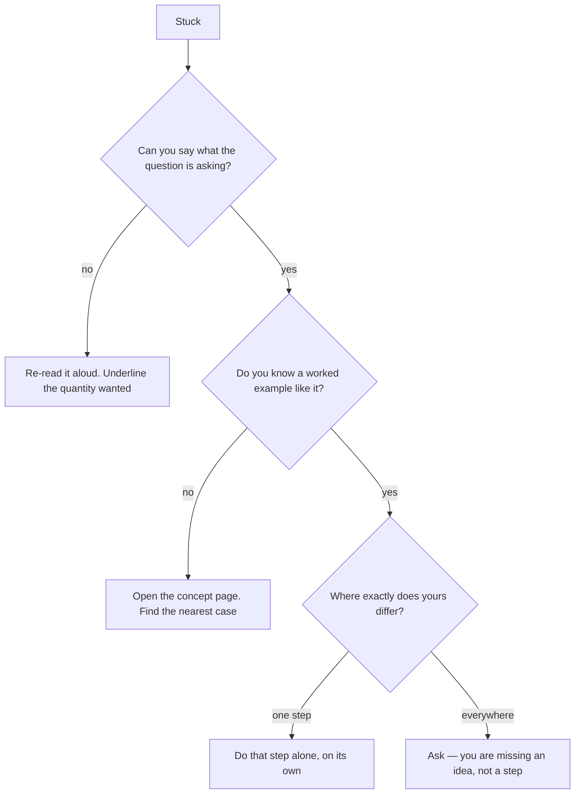

Being stuck is normal and is not a sign of anything. Being stuck for
forty minutes without changing what you are doing is the part worth
fixing.

## First, work out which kind of stuck you are

The bottom-right branch matters. If your problem differs from the
example everywhere, no amount of staring will close the gap, because
what you are missing is a concept rather than a step. That is the
moment to ask, not an hour later.

## Things to try before asking, in order of how often they work

1. **Say the question out loud.** A surprising share of stuck is
   misreading, and your ear catches what your eye skipped.
2. **Write down what you know, with units.** Half of the physics
   problems in this course solve themselves the moment the given
   quantities are on the page beside their units.
3. **Draw it.** A ray diagram, a labelled apparatus sketch, an arrow
   for each substance. See [[Drawing Scientific Diagrams]].
4. **Do the simpler version.** Two atoms instead of six, one lens
   instead of two. Then look at what the extra bit changed.
5. **Find the sentence where your understanding stops.** Not the page —
   the sentence. That sentence is your question.

## Then ask well

"I don't get it" gets you a re-explanation of something you may already
understand. Any of these gets you a real answer in one exchange:

| Instead of | Say |
| --- | --- |
| "I don't get balancing" | "I can balance the hydrogens but then the oxygens break again" |
| "The lab didn't work" | "I expected the image on the screen and got nothing past 20 cm" |
| "I'm lost" | "I follow up to the point where the normal is drawn, then I lose it" |

Each of those tells me where to start. The first column tells me
nothing, so my first three questions have to be diagnostic — and that
is three minutes you did not need to spend.

> [!note] Twenty minutes, then ask
> That is the rule I would like you to use on homework. Twenty minutes
> of genuine attempts, with the attempts written down, and then stop and
> bring them to me. The written attempts are not evidence against you;
> they are the most useful thing you can hand me, because a wrong
> attempt shows exactly which idea is bent.

Where to ask: [[Getting Help]] has the routes and
[[Help Sessions]] has the times. If the problem is that your result
disagrees with everyone else's, that is a different and more interesting
situation — [[Mistakes Are Data]].
