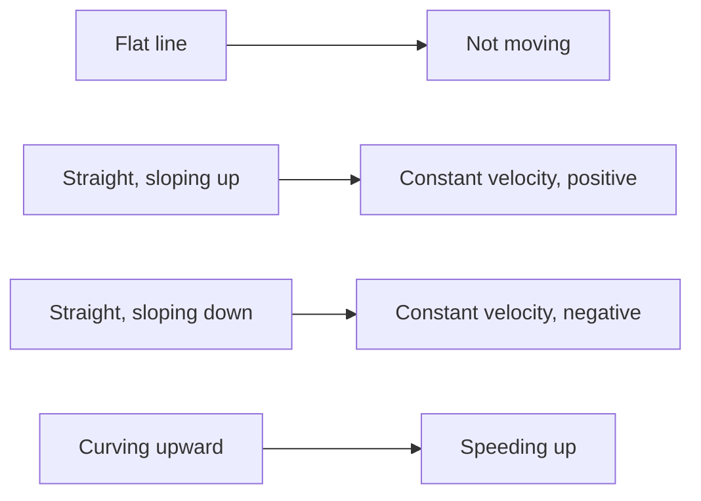

A position–time graph answers "where was it, when?" — and its SLOPE
answers "how fast, which way?".

## Reading one

- **Steeper means faster.** The slope IS the velocity, including its sign.
- **Straight means uniform.** A curve means the velocity is changing,
  which means there is acceleration.
- **Crossing the time axis** means passing back through the origin, not
  stopping.

## The tangent trick

For instantaneous velocity at some moment, draw the tangent to the curve
at that point and find its slope. Do it twice on the same curve, at
different times, and you have measured that the velocity is changing —
which is [[Acceleration]], found without any equation at all.

> [!warning] The classic misread
> A position–time graph that slopes downward does not show something
> going downhill. It shows something moving in the negative direction.
> The graph is not a picture of the journey.

%%curriculum-start%%
## Curriculum connection

![[B2.2]]

![[B3.3]]
%%curriculum-end%%
