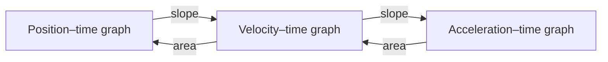
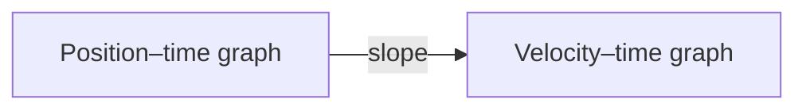

This page has two audiences. Students: it explains why the notes look the
way they do. Teachers: it is a working reference for everything you can
put in a page, with the source shown beside every example.

Everything below is written in **Markdown** — plain text with a few marks
of punctuation that mean something.

---

## Text that carries meaning

You get **bold**, *italic*, ~~struck through~~, and ==highlighted== text.
Highlighting is the one worth knowing: it catches the eye better than bold
when a single ==net force== has to stand out inside a paragraph.

```markdown
**bold**, *italic*, ~~struck through~~, ==highlighted==
```

---

## Headings, and the table of contents

Every `##` heading becomes a link in **Navigate this page**, on the right.
Nothing builds that list by hand, so it can never fall out of step with
the page. A short page reads better without it — one line of frontmatter,
`enableToc: false`, and it is gone. Every class page in
[[All Classes/index|All Classes]] does exactly that.

---

## Callouts

> [!note] Note
> Neutral information worth setting apart.

> [!warning] Warning
> Where people usually go wrong.

> [!danger] Safety
> Used in this course only for real physical hazards — see
> [[Safety in the Lab]].

> [!abstract] At a glance
> Used at the top of every investigation and task for the format, the
> time, and what is due.

```markdown
> [!warning] Where people usually go wrong
> The text of the callout goes here.
```

### Foldable callouts

Add a `-` after the kind and it starts collapsed — which is how every
answer in [[Exercises/index|Exercises]] stays on the page without giving
itself away.

> [!success]- Answer: how fast is it going after falling 2.0 m?
> $v = \sqrt{2gh} = \sqrt{2(9.8)(2.0)} = 6.3\ \text{m/s}$, and the mass
> never entered the calculation.

---

## Mathematics

Inline maths sits inside a sentence: a cart accelerating at
$a = 1.9\ \text{m/s}^2$ from rest reaches $v = 5.7\ \text{m/s}$ in three
seconds.

Display maths gets a line of its own:

$$v_2^2 = v_1^2 + 2a\Delta d$$

### Writing physics notation

| What you type | What appears | What it means |
| --- | --- | --- |
| `$v_1$` | $v_1$ | A subscript labels which one |
| `$v_{av}$` | $v_{av}$ | Braces hold multi-letter subscripts together |
| `$\Delta d$` | $\Delta d$ | "Change in" |
| `$\text{m/s}^2$` | $\text{m/s}^2$ | Units stay upright; variables stay italic |
| `$\mu_k$` | $\mu_k$ | Greek letters are spelled out |
| `$\vec{F}_{net}$` | $\vec{F}_{net}$ | The arrow marks a vector |
| `$\frac{\Delta d}{\Delta t}$` | $\frac{\Delta d}{\Delta t}$ | A stacked fraction |
| `$\sqrt{2gh}$` | $\sqrt{2gh}$ | A radical, with its scope inside braces |
| `$9.8 \pm 0.3$` | $9.8 \pm 0.3$ | A measurement with its uncertainty |

Two habits keep this working:

- **Units are text, not variables.** `\text{m/s}` keeps them upright,
  which is how a reader tells the unit m from the variable $m$.
- **A display equation stays on one physical line.** A `$$` span broken
  across lines, indented four spaces, or spread down a callout hits a
  markdown seam and shatters.

---

## Diagrams

Diagrams are **written, not drawn** — so they can be edited in seconds and
a change to one shows up in a diff.



````markdown

````

---

## Tables

| Quantity | Symbol | Unit |
| --- | --- | --- |
| Velocity | $v$ | m/s |
| Acceleration | $a$ | m/s² |
| Force | $\vec{F}$ | N |

Maths works inside cells, and so do links — which matters, because a
summary table can then be navigation rather than a dead end.

> [!note] For teachers: escape the pipe inside a table cell
> A wikilink with different display words uses a pipe, and so does the
> table. Write `[[Velocity\|how fast, which way]]` with a backslash, or the
> row splits into an extra column.

---

## Checklists

- [ ] Goggles on
- [ ] Feet clear of the falling mass
- [x] Positive direction chosen and written down

On the site they are read-only — the boxes show what the page says, and
clicking does nothing. Copied into a notebook, they are useful for keeping
your place during a lab.

---

## Links between pages

- A plain link: [[Acceleration]]
- A link with different words:
  [[Acceleration|the rate at which velocity changes]]

### Transclusion

`![[Page name]]` pulls a whole page in live rather than copying it:

![[Help Sessions]]

Change the source and every page that embeds it updates. That is how each
section's landing page always shows the current class.

### Backlinks

At the bottom of every page is **When did we do this?** — every page that
links here, gathered automatically. On a concept page it is a list of the
classes that used the idea, which is usually what you were looking for.

---

## Hover previews

Hover over [[Formula Reference]] without clicking. The page appears in a
small window — which in a course where you look up one equation twenty
times a week is the feature you will use most.

---

## Footnotes

Physics writing needs asides, and they belong at the bottom.[^1]

[^1]: Like this one. Footnotes collect at the end of the page no matter
    where you write them, so you can put the note beside the sentence it
    belongs to.

---

## Tags

```yaml
---
tags:
  - concepts
  - unit-3
---
```

Every tag becomes a page listing everything filed under it — which is how
you find every Unit 3 page at once.

---

## What you cannot see

1. **Comments.** Text wrapped in `%%` double percent marks `%%` never
   reaches the site.
2. **Holding a page back.** A page with `publish: false` is skipped
   entirely when the site is built — next week's lesson can sit here
   finished and invisible.

%% This sentence is a comment. If you can read it on the website,
something is broken. %%

> [!tip] For teachers reading this
> A shared page can be published to one section and held back from
> another: at the top of this page's source there is a
> `createdSection1` / `publishForSection1` pair for each of your
> sections. Set one section's key to `false` and the page waits for that
> class.

---

## What this course does not use

The site renders program code and chemical equations too — a computer
science course on this software uses the first, a chemistry course the
second. Neither appears in physics, and pretending otherwise would be
padding.

---

## The point of all this

| Feature | The problem it solves |
| --- | --- |
| Transclusion | The same text copied into six places, five of them stale |
| Backlinks | "Where did we use this again?" |
| Diagrams as text | Rebuilding a whole diagram to change one arrow |
| Holding a page back | Keeping unpublished work in some other file somewhere |
| Typeset equations | Screenshotting maths out of a document |

Write it once, link to it everywhere.
