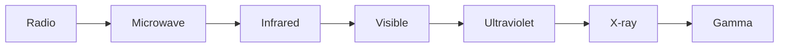

An accelerating charge radiates. A changing electric field makes a
changing magnetic field, which makes a changing electric field, and the
pair propagates — at $c$, without needing a medium.

## One spectrum, one physics

Left to right: shorter wavelength, higher frequency, more energy per
photon. The only difference between a radio wave and a gamma ray is
frequency — but that difference decides whether it passes through you
harmlessly or breaks a molecule.

## What antennas do

An alternating current in a wire is charge accelerating back and forth, so
it radiates at the frequency of the current. A receiving antenna does the
reverse: the passing wave pushes its electrons, making a tiny current at
the same frequency. Broadcasting and receiving are one phenomenon run in
opposite directions.

## The speed that started a revolution

Maxwell's equations predicted a wave speed built entirely from electric
and magnetic constants — and it came out equal to the measured speed of
light. That coincidence told physics that light IS an electromagnetic
wave, and the awkwardness of "speed relative to what?" led directly to
[[Special Relativity]].

%%curriculum-start%%
## Curriculum connection

![[E3.4]]

![[E1.1]]
%%curriculum-end%%
