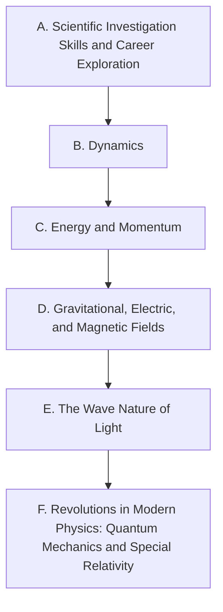

Every expectation the Ministry sets for SPH4U, one page each, so a
lesson or task can link to exactly the ones it addresses. Where the
wording came from, and what the codes mean, is on
[[About These Expectations]].

## A. Scientific Investigation Skills and Career Exploration

![[A1. Scientific Investigation Skills]]

![[A1.1]]

![[A1.2]]

![[A1.3]]

![[A1.4]]

![[A1.5]]

![[A1.6]]

![[A1.7]]

![[A1.8]]

![[A1.9]]

![[A1.10]]

![[A1.11]]

![[A1.12]]

![[A1.13]]

![[A2. Career Exploration]]

![[A2.1]]

![[A2.2]]

## B. Dynamics

![[B1. Relating Science to Technology, Society, and the Environment]]

![[B1.1]]

![[B1.2]]

![[B2. Developing Skills of Investigation and Communication]]

![[B2.1]]

![[B2.2]]

![[B2.3]]

![[B2.4]]

![[B2.5]]

![[B2.6]]

![[B2.7]]

![[B3. Understanding Basic Concepts]]

![[B3.1]]

![[B3.2]]

![[B3.3]]

## C. Energy and Momentum

![[C1. Relating Science to Technology, Society, and the Environment]]

![[C1.1]]

![[C1.2]]

![[C2. Developing Skills of Investigation and Communication]]

![[C2.1]]

![[C2.2]]

![[C2.3]]

![[C2.4]]

![[C2.5]]

![[C2.6]]

![[C2.7]]

![[C3. Understanding Basic Concepts]]

![[C3.1]]

![[C3.2]]

![[C3.3]]

![[C3.4]]

![[C3.5]]

## D. Gravitational, Electric, and Magnetic Fields

![[D1. Relating Science to Technology, Society, and the Environment]]

![[D1.1]]

![[D1.2]]

![[D2. Developing Skills of Investigation and Communication]]

![[D2.1]]

![[D2.2]]

![[D2.3]]

![[D2.4]]

![[D2.5]]

![[D3. Understanding Basic Concepts]]

![[D3.1]]

![[D3.2]]

![[D3.3]]

## E. The Wave Nature of Light

![[E1. Relating Science to Technology, Society, and the Environment]]

![[E1.1]]

![[E1.2]]

![[E2. Developing Skills of Investigation and Communication]]

![[E2.1]]

![[E2.2]]

![[E2.3]]

![[E2.4]]

![[E3. Understanding Basic Concepts]]

![[E3.1]]

![[E3.2]]

![[E3.3]]

![[E3.4]]

## F. Revolutions in Modern Physics: Quantum Mechanics and Special Relativity

![[F1. Relating Science to Technology, Society, and the Environment]]

![[F1.1]]

![[F1.2]]

![[F2. Developing Skills of Investigation and Communication]]

![[F2.1]]

![[F2.2]]

![[F2.3]]

![[F2.4]]

![[F3. Understanding Basic Concepts]]

![[F3.1]]

![[F3.2]]

![[F3.3]]

![[F3.4]]
