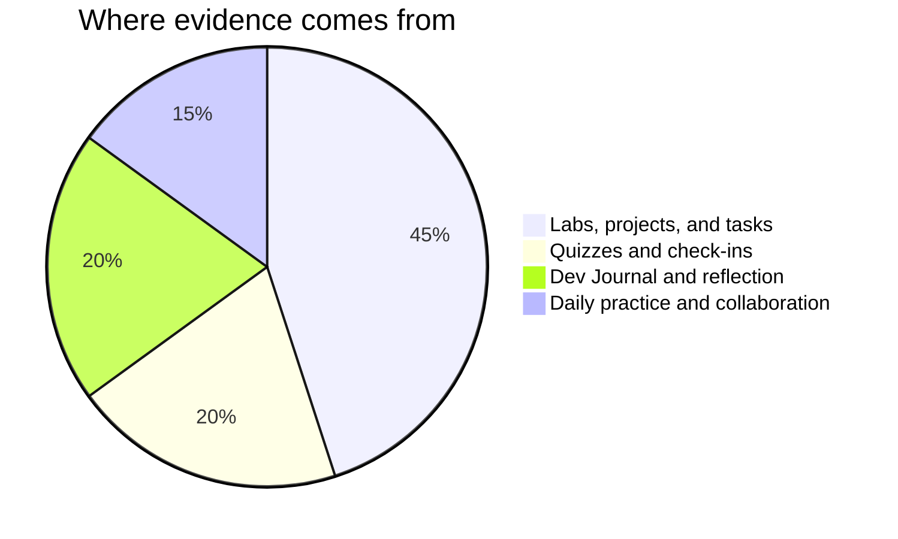

Marks in this course worry people for one wrong reason: the belief that
some people are "good with their hands" and the rest should stay back
from the bench. No such split exists — building, wiring, and
diagnosing are learned skills, and you are marked on **process, growth,
and communication**, all inside your control.

## Where evidence comes from

**Labs and projects** are the pages in Labs and Tasks — each lists its success criteria
before you start, phrased as things an observer could see in your work.
A build that works but nobody could service scores lower than a tidy,
documented build with an honest known-issues list, because
[[Writing About Technology|communication]] is most of the trade.

**Quizzes** are short, frequent, low-stakes, and re-attemptable after
new learning — they exist to find out what needs work, not to close the
book on it.

**Reflection** is your [[Tech Journal]]. It is where a fried component
or a stubborn network turns into evidence of learning — often the
strongest evidence you have.

**Daily practice** is the small stuff done consistently: warm-ups,
bench roles rotated fairly, safety habits kept without reminders, the
question that unstuck a neighbouring bench.

> [!important] Broken builds are never penalised as broken
> Version one of everything fails to POST. The mark follows where your work
> ends up and how visibly you got there — the journal and your comments
> are how "visibly" happens.

If a mark ever surprises you, ask — the criteria on each task page are
the whole story, and [[Getting Help]] lists the ways to reach me.

%%curriculum-start%%
## Curriculum connection

![[D3.1]]
%%curriculum-end%%
