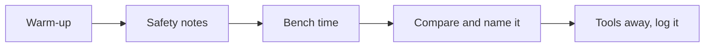

This course is a shop with keyboards. Most days you will have hardware
in your hands, and the ideas get their names *after* you have met them
with a screwdriver.

## Warm-up

Five minutes at the door: [[Name That Part]], a [[Binary Bites]] round,
or [[Spot the Hazard]] on the projector. Small daily reps compound.

## Safety notes

Every lab opens with its specific hazards, read together —
[[Safety in the Lab]] is the standing agreement, and thirty seconds of
walkthrough is what keeps bench time generous.

## Bench time

The heart of class: a [[Labs/index|lab]] in pairs or threes, hands on
real hardware, usually meeting the thing BEFORE the lesson about it —
you will take a computer apart before any lecture names its parts.
Roles rotate (hands, reader, recorder) so nobody camps on the
screwdriver.

## Compare and name it

Benches tour benches: what did your teardown find that ours didn't?
Then the idea gets its proper name and clean statement on a
[[Concepts/index|concept page]], and your "notes to your future self"
capture what YOU need to remember.

## Tools away, log it

The bench is reset — tools shadowed, screws bagged, straps hung — and
the last minutes belong to your [[Tech Journal]]: what you built, what
fought back, what you would try next. A tidy bench and an honest log
are the two habits every shop teacher swears by, because they are the
two habits every technician is paid for.

> [!tip] If you were away
> Check the class page in All Classes; most labs can be caught up at
> lunch — see [[Help Sessions]] — and the concept pages hold what the
> bench taught everyone else.
