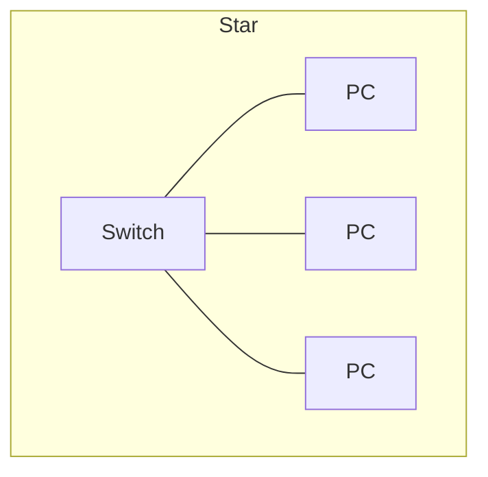

Before a network is cables and addresses, it is a decision about who
holds the resources and how the connections are laid out. Both choices
are made on paper, and both are drawn — a network you cannot draw is a
network you cannot service.

## Who holds the resources

| Model | How it works | Where it fits | What it costs |
| --- | --- | --- | --- |
| **Peer-to-peer** | Every machine shares its own resources and manages its own accounts | Home, a small shop, a bench of five machines | Accounts multiply: ten users on five machines is fifty passwords |
| **Client–server** | One or more servers hold files, accounts, and services centrally | Schools, offices, anywhere with more than about ten users | A server, its licences, and somebody who maintains it |

The tipping point is administration, not size: the moment the same
person is resetting the same password on four machines, the peer-to-peer
model has already cost more than a server would.

## How the connections are laid out

| Topology | Shape | Strength | Weakness |
| --- | --- | --- | --- |
| **Bus** | Every device on one shared backbone | Cheap, and historically simple | One break takes the whole segment down; you meet it in old industrial wiring |
| **Ring** | Each device connects to two neighbours, traffic circulating | Predictable timing; still used in some industrial and telecom rings | A break splits the ring unless it is a dual ring |
| **Star** | Every device to a central switch | One failed cable affects one device; easy to trace and extend | The switch is a single point of failure |
| **Mesh** | Many redundant paths | Survives failures | Expensive in cable and in configuration |

Modern wired networks are stars, usually stars of stars: switches
connected to switches, with a router at the edge. Wireless is
logically a star too, with the access point at the centre.

## Drawing one properly

A service drawing shows, at minimum: every device with its name and
address, every switch with its port numbers, every run with its length
and label, and where the edge of your responsibility is. Two rules
learned the hard way:

- **Label the drawing and the cable with the same string.** A drawing
  that says "Run 4" and a cable that says nothing is half a diagram.
- **Draw what is there, not what was planned.** The drawing is a
  service document; it is worth exactly as much as it is accurate.

> [!tip] The handover test
> Give your drawing to another bench and ask them to find the machine
> at a stated address, without speaking to you. If they cannot, the
> drawing is not finished — and that is the standard applied in
> [[Build and Test a Network]] and in [[The Client Build]].

%%curriculum-start%%
## Curriculum connection

![[B4.2]]

![[A4.1]]
%%curriculum-end%%
