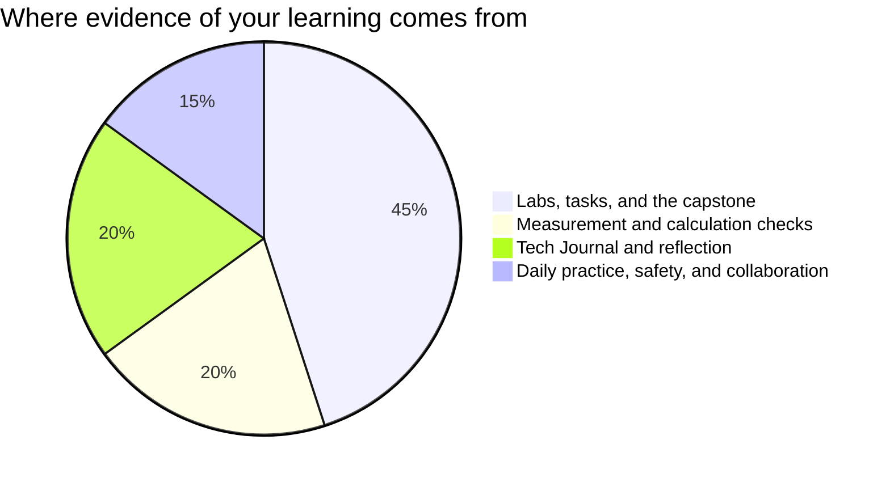

Marks in this course worry people for one wrong reason: a belief that
some people are "good with their hands" and everyone else should stay
back from the bench. No such division exists. Measuring, calculating,
soldering, and diagnosing are learned skills, every one of them, and
you are marked on **process, evidence, and communication** — all three
of which are inside your control.

## Where evidence comes from

**Labs and tasks** are the pages in Labs and Tasks. Each one lists its
success criteria before you start, phrased as things an observer could
see in your work. A circuit that works but that nobody could service
scores below a tidy, documented build with an honest known-issues list
— because [[Documenting Your Build|the documentation]] is not a report
about the work, it *is* a substantial part of the work.

**Measurement and calculation checks** are short and frequent: read
these bands, compute this current, predict this voltage, find this
limit in this datasheet. They are low-stakes and re-attemptable after
new learning, because their job is to find out what still needs work
rather than to close the book on it.

**Reflection** is your [[Tech Journal]]. It is where a destroyed
component, a prediction that missed by a factor of ten, or a stubborn
intermittent fault turns into evidence of learning — and it is often
the strongest evidence you have.

**Daily practice** is the small stuff done consistently: warm-ups,
roles rotated fairly, safety habits kept without being reminded, the
question that unstuck the bench beside you, the meter put back on the
voltage jacks before you walked away.

> [!important] Broken circuits are never penalised as broken
> Version one of everything smokes, blinks wrongly, or does nothing at
> all. The mark follows where your work ends up and how visibly you
> got there — your journal, your documentation, and your measurements
> are how "visibly" happens. A circuit that never worked, fully
> diagnosed and honestly written up, can score higher than one that
> worked immediately and was never understood.

If a mark ever surprises you, ask. The criteria on each task page are
the whole story, and [[Getting Help]] lists every way to reach me.
