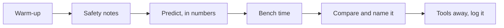

This course is a shop with instruments in it. Most days you will have
hardware in your hands, and the ideas get their names *after* you have
met them with a meter — the same bench-first rhythm as Grade 10, with
one addition that changes everything: this year the bench produces
numbers, and the numbers have to agree with something before we move
on.

## Warm-up

Five minutes at the door: [[Name That Part]], a [[Binary Bites]]
round, [[Read the Schematic]], or [[Spot the Hazard]] on the
projector. Small daily reps compound, and none of them needs the
benches powered.

## Safety notes

Every lab opens with its own specific hazards, read together.
[[Safety in the Lab]] is the standing agreement; the thirty seconds of
walkthrough at the start of each lab is what keeps bench time
generous, because a shop that has to stop is a shop that gets less
time at the bench.

## Predict, in numbers

New this year and non-negotiable: before a supply is switched on,
every bench writes down what it expects to measure, with units. Not
"the LED will light" — "about 14 mA through the branch, about 3 V
across the resistor". Predictions are collected before they can be
revised. This is the whole of [[Predict the Circuit]], moved from the
warm-up into the working day.

## Bench time

The heart of class: a [[Labs/index|lab]] in pairs or threes, hands on
real hardware and real instruments, usually meeting the phenomenon
*before* the lesson that names it. You will measure the relationship
between voltage and current several times before anybody writes
$V = IR$ on the board.

Roles rotate — hands, meter, recorder — so that nobody spends the
semester holding the same tool. The recorder's job is real: units,
conditions, and what the supply was set to.

## Compare and name it

Benches tour benches. Whose measurement disagrees with whose, and by
how much? A disagreement between two benches is the most productive
event that can happen in this room, and it is always worth ten minutes
to chase down. Then the idea gets its proper name and clean statement
on a [[Concepts/index|concept page]], and your own notes capture what
*you* need to remember.

## Tools away, log it

The bench is reset — irons in stands and cooling, meters back to the
voltage jacks, components bagged, straps hung, supplies off and turned
down. The last minutes belong to your [[Tech Journal]]: what you
built, what you predicted, what the meter said, what fought back, what
you would try next.

> [!tip] If you were away
> Check the class page in All Classes first. Most labs can be caught
> up at lunch — times are on [[Help Sessions]] — and the concept pages
> hold what the bench taught everybody else. Do not skip the
> measurements and read the conclusions; the numbers are the lesson.
