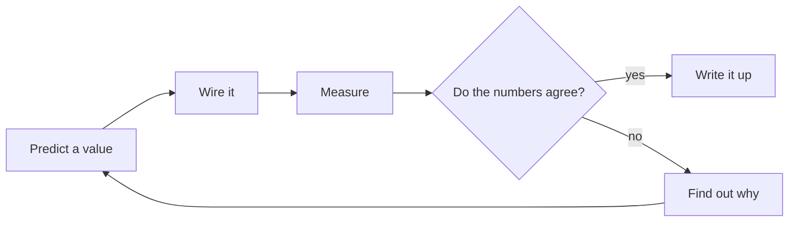
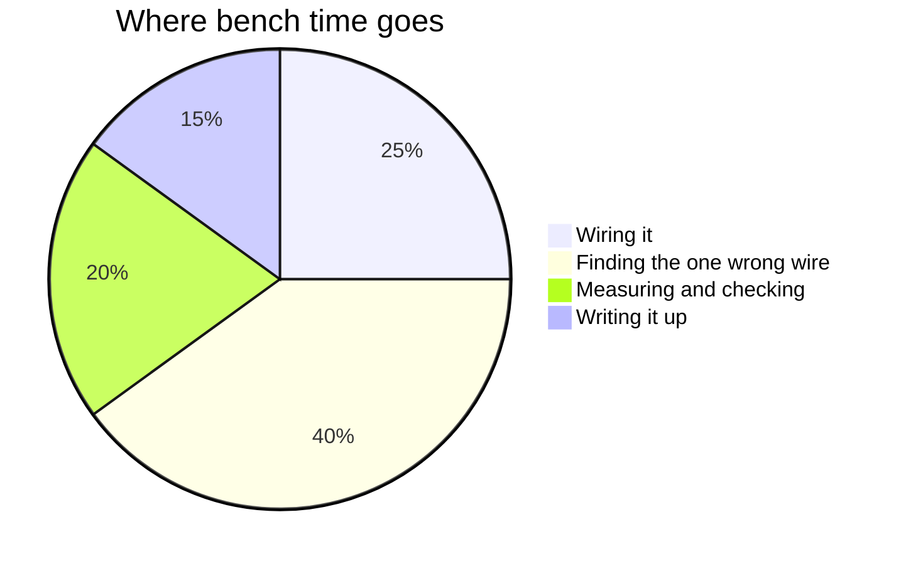
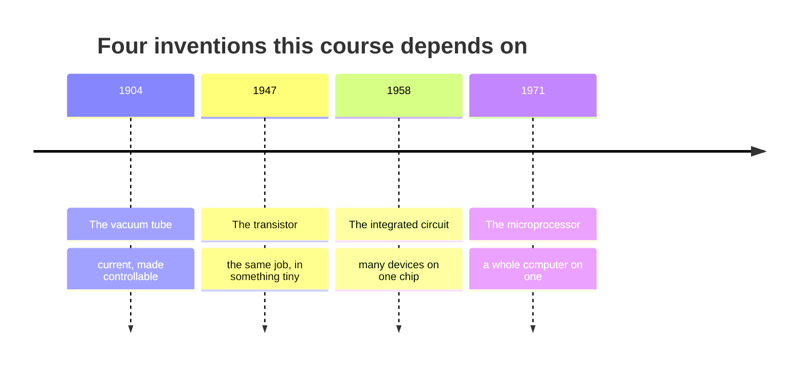

This page exists for two audiences. Students: it shows why the notes
look the way they do, and how to read them. Teachers: it is a working
reference for everything a page can contain, with the source visible
in every example.

Everything below is written in **Markdown** — plain text with a few
marks of punctuation that mean something. If you can write a text
message, you can write this.

---

## Text that carries meaning

You get **bold**, *italic*, ~~struck through~~, and ==highlighted==
text. Highlighting is the one worth knowing: it draws the eye better
than bold when a single ==key term== needs to stand out inside a
paragraph.

**How that was made:**

```markdown
**bold**, *italic*, ~~struck through~~, ==highlighted==
```

Arrows written as `->` become proper arrows: predict -> measure ->
reconcile.

Keyboard keys look like keys: press <kbd>⌘</kbd> + <kbd>K</kbd> to
search.

---

## Mathematics, typeset properly

This course runs on arithmetic that has to be readable, and the site
typesets it exactly. Inline, inside a sentence, like $V = IR$ — or
displayed on a line of its own:

$$I = \frac{V}{R} = \frac{9\ \text{V}}{330\ \Omega} \approx 27\ \text{mA}$$

Units go inside `\text{}` so that they stay upright and are never
mistaken for variables — a small thing that turns out to matter every
single time you write a value down.

**How that was made:** single dollar signs keep an expression inside
the sentence; double dollar signs give it a line of its own.
[[Ohm's Law Practice]] and [[Power Calculations Practice]] lean on
this constantly.

---

## Code, coloured and exact

This is the feature an embedded-systems course lives on: runnable
examples with spacing and quotation marks preserved, coloured by
meaning.

```python
from machine import Pin
import time

# Pin 15 here is an example only — check your own board's pinout
# diagram, because the numbering differs between boards.
led = Pin(15, Pin.OUT)

while True:
    led.value(1)
    time.sleep(0.5)
    led.value(0)
    time.sleep(0.5)
```

**How that was made:** three backticks and the language name, the
code, then three backticks to close it. Every page in
[[Code/index|the Code folder]] uses this.

---

## Headings, and the table of contents

Every `##` heading on a page becomes a link in **Navigate this page**,
over on the right — built automatically from the headings, so it can
never fall out of step with the page. Deeper headings nest underneath.

A short page reads better without a contents panel, and one
frontmatter line (`enableToc: false`) turns it off. Every class page
in [[All Classes/index|All Classes]] does exactly that: an agenda of
six items does not need navigating.

---

## Callouts

Callouts lift something out of the flow of the page, each kind with
its own colour and icon.

> [!note] Note
> Neutral information worth setting apart.

> [!tip] Tip
> A shortcut, a habit, or something that makes the work easier.

> [!important] Important
> The one thing to take away if you take away nothing else.

> [!warning] Warning
> Where people usually go wrong. Tolerance traps and unit-prefix
> errors live in these boxes.

> [!danger] Danger
> Where somebody could actually get hurt. Used sparingly, and every
> time it appears it means it.

> [!question] Question
> Something to think about rather than something to know.

> [!abstract] At a glance
> Used at the top of task pages for format and timing.

**How that was made:** a blockquote with the kind named in brackets.

```markdown
> [!warning] Where people usually go wrong
> The text of the callout goes here.
```

### Foldable callouts

Add a `-` after the kind to start a callout collapsed. Every practice
set hides its worked answers this way — commit to your own number
first, then open it:

> [!success]- Worked answer
> With a 5 V supply, a red LED dropping about 2.0 V, and a 220 Ω
> resistor, the resistor sees 3.0 V, so the current is roughly
> 13.6 mA. If you predicted 22.7 mA, you divided the whole supply
> voltage by the resistance and forgot that the LED takes its share
> first.

```markdown
> [!success]- Worked answer
> The hidden solution.
```

---

## Diagrams

Diagrams here are **written, not drawn** — editable in seconds, and
never needing a graphics program.



**How that was made:**

````markdown

````

Proportions draw themselves too:



And history fits on a line:



---

## Tables

**How that was made:** rows of text separated by `|`, with a line of
dashes under the headings. Mathematics works inside cells, which
matters more here than it sounds.

| Quantity | Symbol | Unit | Measured how |
| --- | --- | --- | --- |
| Voltage | $V$ | volt (V) | Meter in parallel, across the part |
| Current | $I$ | ampere (A) | Meter in series, circuit opened |
| Resistance | $R$ | ohm (Ω) | Power off, one leg lifted |
| Power | $P$ | watt (W) | Calculated, usually, from the others |

---

## Checklists

**How that was made:** a list where each line starts with `- [ ]`, or
`- [x]` for one already done.

- [x] Dial set and jacks checked before the probes touch anything
- [ ] Current limit set before the voltage is raised
- [ ] Prediction written down, with units
- [ ] Eye protection on before any lead is clipped
- [ ] Somebody else could service this build from your notes

They are clickable in the browser and nothing is saved — but they are
how [[Soldering Safely]] and [[Documenting Your Build]] turn from
advice into habit.

---

## Links between pages

This is what makes the site more than a pile of documents.

- A plain link: [[Ohm's Law]]
- A link with different words: [[Ohm's Law|the relationship you will use every day]]
- A link to a section: [[Ohm's Law#What the equation is really claiming]]

**How that was made:** double square brackets.

```markdown
[[Ohm's Law]]
[[Ohm's Law|different words for the link]]
[[Ohm's Law#What the equation is really claiming]]
```

### Transclusion — one page inside another

**How that was made:** `![[Page name]]` — a link with an exclamation
mark in front of it. Here is the help sessions page, embedded live
rather than copied:

![[Help Sessions]]

Change the source page and every page that embeds it updates. That is
how the same information appears in several places without anybody
maintaining duplicates, and without any of the copies going stale.

### Backlinks

Scroll to the bottom of any page and you will find **Backlinks** —
every page that links *to* this one, gathered automatically. Open
[[Using a Multimeter]] and its backlinks list every lab that assumes
you can drive one. Nobody maintains that list, and it is never wrong.

---

## Hover previews

Hover over [[Anti-Static Habits]] without clicking. The page appears
in a small window. Checking one limit or one definition in the middle
of a calculation does not cost you your place in the calculation.

---

## Footnotes

**How that was made:** `[^1]` where the marker goes, and a matching
`[^1]:` line anywhere in the page.

The unit of resistance is named after a schoolteacher.[^1]

[^1]: Georg Ohm published the relationship between voltage, current,
    and resistance in 1827, while teaching at a secondary school. The
    work was not well received at first, and he resigned his post over
    it. The unit came later, which is the usual order of these things.

---

## Tags

**How that was made:** a `tags` list in the frontmatter at the very
top of the page.

```yaml
---
tags:
  - concepts
  - unit-1
---
```

Every tag becomes a page listing everything filed under it.

---

## What you cannot see

Two things on this page are invisible in the browser.

1. **Comments.** Text wrapped in `%%` double percent marks `%%` never
   reaches the site. Useful for notes to yourself inside a page you
   are still writing — tomorrow's hint, next year's fix.
2. **Drafts.** A page with `draft: true` in its frontmatter is skipped
   entirely when the site is built. Write next week's lesson today and
   publish it when you are ready.

%% This sentence is a comment. If you can read it on the site, something is broken. %%

> [!tip] For teachers reading this
> With more than one section, per-section keys such as `draftSection1`
> and `draftSection2` let a single shared page be published to one
> class and held back from another — useful when two sections sit a
> few days apart in the schedule.

---

## The point of all this

None of it is decoration. Each feature removes a reason for a page to
go out of date, or a reason for a student to be looking at something
less useful than the real thing.

| Feature | The problem it solves |
| --- | --- |
| Typeset mathematics | Formulas retyped as plain text and misread |
| Coloured code | Screenshots of code nobody can copy or run |
| Transclusion | The same text copied into six places, five of them stale |
| Backlinks | "Where did we use this again?" |
| Folded answers | Solutions that spoil the attempt |
| Drafts | Next week's lesson living in a file somewhere else |

Write it once, link to it everywhere.
