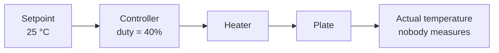
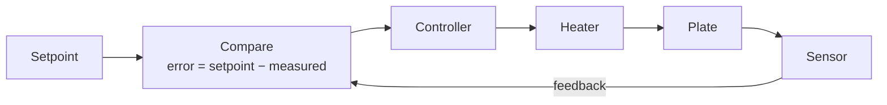

The first attempt at [[Close the Loop]] usually runs the heater at a
fixed 40% duty because 40% held the plate at 25 °C during the trial run
on Tuesday. On Thursday the shop door is propped open and the same 40%
holds it at 19 °C. Nothing broke. The system was never told what
temperature meant; it was told what duty meant, and duty is not the thing
anybody wanted.

## Open loop: acting without checking

An **open-loop** system decides its output from the command alone. There
is no measurement of the result and therefore no way for the system to
know whether it worked.

That is not automatically wrong. Open loop is cheap, simple, always
stable, and completely adequate when the relationship between command and
result is dependable and nothing important disturbs it — a stepper motor
counting steps, a toaster's timer, an LED at a fixed brightness. It fails
exactly where the world varies: a different room temperature, a heavier
load on the motor, a battery that sags, a belt that stretches.

## Closed loop: measuring the thing you actually care about

A **closed-loop** system measures the controlled quantity, compares it
with the setpoint, and drives the output from the difference — the
**error**.

Now the shop door does not matter. A colder room means a larger error,
which means more heat, without anybody reprogramming anything. That is
the whole payoff, and it is bought with three costs you must be able to
name: a sensor and its wiring, the possibility of instability, and a
dependence on the sensor being right — a closed loop controls the number
the sensor reports, not the temperature of the plate, and those two are
the same thing only if you calibrated.

The simplest closed loop of all is on/off with **hysteresis**: heat below
24.5 °C, stop above 25.5 °C, do nothing in between. Two thresholds, not
one, because a single threshold at 25.0 °C with a sensor that jitters by
a few tenths will switch the heater dozens of times a minute and wear out
whatever it is switching. The gap has to be wider than the noise, which
means you must first measure the noise — see [[Filters and Noise]].

## Choosing between them, honestly

| Question | If yes, lean toward |
| --- | --- |
| Is there a sensor that measures the *actual* quantity of interest? | Closed loop |
| Do disturbances change the result for the same command? | Closed loop |
| Does the requirement name a tolerance to hold ("± 0.5 °C")? | Closed loop |
| Is the actuator's response utterly repeatable? | Open loop is defensible |
| Would a failed sensor be more dangerous than no control at all? | Design the failure case explicitly, whichever you choose |

That last row is the Grade 12 question. A closed loop with a disconnected
sensor reads some fixed value and drives the output to an extreme trying
to correct an error that does not exist. The honest design has a
plausibility check on the sensor and a defined safe state when the check
fails — the software half is in [[Defensive Embedded Code]], and it
belongs in your specification as a numbered requirement, not as a good
intention.

> [!question] Which loop is your project really running?
> Take the device you are proposing for [[The Control System]] and answer
> three questions in writing. What quantity does the requirement name?
> What quantity does your sensor actually measure? What happens to the
> output if that sensor is wrong by ten percent, or stops reporting
> altogether?
>
> Plenty of projects that look closed-loop are open-loop systems with a
> display attached — they show a number to a human and never use it. That
> is a legitimate design. It is only a problem when the report claims
> otherwise.

Draw both diagrams for your own device before you write a line of code —
the block-diagram discipline from [[System Block Diagrams]] applies to
control loops exactly as it does to signal chains. Then go on to
[[Feedback and Control Systems]], where the controller block stops being
a rectangle and starts being arithmetic, and rehearse the numbers in
[[Control Systems Practice]].

%%curriculum-start%%
## Curriculum connection

![[A3.2]]

![[A3.4]]

![[B5.3]]
%%curriculum-end%%
