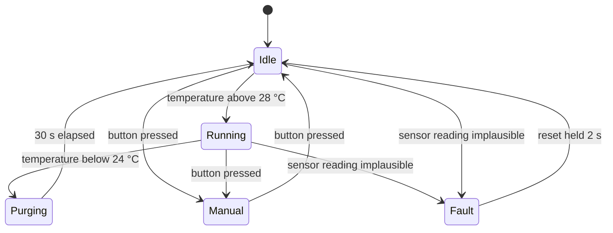

Somewhere in Unit 3 a program in this room reaches five boolean
variables — `running`, `manual`, `warming`, `fault`, `door_open` — and
somebody adds a sixth `if` to fix the one combination that misbehaves,
which breaks a different combination nobody has tried yet. That is not a
coding problem. It is a design problem with a name and a cure.

## The flag explosion

Five booleans describe $2^5 = 32$ possible combinations of the machine's
condition. Your device probably has about six that make any sense. The
other twenty-six are not prevented by anything — they are simply
combinations you never thought about, and the program will happily walk
into them. `running` and `fault` both true. `manual` and `warming` both
true with `door_open`. Each one is a bug waiting for a user unlucky
enough to produce it.

A **finite state machine** replaces the pile with one question: what
state is this device in *right now*? Exactly one answer at a time, drawn
from a list you wrote. The illegal combinations stop existing because
there is nowhere for them to live.

## Name the states, then name the transitions

A state machine is four things: a set of states, a set of events, a
transition for each state-and-event pair that matters, and an action
attached to entering or leaving a state. Here is a bench exhaust fan with
a purge cycle, drawn as a diagram anybody in the room can check:

Read it aloud and you are reading the specification. Two thresholds
rather than one because of the hysteresis argument in
[[Open and Closed Loop Control]]; a purge state because the fan should
not stop the instant the plate cools; a fault state because
[[Defensive Embedded Code]] insists that "the sensor is lying" is a
condition, not an accident.

Notice what the diagram tells you that prose cannot. There is no arrow
from `Purging` to `Manual`, so pressing the button during a purge does
nothing — is that what you want? There is no arrow out of `Fault` except
a deliberate reset, which is almost certainly right for a fault. Every
missing arrow is a decision, and drawing it makes you take the decision
on purpose instead of by omission.

## The transition table leaves nowhere to hide

The diagram is for people. The table is for completeness. Put states down
the side and events across the top, and every cell must be filled in —
even if the entry is "ignore".

| State | Above 28 °C | Below 24 °C | Button | Timer expires |
| --- | --- | --- | --- | --- |
| Idle | → Running | ignore | → Manual | ignore |
| Running | ignore | → Purging | → Manual | ignore |
| Purging | ignore | ignore | ignore | → Idle |
| Manual | ignore | ignore | → Idle | ignore |
| Fault | ignore | ignore | ignore | ignore |

Five states and four events give twenty cells, and the exercise is to
have an answer for all twenty rather than for the six you happened to
test. Blank cells in a table are visible in a way that missing `if`
statements never are. It is the same reasoning behind
[[A5.2|the logic expectation]] — a car that must not start unless the
clutch is in and the gear is in neutral is a multiple-input logic
problem, and it is a state machine before it is a circuit.

## Hardware has been doing this all along

None of this is a software invention. A flip-flop is a one-bit memory
whose next value depends on its current value and its inputs, which is a
two-state machine in silicon. Wire several together with logic that
computes the next state and you have a counter, a shift register, or a
sequencer — the sequential logic from Grade 11, now recognisable as the
same idea you are about to write in MicroPython. Traffic-light
controllers, vending machines, and washing-machine timers were state
machines in hardware for decades before they were state machines in code.

The practical consequences carry across too. Both versions need a defined
power-up state, because "whatever it happened to come up as" is not a
design. Both need every input to be sampled cleanly, because a bouncing
contact looks like several events. And both are far easier to test than a
pile of flags: you can walk the table, cell by cell, and prove you have
been everywhere.

Draw the diagram before you write the code, put it in the report for
[[The Control System]], and check it against the transition table until
they agree — the fan above is the machine you will actually be running in
[[Close the Loop]]. [[State Machine Practice]] drills the reasoning on
paper, and
[[State Machines in Code]] turns the table into MicroPython that stays
readable when a fifth state arrives in week three.

%%curriculum-start%%
## Curriculum connection

![[A3.4]]

![[A5.4]]

![[B5.2]]
%%curriculum-end%%
