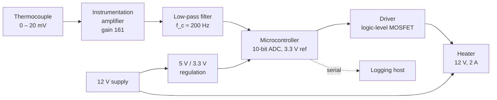

Asked for a block diagram of the device in [[The Specification]], about
half of every class draws a schematic instead — component symbols, pin
numbers, the lot. That is a different drawing for a different purpose. A
schematic says how it is wired. A block diagram says how it is
*organised*, and it is the only drawing you can make before you know
which parts you are using.

## A block is a promise about an interface

Each block names a job. The arrows between blocks name the signals that
cross from one job to another, and each arrow needs three things written
on it or beside it: what the signal is, which way it goes, and what it
looks like electrically.

Read that diagram and you can already ask the questions that decide the
build. Does the amplifier's output stay inside the converter's input
range? Where does the heater's return current flow, and does it share
copper with the sensor's? Which of those blocks needs a supply the
regulator has not been sized for? None of that needs a part number, and
all of it is cheaper to fix now than after a board is soldered.

## Decompose until every block is buildable

Split a block when you cannot yet say how you would build it, and stop
splitting when you can. "Sensing" is not a block; it is a heading.
"Thermocouple, amplifier, filter, converter input" is four blocks, each
of which somebody could go and build.

Three tests for a decomposition that will survive:

- [ ] Every block has one job you can state in one sentence.
- [ ] Every arrow has a direction, a signal name, and a voltage range.
- [ ] Every block's supply appears on the diagram, not in your head.

That third one catches more first drafts than the other two combined.
Power is a signal like any other, and a diagram that shows only the
information flow will let you design a system that cannot be powered.

## The interfaces are where projects fail

Inside a block, one person can be careful. Between two blocks, two people
have to agree — and each has assumed something. The classic failures in
this room are all interface failures: a 5 V sensor output going into a
3.3 V input, an amplifier whose output swings closer to its rails than
the converter needs, two boards with separate grounds that never got tied
together, a bus with no pull-ups because both ends assumed the other end
had them.

So write the interface down as a contract. For every arrow: voltage
range, current, whether it is analog or digital, timing if it matters,
and what happens at power-up before either side is ready. That last
column is the one nobody fills in and everybody needs — see
[[Defensive Embedded Code]] for the software half of the same worry.

Bring the diagram to a design review before the parts are ordered. It is
the drawing your teacher and your partners can actually argue with, and
arguing at this stage costs nothing. [[Specification Practice]] gives you
systems to decompose on paper, [[Read the Schematic]] keeps the other
drawing sharp, and
[[Writing Documentation Somebody Can Build From]] shows what both
drawings look like in a finished handover package.

%%curriculum-start%%
## Curriculum connection

![[A3.2]]

![[A3.4]]

![[B3.1]]
%%curriculum-end%%
