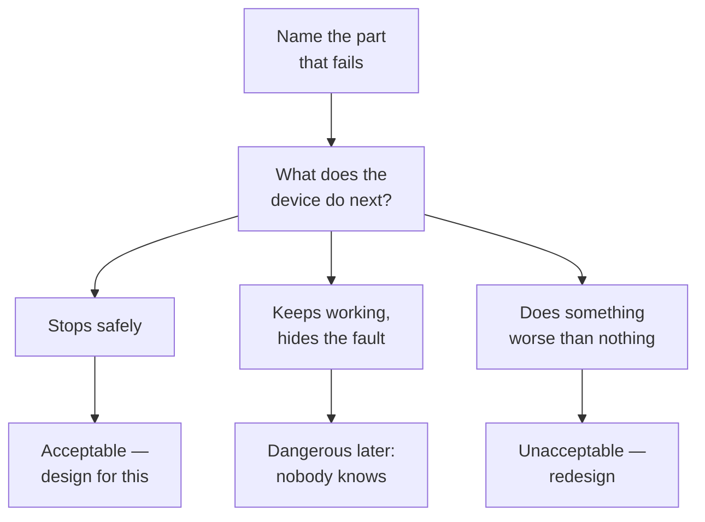

This discussion came back for a reason. In Grade 11 it asked what has
to be true before you hand something to a person who will plug it in,
walk away, and trust it. That was a question about *other people's*
engineering. This year you are the one choosing the numbers, and the
question sharpens accordingly: **what margin did you pick, why that
one, and what happens when you are wrong?**

> [!danger] The gap this page is about
> A circuit that works is not a circuit that is safe. Working is
> observed behaviour under conditions you happened to test. Safe is a
> claim about behaviour under conditions you did *not* test — hotter,
> older, wetter, with a wire loose, with the wrong supply, with
> somebody's child in the room. Nothing you measure on a good day
> tells you what happens on the bad one, and this year nobody hands
> you the number that closes that gap. You choose it.

## The question is no longer "does it work"

It is "how does it fail". Every design has failure modes whether or
not the designer thought about them, and the only real difference
between a careful engineer and a lucky one is that the careful engineer
went looking.

Work that diagram over your own capstone once and you will find at
least one branch you had not considered. A heater whose control
transistor fails shorted does not stop heating. A motor whose position
sensor comes loose does not stop moving. A controller that hangs does
not release anything it was holding. In each case, the safe behaviour
has to be *designed in*, usually as something that happens when the
clever part stops participating — a fuse, a thermal cut-out, a spring
that pulls a valve closed, a watchdog that resets a hung processor and
brings the outputs up in a known state.

## The tools the profession built for this gap

Worth knowing before you decide what you think of them.

- **Absolute maximum ratings** on every part, and the deliberate
  practice of staying well below them. That is derating, and
  [[Reliability and Derating]] is where you learn to defend a number
  rather than inherit one.
- **Certification marks** on products sold in Canada, meaning an
  accredited laboratory tested a sample against a published standard.
- **Inspection** of electrical work, and **licensure** of professional
  engineers — a licence that can be taken away, which is the part
  that gives it teeth. [[Standards and Professional Practice]] has
  the mechanics.
- **Documented test procedures** with pass and fail thresholds written
  before the test is run, so the result cannot be argued afterwards.

Counterfeit phone chargers are the standard cautionary example in the
trade precisely because their failure is invisible: too little
isolation between the mains side and the low-voltage side, in a product
that charges phones perfectly well right up until it does not.

## Software makes the gap worse, not better

A fault in code leaves no burn mark. The case every engineering
programme teaches is the Therac-25, a radiation therapy machine whose
control software could, under a rare sequence of operator inputs,
deliver a massive overdose. It killed people. The machine was not
sabotaged and the engineers were not villains. Safety interlocks that
had previously been physical were moved into software; the failure mode
was rare enough to look like operator error; and reports from the field
were not believed quickly enough.

Read that paragraph again after Unit 3, when you have written the state
machine that decides whether a motor turns. You will be the person who
moved an interlock into software.

## Questions worth arguing about

1. Pick one component in your own design. What derating did you
   choose, and what would have to be true for that margin to be
   consumed? Now defend the number to somebody who wants it cheaper.
2. Name your design's single point of failure — the one part whose
   failure takes everything with it. Can you make its failure safe
   without removing it? What does that cost?
3. A watchdog timer resets a controller that has stopped responding.
   Is a device that silently recovers from its own faults safer, or is
   it hiding the evidence you needed in order to fix the real problem?
   Argue both.
4. Your test says the device ran for four hours at room temperature.
   What is the smallest change to that test that would most increase
   your confidence — longer, hotter, colder, more cycles, or somebody
   else running it? Justify the ranking.
5. You ship with a known flaw and document it honestly. What does that
   documentation actually transfer, and what does it not? Where is the
   line past which an honest note stops being enough and fixing it
   becomes the only acceptable answer?
6. When would you refuse to hand something over — and what would it
   cost you to refuse? Say it out loud now, in a room where it is
   cheap, so that you recognise the moment later when it is not.

The connection to your own bench is direct rather than metaphorical.
[[Safety in the Lab]] carries the practice;
[[Writing Documentation Somebody Can Build From]] is where the honest
known-issues list gets written; and
[[The Engineering Design Project]] is marked partly on whether
somebody else could safely service what you made. Decide here what you
think you owe the person who plugs it in, because
[[The Engineering Review]] will ask you to defend that answer in front
of the room.

%%curriculum-start%%
## Curriculum connection

![[D1.1]]

![[D1.2]]

![[C1.1]]
%%curriculum-end%%
