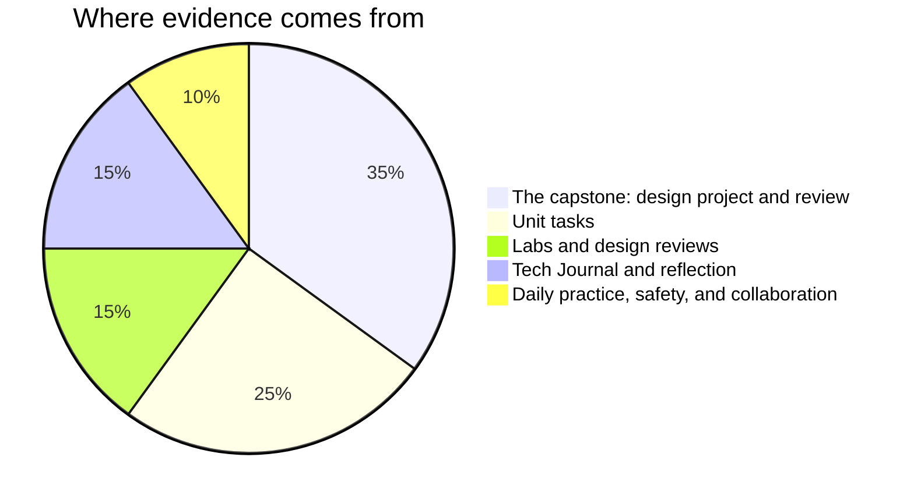

Marks in this course worry people for one wrong reason: a belief that
some people are "good with their hands" and everyone else should stay
back from the bench. No such division exists, and after two years in
this room you have the evidence in your own journal. Measuring,
calculating, specifying, and diagnosing are learned skills, every one
of them, and you are marked on **process, evidence, and
communication** — all three of which are inside your control.

## Where evidence comes from

**The capstone is the largest single piece of this course**, and that
is deliberate. [[The Engineering Design Project]] and
[[The Engineering Review]] together are where everything else lands:
you specify something, choose parts and defend the choices, build it,
measure it, document it so somebody else could build it, and then
stand in front of the room and answer hard questions about it. Nothing
in Grade 10 or Grade 11 asked for all of that at once. It is worth what
it is worth because it is the closest thing in this building to the
actual job.

**Unit tasks** — [[The Specification]], [[The Interface]], and
[[The Control System]] — are the rehearsals. Each one takes a piece of
the capstone and makes it the whole assignment, with its success
criteria published before you start.

**Labs and design reviews** cover bench work and the reviews attached
to it. Presenting a design and being questioned about it is assessed,
and so is the quality of the questions you ask about somebody else's.
A review comment that names a requirement is worth more than three
that name a preference.

**Reflection** is your [[Tech Journal]]. It is where a destroyed
component, a prediction that missed by a factor of ten, or a decision
you later overturned turns into evidence of learning — and it is often
the strongest evidence you have.

**Daily practice** is the small stuff done consistently: warm-ups,
roles rotated fairly, safety habits kept without reminders, the
question that unstuck the bench beside you, the supply turned off and
wound down before you walked away.

> [!important] Broken circuits are never penalised as broken
> Version one of everything smokes, blinks wrongly, or does nothing at
> all. The mark follows where your work ends up and how visibly you got
> there — your journal, your documentation, and your measurements are
> how "visibly" happens. A design that never fully worked, honestly
> diagnosed, properly documented, and defended with real numbers can
> score higher than one that worked immediately and was never
> understood.

> [!tip] The capstone is not marked on ambition
> A modest device that is specified, measured, documented, and
> defended will beat an ambitious one held together by luck and
> optimism every single time. Choose a project you can finish and then
> make the engineering deep rather than the feature list long. That
> advice arrives in this folder because by the time it arrives in
> [[The Engineering Design Project]] you will have already chosen.

If a mark ever surprises you, ask. The criteria on each task page are
the whole story, and [[Getting Help]] lists every way to reach me.
